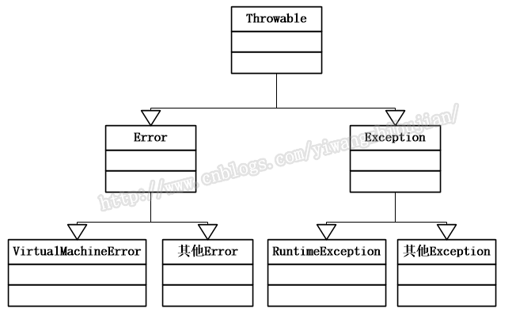

# 面经收集的题

# 新加题


# Java基础

## Java中的基本类型和所占字节数、取值范围
Java中基本类型有**八种**  

* byte：8位，最大存储数据量是255，存放的数据范围是-128~127之间。
* short：16位，最大数据存储量是65536，数据范围是-32768~32767之间。
* int：32位，最大数据存储容量是2^32 - 1，数据范围是 -2^31 ~ 2^31 - 1
* long：64位，最大数据存储容量是2的64次方减1，数据范围为 -2^63 ~ 2^63 - 1
* float：32位，数据范围在3.4e(-45) ~ 1.4e38，直接赋值时必须在数字后加上f或F。
* double：64位，数据范围在4.9e-324~1.8e308，赋值时可以加d或D也可以不加。
* boolean：只有true和false两个取值。
* char：16位，存储Unicode码，用单引号赋值。

## hashcode 和 equals 的关系
### 1. equals 的作用
**判断两个对象相等**。定义在JDK的Object类中，通过判断两个对象的地址是否相等，来区分他们是否相等。即默认的equals()方法等价于 “ == ”。  

String中复写了equals方法用来判断两个字符串内容是否相同。  

### 2.equals与 == 的区别
== : 它的作用是判断两个对象的地址是不是相等。即，判断两个对象是不是同一个对象。  

equals() : 它的作用也是判断两个对象是否相等。但它一般有两种使用情况  

1. 类没有覆盖equals()方法。则通过equals()比较该类的两个对象时，等价于通过“==”比较这两个对象。
2. 类覆盖了equals()方法。一般，我们都覆盖equals()方法来两个对象的内容相等；若它们的内容相等，则返回true(即，认为这两个对象相等)。

### 3. hashCode()的作用
**获取哈希码**，也称散列码。这个哈希码的作用是确定对象在哈希表中的位置。  

hashCode()函数定义在JDK的Object类中，意味着每个Java类都包含这个函数。**然而，hashCode() 在散列表中才有用，在其它情况下没用**  

### 4. hashcode 和 equals 的关系
两种情况：

**1. 第一种情况，不会创建“类对应的散列表”**  

在这种情况下，该类的“hashCode() 和 equals() ”没有半毛钱关系的！

**2. 第二种情况，会创建“类对应的散列表”**  

在这种情况下，该类的“hashCode() 和 equals() ”是有关系的：

	如果两个对象相等，那么它们的hashCode()值一定相同。这里的相等是指，通过equals()比较两个对象时返回true。  
	如果两个对象hashCode()相等，它们并不一定相等。
	在这种情况下。若要判断两个对象是否相等，除了要覆盖equals()之外，也要覆盖hashCode()函数。否则，equals()无效。

## 深拷贝、浅拷贝区别
* 浅拷贝是按位拷贝对象，它会创建一个新对象，这个对象有着原始对象属性值的一份精确拷贝。

如果属性是基本类型，拷贝的就是基本类型的值；**如果属性是内存地址（引用类型），拷贝的就是内存地址 ，因此如果其中一个对象改变了这个地址，就会影响到另一个对象。**

* 深拷贝会拷贝所有的属性,**并拷贝属性指向的动态分配的内存**。当对象和它所引用的对象一起拷贝时即发生深拷贝。深拷贝相比于浅拷贝速度较慢并且花销较大。

## java 异常体系？RuntimeException Exception Error 的区别
  

* Java把异常作为一种类，当做对象来处理。**所有异常类的基类是Throwable类，两大子类分别是Error和Exception**。
* 系统错误由Java虚拟机抛出，用Error类表示。**Error类描述的是内部系统错误**，例如Java虚拟机崩溃。这种情况仅**凭程序自身是无法处理的，在程序中也不会对Error异常进行捕捉和抛出**。
* 异常（Exception）又分为**RuntimeException(运行时异常)和CheckedException(检查时异常)**，两者区别如下：

区别：
1. RuntimeException：程序运行过程中才可能发生的异常。一般为代码的逻辑错误。例如：类型错误转换，数组下标访问越界，空指针异常、找不到指定类等等。
2. CheckedException：编译期间可以检查到的异常，**必须显式的进行处理（捕获或者抛出到上一层）**。例如：IOException, FileNotFoundException等等。

# 集合
## Collection 有什么子接口、有哪些具体的实现
List Set Queue 三个子接口，具体实现有ArrayList、LinkedList、HashSet、PriorityQueue等  

## 讲一下 hashMap 原理。hashMap 可以并发读么？并发写会有什么问题？
可以并发读，不可以并发写。  

并发写会发生链表尾部元素值被覆盖的情况。  

## 讲一下 ConcurrentHashMap 原理。头插法还是尾插法？扩容怎么做？
尾插法。  

ConcurrentHashMap会在以下情况下触发扩容：  

1. 添加新元素后，元素个数达到阈值
2. 调用putAll方法，发现容量不足以容纳所有元素时
3. 某个槽内长度达到8，要变成红黑树之前检查，数组长度不足64时

ConcurrentHashMap统计元素个数：  

内部实例化了一个 CounterCell 的数组来记录元素的个数，每当线程 put 一个元素到容器中，线程会被映射到一个 CounterCell 的一个元素上面采用 CAS 算法进行加 1 操作，当然如果当前 CounterCell 上已经有线程在操作，或者并发量比较小的话会直接将加 1 累加到 BASECOUNT 上面。  

扩容是在有以下步骤： 

1. 通过计算 CPU 核心数和 Map 数组的长度得到每个线程（CPU）要帮助处理多少个桶，并且这里每个线程处理都是平均的。默认每个线程处理 16 个桶。因此，如果长度是 16 的时候，扩容的时候只会有一个线程扩容。
2. 初始化临时变量 nextTable。将其在原有基础上扩容两倍。
3. 每当开始迁移一个槽中的元素的时候，**线程会锁住当前槽中列表的头元素**
4. 假设这时候正好有 get 请求过来会仍旧在旧的列表中访问，如果是插入、修改、删除、合并、compute 等操作时遇到 ForwardingNode，当前线程会加入扩容大军帮忙一起扩容，扩容结束后再做元素的更新操作。

## 堆是怎么存储的，插入是在哪里？
堆在Java中是以数组形式存储的。  

插入在数组最后，即挂载在树的最下面，然后通过一系列上浮操作维持堆的状态  


## 集合在迭代的过程中，插入或删除数据会怎样？
分为三种情况
1. for循环遍历时，插入删除元素都是可以的，但要注意index范围的变化
2. foreach遍历时，会抛出 java.util.ConcurrentModificationException 异常
3. Iterator遍历时直接调用容器的插入删除方法，会抛出 java.util.ConcurrentModificationException 异常，但调用Iterator的remove()方法是可以的

原因是：集合中维持了一个modCount，表示map中的元素被修改了几次(在移除，新加元素时此值都会自增)，而expectedModCount是表示期望的修改次数，在迭代器构造的时候这两个值是相等，如果在遍历过程中这两个值出现了不同，就会抛出ConcurrentModificationException异常。  

# 并发
## 进程和线程的区别
1. **拥有资源**
	**进程是资源分配的基本单位**，但**线程不拥有资源，线程可以访问隶属进程的资源**
2. **调度**
	**线程是独立调度的基本单位**，在同一进程中，线程切换不会引起进程切换，从一个进程中的线程切换到另一个进程中的线程时，会引起进程切换
3. **系统开销**
	创建或撤销进程时，系统都要分配或回收资源，如内存空间、I/O设备等，所付出的开销远大于创建或撤销线程时的开销。
	类似的，在进程切换时，涉及当前执行进程CPU环境的保存和新调度进程CPU环境的设置，开销很大；而线程切换时只需保存和设置少量寄存器内容，开销很小。
4. **通信**
	线程间可以通过**直接读写同一进程中的数据进行通信**；但**进程通信需要借助IPC**
## 并行和并发的区别
* 并发:一个处理器同时处理多个任务。  
* 并行:多个处理器或者是多核的处理器同时处理多个不同的任务.

前者是逻辑上的同时发生（simultaneous），而后者是物理上的同时发生．

## 了解协程么
> A coroutine is a function that can suspend its execution (yield) until the given given YieldInstruction finishes.

使用一个 CPU 也可以同时处理多个进程任务，这是一种“伪多线程”的技术。协程不是被操作系统内核所管理，而完全是由程序所控制（也就是**在用户态执行**）。这样带来的好处就是性能得到了很大的提升，**不会像线程那样需要上下文切换来消耗资源，因此协程的开销远远小于线程的开销。**  

协程调用是在一个线程内进行的，是单线程
## 进程间如何通信？进程 A 想读取进程 B 的主存怎么办？线程间通信？
进程间通信：

* 管道：半双工，且只能在有亲缘关系的进程之间使用
* 有名管道：半双工，允许无亲缘关系进程间的通信
* 信号量：是一个计数器，控制多个进程对一个共享变量的访问
* 消息队列：消息队列是由消息的链表，存放在内核中并由消息队列标识符标识
* 共享内存：共享内存就是映射一段能被其他进程所访问的内存，这段共享内存由一个进程创建，但多个进程都可以访问。共享内存是最快的 IPC 方式，它是针对其他进程间通信方式运行效率低而专门设计的。它往往与其他通信机制，如信号量，配合使用，来实现进程间的同步和通信。
* 套接字socket：可用于不同设备间的进程通信

线程间通信：
1. 锁机制：包括互斥锁、条件变量、读写锁
	wait/notify 等待
	Volatile 内存共享
	CountDownLatch 并发工具
	CyclicBarrier 并发工具
2. 信号量机制
3. 信号机制

## 线程的生命周期有哪些状态 怎么转换

线程的生命周期有以下状态：

* 初始 NEW：调用Thread.start()进入运行状态
* 运行 RUNNABLE：调用Object.wait(),Object.join(),LockSupport.park()进入WAITING状态；
调用Thread.sleep(long),Object.wait(long),Thread.join(long),LockSupport.parkNanos(),LockSupport.Until()进入TIME_WAITING状态；等待进入synchronized方法，等待进入synchronized代码块时进入BLOCKED状态
* 等待 WAITING：调用notify()/notifyAll()，LockSupport.unpark(Thread)进入RUNNABLE状态
* 超时等待 TIME_WAITING：调用notify()/notifyAll()，LockSupport.unpark(Thread)进入RUNNABLE状态
* 阻塞 BLOCKED：获取到锁进入RUNNABLE状态
* 终结 TERMINATED：线程执行完成进入TERMINATED状态

  

## wait() 和 sleep ()有什么区别？什么情况下会用到 sleep？
1. 属于不同的类，**wait()方法属于Object，而sleep属于Thread**
2. sleep()不会释放锁，wait()会释放锁。也可以说**sleep()跟锁是无关的**
3. sleep()任何地方都可以使用，**wait()只能在同步代码方法或者同步代码块中使用**
4. sleep()必须捕获异常，wait()方法不需要捕获异常
5. **sleep()使线程进入阻塞状态（线程睡眠，线程状态是TIMED_WAITING），wait()方法使线程进入等待队列（线程挂起，线程状态是WAITING，但带实现的wait方法进入的也是TIMED_WAITING状态）**，也就是阻塞类别不同。
6. 它们都可以被interrupt

一般wait()和notify()方法使用于线程间的通信；sleep()方法用于暂停当前线程的执行。  

## 线程的WAITING和BLOCKED状态有什么区别
BLOCKED状态的线程是：正在阻塞等待一个监视器锁的线程，或者一个线程在调用了Object.wait()方法释放了监视器锁之后，重新进入同步块的状态  

WAITING状态：一个线程无限期的等待另一个线程执行一个**特别的动作**的状态。  

一个线程进入WAITING状态是因为调用了以下方法：

* 不带时限的Object.wait()方法
* 不带时限的Thread.join()方法
* LockSupport.park()方法

那么javadoc里面所说的等待另一个线程的特别的动作就是相对的：

* 其他线程调用同一个对象的Object.notify()方法或者Object.notifyAll()方法
* 调用了Thread.join()的线程，等待指定线程运行结束
* 调用了LockSupport.park()的线程，等待其他线程调用LockSupport.unpark()


## 线程的TIMED_WAITING状态是怎么实现的
进入TIMED_WAITING的方法有以下：

* Thread.sleep
* Object.wait(time)
* Thread.join(time)
* LockSupport.parkNanos()
* LockSupport.parkUntil()

TIMED_WAITING 与 WAITING 间的联系还是很紧密的，主要差异在时限（timeout）参数上。  

## 怎么停止线程
1. 使用stop()方法，已被弃用。因为stop()是立即终止，导致**数据有一部分被处理完，一部分没有处理完**，产生不完整的“残疾”数据。  
2. volatile变量作为停止标志位，控制线程停止
3. 使用interrupt()中断的方式，注意使用interrupt()方法中断正在运行中的线程只会修改中断状态位，可以通过isInterrupted()判断。如果使用interrupt()方法中断阻塞中的线程，那么就会抛出InterruptedException异常，可以通过catch捕获异常，然后进行处理后终止线程。有些情况，我们不能判断线程的状态，所以使用interrupt()方法时一定要慎重考虑。


## 怎么控制多个线程按序执行？
1. 使用线程的join方法
2. 使用线程的wait方法
3. 使用线程的线程池方法
4. 使用线程的Condition(条件变量)方法
5. 使用线程的CountDownLatch(倒计数)方法
6. 使用线程的CyclicBarrier(回环栅栏)方法
7. 使用线程的Semaphore(信号量)方法

https://zhuanlan.zhihu.com/p/80787379  

## 锁讲一下锁，有哪些锁，有什么区别，怎么实现的？

https://www.cnblogs.com/qifengshi/p/6831055.html

## 死锁条件
1. 互斥：一个资源只能同时被一个进程使用
2. 占有和等待：已经占有资源的进程可以请求新的资源
3. 不可抢占：已经分配给一个线程的资源不能被其他进程强制性的抢占，只能被占有他的进程显式地释放
4. 环路等待：有两个或者两个以上地进程组成一条环路，环路上每一个进程都在等待上一个进程释放资源

## 乐观锁和悲观锁的区别，以及适用场景
* 悲观锁，总是假设最坏的情况，每次去拿数据的时候都认为别人会修改，所以每次在拿数据的时候都会上锁，这样别人想拿这个数据就会阻塞直到它拿到锁（**共享资源每次只给一个线程使用，其它线程阻塞，用完后再把资源转让给其它线程**）  

* 乐观锁，总是假设最好的情况，每次去拿数据的时候都认为别人不会修改，所以不会上锁，但是在更新的时候会判断一下在此期间别人有没有去更新这个数据，可以使用版本号机制和CAS算法实现。乐观锁适用于多读的应用类型，这样可以提高吞吐量

### 实现乐观锁的两种机制
1. 版本号机制：解决ABA问题
2. CAS算法：compare and swap，著名的**无锁算法**。需要实现为一个原子操作

### 乐观锁的问题
#### 1. ABA问题
A修改为C之后，验证原本数据库中的数据还是A，则表明没有被其他线程修改过。但可能是被其他线程修改成B之后又修改成了A，数据已经变了。这就是ABA问题  

JDK 1.5 以后的 **AtomicStampedReference 类**就提供了此种能力，其中的 compareAndSet 方法就是首先检查当前引用是否等于预期引用，并且**当前标志是否等于预期标志**，如果全部相等，则以原子方式将该引用和该标志的值设置为给定的更新值。  

另外自己实现的话可以添加一个每次修改递增Version字段作为是否修改的标志

#### 2. 循环时间长开销大
自旋CAS（也就是不成功就一直循环执行直到成功）如果长时间不成功，会给CPU带来非常大的执行开销。  

#### 3. 只能保证一个共享变量的原子操作
CAS 只对单个共享变量有效，当操作涉及跨多个共享变量时 CAS 无效。  

但是从 JDK 1.5开始，**提供了AtomicReference类来保证引用对象之间的原子性**，你可以把**多个变量放在一个对象里来进行 CAS 操作.所以我们可以使用锁或者利用AtomicReference类把多个共享变量合并成一个共享变量来操作**。  

### CAS和synchronized的使用场景
**简单来说，CAS适用于读多，写比较少的情况下，冲突一般较少。synchronized适用于写比较多的情况下，冲突一般较多。**  

1. 对于资源竞争较少，冲突较少的情况，使用**synchronized进行线程阻塞和唤醒切换，以及用户态内核态之间的切换操作浪费CPU资源**；而**CAS基于硬件实现，不需要进入内核，不需要切换线程，操作自旋几率较少，因此可以获得更高的性能**。
2. 对于资源竞争严重的情况，**CAS自旋的概率较大，会浪费更多的CPU资源**，效率低于synchronized。

其实现在synchronized经过各种优化之后，性能已经很高了，在线程冲突较少的情况，可以获得和CAS类似的性能；而线程冲突严重的情况下，性能远高于CAS。  

## synchronized的底层实现
https://juejin.cn/post/6844903726545633287  

偏向锁 -> 产生竞争 -> 轻量级锁 -> 产生竞争 -> 重量级锁  


## 讲一下 threadLocal 原理，threadLocal 是存在 jvm 内存哪一块的

ThreadLocal是独立于Thread之外的单独的类，ThreadLocalMap是ThreadLocal的内部类，Thread中有一个全局变量ThreadLocal.ThreadLocalMap。  

Thread中，通过调用ThreadLocal的set()方法创建一个ThreadLocalMap，并附着在Thread上。  

ThreadLocalMap是一个自定义个HashMap，与Map接口没关系。  

# IO
## 讲讲NIO BIO AIO，有什么区别
* BIO（阻塞I/O）：数据的读取写入必须阻塞在一个线程中完成
* NIO（同步非阻塞I/O）：线程轮询数据状态，查看是否准备好了，无需阻塞等待数据到来
* AIO（异步非阻塞I/O）：无需一个线程轮询所有IO操作的状态改变，系统会通知线程来处理

## 讲讲Java NIO
NIO也叫Non-Blocking IO 是同步非阻塞的IO模型。**线程发起io请求后，立即返回（非阻塞io）**。**同步指的是必须等待IO缓冲区内的数据就绪**，而**非阻塞指的是，用户线程不原地等待IO缓冲区**，可以先做一些其他操作，但是要**定时轮询检查IO缓冲区数据是否就绪**。其实是NIO加上IO多路复用技术。IO多路复用模型中，将检查IO数据是否就绪的任务，交给系统级别的select或epoll模型，由系统进行监控，减轻用户线程负担。  

NIO主要有**buffer、channel、selector三种技术的整合**，通过零拷贝的buffer取得数据，每一个客户端通过channel在selector（多路复用器）上进行注册。服务端不断轮询channel来获取客户端的信息。channel上有connect,accept（阻塞）、read（可读）、write(可写)四种状态标识。根据标识来进行后续操作。所以一个服务端可接收无限多的channel。不需要新开一个线程。大大提升了性能。  

NIO重点是把Channel（通道），Buffer（缓冲区），Selector（选择器）三个类之间的关系弄清楚。  

1. Buffer：在NIO中，所有的数据都是用缓冲区处理。这也就本文上面谈到的IO是面向流的，NIO是面向缓冲区的。缓冲区实质是一个数组，通常它是一个字节数组（ByteBuffer），也可以使用其他类的数组。但是一个缓冲区不仅仅是一个数组，缓冲区提供了对数据的结构化访问以及维护读写位置（limit）等信息。
2. Channel：Channel是一个通道，可以通过它读取和写入数据，他就像自来水管一样，网络数据通过Channel读取和写入。
3. Selector：Selector选择器可以监听多个Channel通道感兴趣的事情(read、write、accept(服务端接收)、connect，实现一个线程管理多个Channel，节省线程切换上下文的资源消耗。Selector只能管理非阻塞的通道，FileChannel是阻塞的，无法管理。

# JVM
## JVM 内存区域分布？gc 发生在哪些部分？
JVM分为以下区域：
* 程序计数器：程序控制流的指示器。线程私有
* Java栈：存储Java方法运行时的堆栈，其中堆栈中包括局部变量表，操作数栈，动态链接，方法出入口。局部变量表中有基本数据类型，对象引用，returnAddress。 线程私有
* 本地栈：本地方法的堆栈
* Java堆：存放对象实例。线程共享
* 方法区：在本地内存上的元数据中，存放类型信息，常量，静态变量，临时编译器编译的代码缓存。线程共享
* 运行时常量池：方法区的一部分，存放编译器生成的字面量和符号引用
* 堆外内存：不受JVM管理

GC发生在Java堆和方法区

## GC触发的方式
* Minor GC的触发条件：新生代/Eden区满时触发
* Full GC触发条件：
	1. 程序调用System.gc时可以触发Full GC(会建议JVM进行垃圾回收，不代表一定会进行GC
	2. 老年区空间不足
	3. 方法区空间不足
	4. 通过Minor GC进入老年代的平均大小大于老年代的可用内存
	5. 由Eden区、From Space区向To Space区复制时，对象大小大于To Space可用内存，则把该对象转存到老年代，且老年代的可用内存小于该对象大小


## 介绍一下垃圾回收过程
垃圾回收的过程要确定几个问题：
1. 什么时候开始回收
	看上一题

2. 回收什么
	利用可达性分析 + 三色标记法 + 增量更新/原始快照 确定已经没有用的对象

3. 怎么回收
	标记整理、标记复制、标记清除
	

总体流程：
1. 初始标记，需要STW
2. 并发标记
3. 增量更新，需要STW
4. 并发清除

## JVM现在使用的什么垃圾回收器？知道哪些？讲讲CMS和G1
JDK1.8默认的是Parallel Scavenge （新生代）+ Serial Old（老年代）  

JDK1.9开始默认的是G1  

IDEA默认的是ParNew （新生代）+ CMS（新生代） + Serial Old（老年代）  

||CMS|G1|
|----|----|----|
|面向区域|新生代|新生代+老年代（没有严格分代概念）|
|算法|标记-清除|全局标记-整理，局部标记-复制|
|并发可达性分析|增量更新|原始快照|
|优化目标|降低STW时间|停顿时间模型|

## 容器的内存和 JVM 的内存有什么关系？参数怎么配置？
TODOTODO


## 线上有什么 jvm 参数调整？
### 数据区设置
* Xms：初始堆大小
* Xmx：最大堆大小
* Xss：Java每个线程的Stack大小
* XX：NewSize=n：新生代大小
* XX：NewRatio=n：设置新生代和老年代的比值。如：为 3，表示年轻代与年老代比值为 1:3，年轻代占整个堆的 1/4。
* XX：SurvivorRatio=n：新生代中 Eden 区与两个 Survivor 区的比值。注意 Survivor区有两个。如：3，表示 Eden：Survivor=3：2，一个 Survivor 区占整个年轻代的 1/5。
* XX：MaxPermSize=n：设置持久代大小。

### 收集器设置
* XX：+UseSerialGC：设置串行收集器
* XX：+UseParallelGC:：设置并行收集器
* XX：+UseParalledlOldGC：设置并行年老代收集器
* XX：+UseConcMarkSweepGC：设置并发收集器
* XX：+UseG1GC：G1收集器，Java9默认开启，无需设置

### 垃圾回收统计信息
* -XX:+PrintGC
* -XX:+PrintGCDetails
* -XX:+PrintGCTimeStamps
* -Xloggc:filename

## OOM问题排查思路
OOM就是没有内存了，原因无非就是两点：
1. 分配的太少，JVM本身可使用的内存太少
2. 应用用得太多，而且用完没释放，造成内存泄漏

OOM有以下两种：
1. Java堆内存溢出：一般由于内存泄露或者堆的大小设置不当引起。对于内存泄露，需要通过内存监控软件查找程序中的泄露代码，而堆大小可以通过虚拟机参数-Xms,-Xmx等修改。
2. 方法区（Java8元空间）溢出：可以通过更改方法区的大小来解决，使用-XX:PermSize=64m -XX:MaxPermSize=256m的形式修改。另外，过多的常量尤其是字符串也会导致方法区溢出。

### OOM排查手段
一般手段是：先通过内存映像工具对Dump出来的堆转储快照进行分析，重点是确认内存中的对象是否是必要的，也就是要先分清楚到底是出现了内存泄漏还是内存溢出。  

* 如果是内存泄漏，可进一步通过工具**查看泄漏对象到GC Roots的引用链**。这样就能够找到泄漏的对象是通过怎么样的路径与GC Roots相关联的导致垃圾回收机制无法将其回收。掌握了泄漏对象的类信息和GC Roots引用链的信息，就可以比较准确地定位泄漏代码的位置。
* 如果不存在泄漏，那么就是内存中的对象确实必须存活着，那么此时就需要通过虚拟机的堆参数（ -Xmx和-Xms）来**适当调大堆内存**；从**代码上检查是否存在某些对象存活时间过长**、持有时间过长的情况，尝试减少运行时内存的消耗。

jmap -dump:format=b,file= 文件名 [pid] 利用 Jmap dump。打印堆转储快照  

使用性能分析工具对上一步 dump 出来的文件进行分析，工具有 MAT 等。  

## cpu 使用率特别高，怎么排查？通用方法？定位代码？cpu高的原因？
1. 通过 top 命令找到占用cpu最高的 pid[进程id]
2. 通过 top -Hp pid 查看进程中占用cpu过高的 tid[线程id]
3. 使用ps -mp PID -o THREAD,tid,time | sort -rn命令，将该进程下的线程按资源使用情况倒序展示
4. 使用printf "%x\n" PID命令，将PID转为十六进制的TID
5. 使用jstack PID | grep TID -A 100命令，查询堆栈信息
6. 可能是用户线程在做CPU密集的操作，也有可能是GC线程频繁GC

## 频繁 GC 原因？什么时候触发 Full GC？
频繁Minor GC：
1. 堆内存设置太小  

频繁Full GC：
1. 内存泄露
2. 死循环
3. 大对象

大对象是Full GC高发的原因，最常发生的原因是数据库查询出了大对象。比如查询时少了条件，导致直接查出了几万条数据放在内存中，直接溢出。  

触发Full GC：
1. 程序调用**System.gc**时可以触发Full GC(会建议JVM进行垃圾回收，不代表一定会进行GC
2. **老年区**空间不足
3. **方法区**空间不足
4. 通过**Minor GC进入老年代的平均大小大于老年代的可用内存**
5. 由Eden区、From Space区向To Space区复制时，**对象大小大于To Space可用内存**，则把该对象转存到老年代，且老年代的可用内存小于该对象大小


## 怎么获取 dump 文件？怎么分析？
获取dump文件：
1. 使用`ps -ef | grep java`查询服务器上的java应用进程信息，找到应用进程及id
2. jmap -dump:format=b,file=/home/app/dump.out 17740

或者在JVM启动前加参数：  
```
-XX:+HeapDumpBeforeFullGC   
-XX:HeapDumpPath=/httx/logs/dump  
```
也可以获得dump文件   


分析dump文件：  
1. jhat：    jhat 是JDK自带的用于分析JVM Heap Dump文件的工具，使用下面的命令可以将堆文件的分析结果以HTML网页的形式进行展示：
```
jhat <heap-dump-file>
```
之后访问http://localhost:7000/ 即可看到dump文件  

2. MAT/ IDEA JProfiler

## 怎么实现自己的类加载器？
### 为什么要自定义类加载器？
因为系统提供的类加载器功能不足以满足需求。  

比如Tomcat中自定义类加载器为了满足以下需求：

1. **部署在同一个服务器上的两个Web应用程序所使用的Java类库可以实现相互隔离**。这是最基本的要求，两个不同的应用程序可能会依赖同一个第三方类库的不同版本，不能要求一个类库在一个服务器中只有一份，服务器应当保证两个应用程序的类库可以互相使用
2. **部署在同一个服务器上的两个Web应用程序所使用的Java类库可以相互共享**。这个需求也很常见，比如相同的Spring类库10个应用程序在用不可能分别存放在各个应用程序的隔离目录中
3. 支持**热替换**，我们知道JSP文件最终要编译成.class文件才能由虚拟机执行，但JSP文件由于其纯文本存储特性，运行时修改的概率远远大于第三方类库或自身.class文件，而且JSP这种网页应用也把修改后无须重启作为一个很大的优势看待

### JDK中的ClassLoader
```
protected synchronized Class<?> loadClass(String name, boolean resolve)
    throws ClassNotFoundException
    {
    // First, check if the class has already been loaded
    Class c = findLoadedClass(name);
    if (c == null) {
        try {
        if (parent != null) {
            c = parent.loadClass(name, false);
        } else {
            c = findBootstrapClass0(name);
        }
        } catch (ClassNotFoundException e) {
            // If still not found, then invoke findClass in order
            // to find the class.
            c = findClass(name);
        }
    }
    if (resolve) {
        resolveClass(c);
    }
    return c;
    }
```

原理很简单：
1. 找.class文件是否被加载过
2. 如果.class文件没有被加载过，找加载器的父加载器。执行父加载器的loadClass方法，一直往上找，直到父加载器为null
3. 父加载器尝试加载，加载成功就返回java.lang.Class，否则就抛出一个ClassNotFoundException，给子加载器去加载
4. 如果加载了这个.class文件，解析resolve一下，解析就是把符号引用替换为直接引用的过程
5. findClass方法里面没有具体实现，是留给开发者重写用的

### 自定义类加载器
* 如果不想打破双亲委派，就重写findClass方法即可。在findClass中，根据全限定类名确定要加载的.class文件，然后读入类文件字节流，然后调用defineClass方法生成对应的Class类型  
* 如果想要打破双亲委派，就重写整个loadClass，不把类加载抛给父加载器

## 类加载过程？
**加载 —— 验证 —— 准备 —— 解析 —— 初始化** 五个过程称为类加载过程  

### 加载
1. 通过类的全限定类名找到.class文件并获取类文件的二进制字节流
2. 将字节流代表的静态存储结构转化为方法区的运行时数据结构
3. 在内存中生成java.lang.Class对象，作为运行时数据结构的访问入口

### 验证
验证Class文件的字节流是否符合《Java虚拟机规范》的要求，保证运行后不会危害虚拟机

### 准备
为类中的静态变量分配内存并设置类变量初始值

### 解析
JVM将方法区中运行时常量池中的符号引用替换为直接引用

### 初始化
执行类构造器\<cinit()\>的过程  

\<cinit()\>由JVM自动收集的类变量赋值动作、静态代码块合并而成，顺序是文件中定义的顺序

## 初始化顺序？
>https://segmentfault.com/a/1190000004527951


对于单个类中，静态变量、静态初始化块、变量、初始化块、构造器，它们的初始化顺序依次是  

**（静态变量、静态初始化块）>（变量、初始化块）> 构造器**  

对于有继承的情况，  

父类--静态变量  

父类--静态初始化块  

子类--静态变量  

子类--静态初始化块  

子类main方法  

父类--变量  

父类--初始化块  

父类--构造器  

子类--变量  

子类--初始化块  

子类--构造器  

**另外，不触发类初始化的情况：**  

1. 通过子类引用父类的静态字段，不会导致子类初始化
2. 通过数组定义来引用类，不会触发此类的初始化
3. 常量在编译阶段会存入调用类的常量池中，本质上没有直接引用到定义常量的类，因此不会触发定义常量的类的初始化。

# Spring
## Spring介绍一下
Spring是一个轻量级的容器，提供了IoC容器和非侵入式的框架，提供了AOP的实现方式，提供对持久层、事务的支持，提供MVC Web框架的实现，并对常用的API提供一致封装，另外还提供对各种框架的整合方案

## 讲一下 IoC、AOP
### IoC是什么
IoC，即控制反转，是一种设计思想。在Spring中，IoC意味着将你设计好的对象交给容器控制，而不是传统的在你的应用中对对象直接控制。

* **谁控制谁，控制什么**：传统Java SE程序设计，我们直接在对象内部通过new进行创建对象，是程序主动去创建依赖对象；而IoC是有专门一个容器来创建这些对象，即由Ioc容器来控制对 象的创建；**谁控制谁？当然是IoC 容器控制了对象；控制什么？那就是主要控制了外部资源获取（不只是对象包括比如文件等）**。  
* **为何叫反转？哪些方面反转了？**：有反转就有正转。传统应用程序是由我们自己在对象中主动控制去直接获取依赖对象，也就是正转；而反转则是由容器来帮忙创建及注入依赖对象；为何是反转？**因为由容器帮我们查找及注入依赖对象，对象只是被动的接受依赖对象，所以是反转；哪些方面反转了？依赖对象的获取被反转了**。


传统程序设计如图2-1，都是主动去创建相关对象然后再组合起来：  

  

当有了IoC/DI的容器后，在客户端类中不再主动去创建这些对象了，如图2-2所示:

  

### IoC能做什么
**IoC指导我们如何设计出松耦合、更优良的程序**  

### IoC和DI
**DI - 依赖注入，组件之间依赖关系由容器在运行期决定，即由容器动态的将某个依赖关系注入到组件之中**。**依赖注入的目的并非为软件系统带来更多功能，而是为了提升组件重用的频率，并为系统搭建一个灵活、可扩展的平台**。通过依赖注入机制，我们只需要通过简单的配置，而无需任何代码就可指定目标需要的资源，完成自身的业务逻辑，而不需要关心具体的资源来自何处，由谁实现。  

* **谁依赖谁**：应用程序依赖IoC容器中的资源
* **为什么需要依赖**：应用程序需要IoC容器来提供对象需要的外部资源
* **谁注入谁**：IoC容器注入应用程序某个对象，应用程序依赖的对象
* **注入了什么**：就是注入某个对象所需要的外部资源（包括对象、资源、常量数据）

IoC和DI是什么关系呢？  

其实依赖注入和控制反转是**同一个概念不同角度的描述**。对于IoC而言，**“依赖注入”明确描述了“被注入对象依赖IoC容器来配置依赖对象“**  

### Spring中的IoC和DI
IoC是Spring的核心，对于Spring框架来说，**就是由Spring来负责控制对象的生命周期和对象间的关系**   

所有的类都会在Spring容器中登记，告诉Spring，你作为一个类，你是什么，你需要什么。然后Spring就会在**运行到适当的时候，把你要的东西给你，同时把你交给需要你的地方**。所有的类的创建、销毁都由Spring来控制，也就是说控制对象生命周期的不再是引用他的对象，而是Spring容器。对于某个具体的对象而言，以前是它控制其他对象，现在是所有的对象都由Spring控制，所以这叫做控制反转IoC。  

**IoC的一个重点是在系统运行的过程中，动态的向某个对象提供它所需要的其他对象和资源。这一点是通过DI依赖注入来实现的。**  

比如对象A需要操作数据库，以前我们总是要在A中自己编写代码来获得一个Connection对象，有了 spring我们就只需要告诉spring，A中需要一个Connection，至于这个Connection怎么构造，何时构造，A不需要知道。在系统运行时，spring会在适当的时候制造一个Connection，然后像打针一样，注射到A当中，这样就完成了对各个对象之间关系的控制。A需要依赖 Connection才能正常运行，而这个Connection是由spring注入到A中的，依赖注入的名字就这么来的。那么DI是如何实现的呢？ Java 1.3之后一个重要特征是**反射（reflection），它允许程序在运行的时候动态的生成对象、执行对象的方法、改变对象的属性，spring就是通过反射来实现注入的。**  

>https://www.cnblogs.com/xdp-gacl/p/4249939.html  
>
>https://juejin.cn/post/6844903664788717576  


## IoC怎么解决循环依赖
### 什么是循环依赖
  

在Spring中，循环依赖的场景一定是默认**单例的Bean**中，属性相互引用的场景，甚至是自己循环依赖自己  

**出现循环依赖一定是系统设计有问题，比如没有进行合理分层，要优先从系统设计的角度解决**。  

### 循环依赖会导致什么问题？
如果A依赖B，B也依赖A。那么当我们实例化A时，需要实例化B，在实例化B时，又要实例化A，而A还没有被实例化完成，那么就会无限执行上面的过程，直到内存溢出。  

### Spring解决循环依赖
首先，Spring内部维护了三个**Map**，也就是通常说的**三级缓存**。  

在Spring的DefaultSingletonBeanRegistry类中，可以找到三个Map的定义：
* singletonObjects 它是我们最熟悉的朋友，俗称**“单例池”“容器”**，缓存创建完成单例Bean的地方。
* singletonFactories 映射创建Bean的原始工厂
* earlySingletonObjects 映射Bean的**早期**引用，也就是说在这个Map里的Bean不是完整的，甚至**还不能称之为“Bean”，只是一个Instance**

Spring是通过建立一个缓存池子，缓存了一下还没有被实例化完成的Bean。正在被创建的Bean放在半成品池子里，在注入Bean时，向容器获取Bean，先向成品缓存要，要不到，再去半成品缓存要。  

Spring通过**三级缓存**解决了循环依赖，其中一级缓存为单例池（singletonObjects）,二级缓存为早期曝光对象earlySingletonObjects，三级缓存为早期曝光对象工厂（singletonFactories）。当A、B两个类发生循环引用时，在A完成实例化后，就使用实例化后的对象去**创建一个对象工厂，并添加到三级缓存中**，如果A被AOP代理，那么通过这个工厂获取到的就是A代理后的对象，如果A没有被AOP代理，那么这个工厂获取到的就是A实例化的对象。当A进行属性注入时，会去创建B，同时B又依赖了A，所以创建B的同时又会去调用getBean(A)来获取需要的依赖，此时的getBean(A)会从缓存中获取，**第一步，先获取到三级缓存中的工厂；第二步，调用对象工工厂的getObject方法来获取到对应的对象，得到这个对象后将其注入到B中**。紧接着B会走完它的生命周期流程，包括初始化、后置处理器等。当B创建完后，**会将B再注入到A中**，此时A再完成它的整个生命周期。至此，循环依赖结束。

### 为什么三级缓存，而不是二级
三级缓存是为了先缓存以下实例化后的Bean，而暂时不对其进行AOP代理。代理时机是通过后主处理器在Bean生命周期的最后一步完成。如果要使用二级缓存解决循环依赖，意味着所有Bean在实例化后就要完成AOP代理，这样违背了Spring设计的原则。

https://developer.aliyun.com/article/766880  

https://zhuanlan.zhihu.com/p/62382615  

https://zhuanlan.zhihu.com/p/84267654  

## AOP 的实现原理、动态代理过程
Spring中AOP的作用是**将那些与业务无关，却为业务模块所共同调用的逻辑或责任（例如事务处理、日志管理、权限控制等）封装起来，便于减少系统的重复代码，降低模块间的耦合度，并有利于未来的可拓展性和可维护性。**  

要知道AOP的实现原理，首先要从代理说起
### 静态代理
静态代理的具体做法是：
1. 为每一个类都编写一个对应的**代理类**，与目标类实现相同的接口  
2. 在创建代理对象时，通过构造器塞入一个目标对象，代理对象的方法调用目标对象的同名方法，并在调用前后书写增强代码。即**代理对象 = 增强代码 + 目标对象（原对象）**  

静态代理由一个缺陷：**程序员要手动为每一个类编写代理类，工作量太大**，由此产生了动态代理  

### 动态代理
我们都知道，Java中创建一个对象，要经过以下几个步骤  
1. 加载：找到类字节流，读入应用，并生成Class对象
2. 验证：验证class文件中的字节流是否符合JVM规范
3. 准备：为静态变量分配内存，并初始化为零值
4. 解析：符号引用转直接引用
5. 初始化：执行<cinit()>，是由静态变量赋值操作和静态代码块收集而来的
接下来是对象创建
6. 为新生对象分配内存
7. 初始化分配的内存为零值
8. 对对象进行必要设置（markword）
9. 执行构造函数

在这个过程中，最关键的是**得到Class对象**。而动态代理所做的就是**直接代理Class对象，根据它创建代理实例（反射）**。  

Class对象包含了一个类的所有信息，比如构造器、方法、字段等。如果我们不写代理类，这些信息从哪获取呢？苦思冥想，突然灵光一现：**代理类和目标类理应实现同一组接口**。**之所以实现相同接口，是为了尽可能保证代理对象的内部结构和目标对象一致，这样我们对代理对象的操作最终都可以转移到目标对象身上，代理对象只需专注于增强代码的编写**。  

JDK提供了java.lang.reflect.InvocationHandler接口和 java.lang.reflect.Proxy类，用来实现动态代理。Proxy有个静态方法：getProxyClass(ClassLoader, interfaces)，只要你给它传入类加载器和一组接口，它就给你返回代理Class对象。  

getProxyClass()方法的本质就是**以Class造Class**  

根据代理Class的构造器创建对象时，**需要传入InvocationHandler。通过构造器传入一个引用，那么必然有个成员变量去接收**。没错，代理对象的内部确实有个成员变量invocationHandler，而且代理对象的每个方法内部都会调用handler.invoke()。**InvocationHandler对象成了代理对象和目标对象的桥梁，不像静态代理那么直接。**  

  

```
public class ProxyTest {
	public static void main(String[] args) throws Throwable {
		CalculatorImpl target = new CalculatorImpl();
                //传入目标对象
                //目的：1.根据它实现的接口生成代理对象 2.代理对象调用目标对象方法
		Calculator calculatorProxy = (Calculator) getProxy(target);
		calculatorProxy.add(1, 2);
		calculatorProxy.subtract(2, 1);
	}

	private static Object getProxy(final Object target) throws Exception {
		//参数1：随便找个类加载器给它， 参数2：目标对象实现的接口，让代理对象实现相同接口
		Class proxyClazz = Proxy.getProxyClass(target.getClass().getClassLoader(), target.getClass().getInterfaces());
		Constructor constructor = proxyClazz.getConstructor(InvocationHandler.class);
		Object proxy = constructor.newInstance(new InvocationHandler() {
			@Override
			public Object invoke(Object proxy, Method method, Object[] args) throws Throwable {
				System.out.println(method.getName() + "方法开始执行...");
				Object result = method.invoke(target, args);
				System.out.println(result);
				System.out.println(method.getName() + "方法执行结束...");
				return result;
			}
		});
		return proxy;
	}
}
```
这样就非常灵活，非常优雅了。无论现在系统有多少类，只要你把实例传进来，getProxy()都能给你返回对应的代理对象。就这样，我们完美地跳过了代理类，直接创建了代理对象！  

**不过实际编程中，一般不用getProxyClass()，而是使用Proxy类的另一个静态方法：Proxy.newProxyInstance()，直接返回代理实例**，连中间得到代理Class对象的过程都帮你隐藏：  

```
public class DynamicProxyTest {

    interface IHello {
        void sayHello();
    }

    static class Hello implements IHello {

        @Overridex
        public void sayHello() {
            System.out.println("Hello World");
        }
    }

    static class DynamicProxy implements InvocationHandler {

        Object orginalObj;

        Object bind(Object orginalObj) {
            this.orginalObj = orginalObj;
            return Proxy.newProxyInstance(orginalObj.getClass().getClassLoader(), orginalObj.getClass().getInterfaces(), this);
        }

        @Override
        public Object invoke(Object proxy, Method method, Object[] args) throws Throwable {
            System.out.println("welcome");
            return method.invoke(orginalObj, args);
        }
    }

    public static void main(String[] args) {
        IHello hello = (IHello)new DynamicProxy().bind(new Hello());
        hello.sayHello();

    }
}
```

动态代理小结：  

动态代理其实就是**给原本不能实例化的Class对象，代理了一个可以创建实例的代理对象InvocationHandler，并且把实例的每个方法调用都转接给invoke方法，在invoke方法中书写增强代码，并调用原始类的方法即可**。  

动态代理可以对一个类的方法实现方法增强，没错，AOP就是通过动态代理的方式实现的。  

### AOP
在Spring中，给方法加了切面注解之后，容器中保存的就不是普通的Impl，而是一个代理对象了。也就是说，此时这个方法的类已经被代理了，并且添加了AOP切面   

https://www.zhihu.com/question/23641679/answer/704897152  

AOP其实是一个**拦截器链式调用**的过程，AOP方法调用要顺序做以下几件事：
1. 包装代理对象
2. 调用代理对象proxy的某个方法，这个方法调用会触发CglibAopProxy.intercept()
3. intercept()方法中收集了所有的**增强器并包装成拦截器**，然后如果没收集到拦截器，则直接执行目标方法；如果收集到了拦截器，则把拦截器组装成**拦截器链，和目标对象一起传入new CglibMethodInvocation(...).proceed()**
4. 这里的CglibMethodInvocation就是AOP大杂烩，AOP需要的东西都传进来
5. 然后**先执行所有的拦截器链，再调用目标方法执行**
6. 这里有个问题，先执行所有拦截器，那为什么Before切面在方法之前执行，After在方法之后执行？因为这里Before拦截器先调用了advice.before，即反射执行了@Before方法，再调用mi.proceed()方法（这里的mi就是CglibMethodInvocation对象）；而After是先调用 mi.proceed()，后反射调用@After。**而且这里的拦截器方法是递归的，所以Before会先执行完，再回来执行proceed()** 

这就是AOP递归责任链调用的原理  

## Spring中的Bean都是单例的吗？
默认是单例。与单例相对的是Prototype，原型的。  

### 为什么单例？
1. 减少新生成实例的消耗
2. 减少JVM垃圾回收
3. 可以快速获取到Bean

### 单例的劣势
不能做到线程安全。而原型Bean不会有这种问题，因为它会给每个请求都创建新实例
## Tomcat 与 Spring、Controller 的关系
TODOTODOTODO

## Spring MVC 处理请求的过程？
1. DispatcherServlet接收到请求后，根据对应配置文件中配置的处理器映射，找到对应的处理器映射项（HandlerMapping），根据配置的映射规则，**找到对应的处理器（Handler）**。
2. **调用相应处理器中的处理方法，处理该请求**，处理器处理结束后会**将一个ModelAndView类型的数据传给DispatcherServlet**，这其中包含了处理结果的视图和视图中要使用的数据。 
3. DispatcherServlet根据得到的ModelAndView中的视图对象，**找到一个合适的ViewResolver（视图解析器），根据视图解析器的配置**，DispatcherServlet将视图要显示的数据传给对应的视图，**最后给浏览器构造一个HTTP响应**。 DispatcherServlet是整个Spring MVC的核心。

# MySQL
## ACID 含义？事务隔离级别？
ACID：
* 一致性
* 原子性
* 隔离性
* 持久性

事务隔离级别：
* READ UNCOMMITED
* READ COMMITED 
* REPEATABLE READ
* SERIALIZABLE
## 幻读怎么解决的？
### 幻读是什么：
在一次事务里面，多次查询之后，结果集的个数不一致的情况叫做幻读。而多出来或者少的哪一行被叫做幻行。**重点在增删**  

## 幻读怎么解决的：
幻读是通过间隙锁（Gap Lock、Next Key Lock）解决的  

为了解决
## 用过 mysql 的锁么？有哪些锁？
MySQL有表级锁和行级锁  

共享锁和互斥锁
* 互斥锁：SELECT ...... FOR UPDATE
* 共享锁：SELECT ...... LOCK IN SHARE MODE
## MyISAM、InnoDB 区别？为什么不用 MyISAM？
1. 是否有行级锁
2. 是否有事务、崩溃恢复机制
3. 是否是聚簇索引
4. 是否支持外键
5. 是否支持MVCC


## MVCC 原理？多版本数据存放在哪？
事务并发引起了脏读、不可重复读、幻读问题，通过加锁解决，实现事务的隔离性。  

加锁引起了性能问题，写时不能并发读，读时不能并发写。用MVCC多版本控制解决  

### MVCC核心知识点
#### 1. 事务的版本号
每次事务开启前都会从数据库获得一个自增长的事务ID，可以从事务ID判断事务的执行先后顺序。

#### 2. 表格的隐藏列
* DB_TRX_ID: 记录操作该数据事务的**事务ID**；

* DB_ROLL_PTR：指向**上一个版本数据在undo log 里的位置指针**；

* DB_ROW_ID: 隐藏ID ，当创建表没有合适的索引作为聚集索引时，会用该**隐藏ID创建聚集索引**;

#### 3. Undo Log
用于记录数据被修改之前的日志，在表信息修改之前会先把数据拷贝到undo log里，当事务回滚的时候可以通过undo log种的日志进行数据还原

1. 保证事务Roll Back时的原子性和一致性
2. 用于MVCC快照读的数据

#### 4. 事务版本号、表格的隐藏列、undo log的关系
事务版本号自增，携带原始数据存在undo log中，表格隐藏列的指针指向undo log中的这行历史数据  

#### 5. Read View
在InnoDB中每个SQL执行前都得到一个Read_view，副本主要保存了当前数据库系统中正处于活跃（没有Commit）的事务ID。即不应该被本事务看到的其他事务ID列表  

### 多版本数据存在哪
Undo Log


## mysql 脏页？
### Write-Ahead Loggin
WAL是预写日志，关键在于先写日志再写磁盘。  

在对数据页进行修改时, 通过将"修改了什么"这个操作记录在日志中, 而不必马上将更改内容刷新到磁盘上, 从而将随机写转换为顺序写, 提高了性能.  

但由此带来的问题是, 内存中的数据页会和磁盘上的数据页内容不一致, 此时**将内存中的这种数据页称为 脏页**  

### Redo Log
上面说的预写的日志是Redo Log，它记录了某个数据页上做了什么修改。这个日志会携带一个LSN（日志序列号），可以用于判断是否是脏页。  

比如某个Write Pos对应的LSN比某个数据页的LSN大，则这个数据页肯定是干净页。同时当脏页提前刷到磁盘时，在应用Redo Log可以识别是否刷过。  

这里两个关键点：
* write pos：当前记录的位置，一边写一边后移
* checkpoint：当前要擦除的位置，擦除记录前将记录更新到磁盘上的数据文件

### 脏页
当内存数据页和磁盘数据页内容不一致的时候, 将内存页称为"脏页".  
内存数据页写入磁盘后, 两边内容一致, 此时称为"干净页".  
将内存数据页写入磁盘的这个操作叫做"刷脏页"(flush).  

InnoDB是以缓冲池(Buffer Pool)来管理内存的, 缓冲池中的内存页有3种状态:
* 未被使用
* 已被使用, 并且是干净页
* 已被使用, 并且是脏页

### 刷脏页 Flush
#### 时机
1. Redo Log写满了，需要将checkpoint向前推进，以便继续写入日志。推进区间涉及的所有脏页刷新到磁盘
2. 内存不足, 需要淘汰一些内存页(最久未使用的)给别的数据页使用.如果是脏页，需要刷新到磁盘
3. 数据库系统空闲时。
4. 数据库正常关闭

#### Redo Log写满
写满时，MySQL不接收更新，所有更新语句都会被阻塞。  
此时需要将checkpoint向前推进，一边写一边刷盘

#### 内存不足
这其实是常态  

根据LRU（最近不使用）淘汰掉内存页来给新的写入使用。如果淘汰的是脏页，则需要先刷盘

### 策略
控制刷脏页的策略主要是：
* 脏页比例
* redo log写盘速度
* redo log大小

## redo log，undo log，binlog？
* RedoLog：用来保证事务的持久性，分为物理Redo和逻辑Redo。任何DML对页的修改，均需要WAL首先记录Redo log。  
* undo log：记录数据的逻辑变化，为了在发生错误时回滚之前的操作。将之前的操作都记录下来，在发生错误时回滚。用于事务回滚和MVCC。注意DML修改聚簇索引时记录undo log，修改辅助索引不记录undo log。
* binlog：MySQL层面的，不属于InnoDB。又称为归档日志，以二进制形式记录语句的原始逻辑，没有crash-safe能力。用于恢复数据使用，主从搭建。redolog用于一场当即或者介质故障后的数据恢复使用。

* redo 和 undo log 不是逆过程。undo log是逻辑日志，对事务回滚时，只是将数据库逻辑地恢复到原来的样子，而redo log是物理日志，记录的是数据页的物理变化，显然undo log不是redo log的逆过程。

## 索引innodb 的索引结构是什么？
B+树
## 什么是聚簇索引？
叶子节点保存每一行完整信息的B+树索引
## b+ 树与 b 树的区别？
1. **B+树内部节点只保存索引，不保存数据；B树内部节点也保存数据**。B+树磁盘页能容纳更多节点元素
2. **B+树每个叶子结点都存有相邻叶子结点的指针，叶子结点本身依关键字的大小自小而大顺序链接**。
3. **B+树数据都在叶子节点，范围查找直接遍历叶子节点链表即可；B树需要中序遍历**

## b+ 树与二叉树区别，优点？
B+树是为了磁盘等存储大数据量而设计的平衡多路查找树，内节点有更多分支，一个节点存储更多数据。树结构更矮，查询时磁盘I/O更少 。  

且支持快速的范围查询
## 为什么不用红黑树？
红黑树是特殊的AVL树，它虽然平衡，但是深度更大，也不便于顺序的范围查询  

https://cloud.tencent.com/developer/article/1582770

## 联合索引的结构
  

先排第一列，第一列冲突在排第二列，……  

## 字符串类型和数字类型索引的效率？
相当。MySQL中产生效率差距的是索引的数据结构，而非索引元素的数据类型

## 数据类型隐式转换
定义表的时候，areacode字段是字符串类型的，查询的时候传入的是0001，这里0001被Mysql当做了整数处理为1，Mysql检测到areacode这个字段的查询类型是整型，就会全表扫描，将所有行的areacode转换成整型，然后在做查询处理。

会导致不走索引，变为全表扫描。  
解决方案是，操作数类型与索引字段类型相同  

## 主键与普通索引的联系？存储上的区别？
结构都是B+树。且普通索引的叶子节点上会保存索引数据+主键  

## sql join 和 in 怎么选择？有什么区别？

## union 和 union all 有什么区别？怎么选择？
union和union all关键字都是将两个结果集合并为一个，但这两者从使用和效率上来说都有所不同。  

*  union在进行表链接后会筛选掉重复的记录，所以在表链接后会对所产生的结果集进行排序运算，删除重复的记录再返回结果。
*  而union all只是简单的将两个结果合并后就返回。这样，如果返回的两个结果集中有重复的数据，那么返回的结果集就会包含重复的数据了。

## 怎么处理 sql 慢查询？
https://www.jianshu.com/p/af48705f20b8  

MySQL的慢查询，全名是慢查询日志，是MySQL提供的一种日志记录，用来记录在MySQL中响应时间超过阀值的语句。  

1. 开启mysql慢查询。通过配置文件打开，并配置long_query_time
2. 分析慢查询日志。可以利用explain，查看索引情况
3. 优化方式：
	1.1 索引没起作用的情况：使用了LIKE关键字，且匹配字符串第一个字符为%，则索引不起作用；联合索引，第一个字段没有匹配，则索引使用失败。
	1.2 优化数据库结构：垂直分表，水平分表；增加中间表
	1.3 分解关联查询，转为多个单表查询，在应用程序中合并
	1.4 分页查询优化，偏移量非常大的时候，会遍历表，代价很高。利用索引覆盖扫描，建立复合索引；或者子查询优化先查询主键

## 索引用得不太正常怎么处理？

## 同时有（a，b）和（a，c）的索引，查询 a 的时候，会选哪个 索引？
## 跨库分页的实现？

## 分库分表有哪些策略？怎么保证 id 唯一？

## 对 uuid 的理解？知道哪些 GUID、Random 算法？
## 主键选随机 id、uuid 还是自增 id？为什么？主键有序无序对数据库的影响？
## 主从复制的过程？复制原理？怎么保证强一致性？
MySQL 主从复制是指数据可以从一个MySQL数据库服务器主节点复制到一个或多个从节点。  

MySQL 默认采用**异步复制**方式，这样从节点不用一直访问主服务器来更新自己的数据，数据的更新可以在远程连接上进行，从节点可以复制主数据库中的所有数据库或者特定的数据库，或者特定的表。  


# Redis
## Redis 数据结构、对象，使用场景
* string：SDS,常用于计数场景，或者缓存，分布式锁
* list：双向链表，列表元素较少的时候会用连续内存区域，叫做ziplist，常用于发布订阅或者消息队列
* hash：数组+链表，存储对象结构
* set：HashSet，存放数据不能重复，以及需要获取多个数据源交集和并集的场景
* zset：SkipList，存放需要根据某个权重排序的场景


## Redis 内存淘汰策略
LRU淘汰：最近最少访问
TTL淘汰：从过期时间的表中随机挑选几个键值对
随即淘汰：从过期时间表里随机选择键值对淘汰

## 缓存的热点 Key 怎么处理？redis 缓存穿透，怎么避免？
缓存的热点Key要预防热点Key重建带来的问题
解决方案：

1. 互斥锁
2. 永不过期

缓存穿透是大量访问缓存中不存在的Key，导致访问直接打在数据库上，增大数据库的压力。  
避免方案：
1. 缓存空值
2. 布隆过滤器
3. 增加参数校验
4. 在网关层对同一IP发起的大量请求进行拦截

## redis keys 命令有什么缺点
Redis Keys 命令用于查找所有符合给定模式 pattern 的 key
```
KEYS pattern // 比如 KEYS h*llo可以匹配 hllo hello heeeello等
```

问题：Keys命令是高耗时的查询，因为Redis文件处理器是单线程的，会导致Redis阻塞，所有请求都被拖慢。严重的甚至会引起宕机。  

## 主从同步原理，新加从库的过程
主从复制原理：
1. 保存主节点信息
2. 从节点内部定时任务维护复制相关逻辑
3. 发送ping命令
4. 权限验证
5. 同步数据集。主节点主动发给从节点
6. 命令持续复制，保证一致性

数据同步由全量复制sync和部分复制psync  

新加从库：
1. 配置文件中添加slaveof配置
2. 启动从节点
3. 它将被Sentinel自动发现

## RDB 和 AOF 怎么选择，什么场景使用？
RDB：全量备份
AOF：增量备份

* RDB只代表某个时间点上的数据快照，所以适用于备份与全量复制，如一天进行备份一次。
* Redis加载RDB文件恢复数据远快于AOF
* 性能上RDB优于AOF，只需要一次fork子进程完成bgsave，父进程没有磁盘IO

* 通过配置同步策略基本能够达到实时持久化数据，如配置为everysec，则每秒同步一次AOF文件，也就是说最多丢失一秒钟的数据，兼顾了性能与数据的安全性
* 只进行日志追加，但AOF体积要稍大一些
## redis 的 zset 的使用场景？底层实现？为什么要用跳表不使用红黑树等？
1. 延时队列：按照时间排序，起一个循环线程不断取第一个key，到时间就消费删除
2. 排行榜
3. 限流：利用zset实现一个滑动窗口

底层使用跳表。  

使用跳表而不使用红黑树的原因：
1. 跳表操作时间复杂度和红黑树相同

2. 跳表代码实现简单，更易读易维护

3. 跳表区间查找效率更高
## 怎么实现 redis 分布式锁？
```
set key value NX PX 5000
```

* 唯一ID作为锁的Key，避免A加的锁被B解锁
* 解锁要先验证是否有锁，Key是否是自己的Key，利用LUA的原子性
* value中保存重入锁的重入次数，Key比较相同则重入加锁
* 单点故障的解决方案：ReadLock，在N个Redis实例上尝试获取锁，从绝大多数实例上获取了锁才认为加锁成功。如果加锁失败，则从已经获取锁的实例上解锁

### ZK分布式锁
利用临时顺序节点

* 其他节点有两种实现：1. 注册Watcher到加锁节点，利用回调函数获取锁  2. 循环加锁
* 利用顺序节点实现共享锁和独占锁，比自己小的都是读请求，则本身是读请求的话就可以加锁。没有比自己小的节点，则可以加写锁
* 临时节点避免机器宕机导致的死锁。心跳
* 羊群效应：节点释放会通知所有服务器，导致很多请求同时打到ZK上。利用临时顺序节点，让请求只监听比自己小的最后一个节点，这样锁释放时，只有一个节点被唤醒。  

### MySQL分布式锁
表记录中建立唯一索引，事务加行锁。有记录表示加锁，记录删除表示解锁  

* 锁没有失效时间
* 只能是非阻塞锁
* 不可重入


