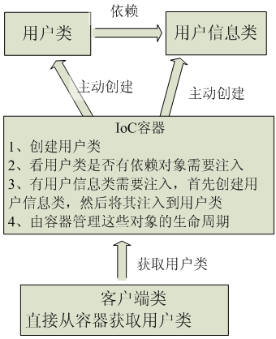

# 面经收集的题

# Java基础

## Java中的基本类型和所占字节数、取值范围
Java中基本类型有**八种**  

* byte：8位，最大存储数据量是255，存放的数据范围是-128~127之间。
* short：16位，最大数据存储量是65536，数据范围是-32768~32767之间。
* int：32位，最大数据存储容量是2^32 - 1，数据范围是 -2^31 ~ 2^31 - 1
* long：64位，最大数据存储容量是2的64次方减1，数据范围为 -2^63 ~ 2^63 - 1
* float：32位，数据范围在3.4e(-45) ~ 1.4e38，直接赋值时必须在数字后加上f或F。
* double：64位，数据范围在4.9e-324~1.8e308，赋值时可以加d或D也可以不加。
* boolean：只有true和false两个取值。
* char：16位，存储Unicode码，用单引号赋值。


## hashcode 和 equals 的关系
### 1. equals 的作用
**判断两个对象相等**。定义在JDK的Object类中，通过判断两个对象的地址是否相等，来区分他们是否相等。即默认的equals()方法等价于 “ == ”。  

String中复写了equals方法用来判断两个字符串内容是否相同。  

### 2.equals与 == 的区别
== : 它的作用是判断两个对象的地址是不是相等。即，判断两个对象是不试同一个对象。  

equals() : 它的作用也是判断两个对象是否相等。但它一般有两种使用情况  

1. 类没有覆盖equals()方法。则通过equals()比较该类的两个对象时，等价于通过“==”比较这两个对象。
2. 类覆盖了equals()方法。一般，我们都覆盖equals()方法来两个对象的内容相等；若它们的内容相等，则返回true(即，认为这两个对象相等)。

### 3. hashCode()的作用
**获取哈希码**，也称散列码。这个哈希码的作用是确定对象在哈希表中的位置。  

hashCode()函数定义在JDK的Object类中，意味着每个Java类都包含这个函数。**然而，hashCode() 在散列表中才有用，在其它情况下没用**  

### 4. hashcode 和 equals 的关系
两种情况：
**1. 第一种情况，不会创建“类对应的散列表”**  

在这种情况下，该类的“hashCode() 和 equals() ”没有半毛钱关系的！

**2. 第二种情况，会创建“类对应的散列表”**  

在这种情况下，该类的“hashCode() 和 equals() ”是有关系的：

	如果两个对象相等，那么它们的hashCode()值一定相同。这里的相等是指，通过equals()比较两个对象时返回true。  
	如果两个对象hashCode()相等，它们并不一定相等。
	在这种情况下。若要判断两个对象是否相等，除了要覆盖equals()之外，也要覆盖hashCode()函数。否则，equals()无效。

## 深拷贝、浅拷贝区别
* 浅拷贝是按位拷贝对象，它会创建一个新对象，这个对象有着原始对象属性值的一份精确拷贝。

如果属性是基本类型，拷贝的就是基本类型的值；**如果属性是内存地址（引用类型），拷贝的就是内存地址 ，因此如果其中一个对象改变了这个地址，就会影响到另一个对象。**

* 深拷贝会拷贝所有的属性,**并拷贝属性指向的动态分配的内存**。当对象和它所引用的对象一起拷贝时即发生深拷贝。深拷贝相比于浅拷贝速度较慢并且花销较大。

## java 异常体系？RuntimeException Exception Error 的区别
  

* Java把异常作为一种类，当做对象来处理。**所有异常类的基类是Throwable类，两大子类分别是Error和Exception**。
* 系统错误由Java虚拟机抛出，用Error类表示。**Error类描述的是内部系统错误**，例如Java虚拟机崩溃。这种情况仅**凭程序自身是无法处理的，在程序中也不会对Error异常进行捕捉和抛出**。
* 异常（Exception）又分为**RuntimeException(运行时异常)和CheckedException(检查时异常)**，两者区别如下：

区别：
1. RuntimeException：程序运行过程中才可能发生的异常。一般为代码的逻辑错误。例如：类型错误转换，数组下标访问越界，空指针异常、找不到指定类等等。
2. CheckedException：编译期间可以检查到的异常，**必须显式的进行处理（捕获或者抛出到上一层）**。例如：IOException, FileNotFoundException等等。

# 集合
## Collection 有什么子接口、有哪些具体的实现
List Set Queue 三个子接口，具体实现有ArrayList、LinkedList、HashSet、PriorityQueue等  

## 讲一下 hashMap 原理。hashMap 可以并发读么？并发写会有什么问题？
可以并发读，不可以并发写。  

并发写会发生链表尾部元素值被覆盖的情况。  

## 讲一下 ConcurrentHashMap 原理。头插法还是尾插法？扩容怎么做？
尾插法。  

ConcurrentHashMap会在以下情况下触发扩容：  

1. 添加新元素后，元素个数达到阈值
2. 调用putAll方法，发现容量不足以容纳所有元素时
3. 某个槽内长度达到8，要变成红黑树之前检查，数组长度不足64时

ConcurrentHashMap统计元素个数：  

内部实例化了一个 CounterCell 的数组来记录元素的个数，每当线程 put 一个元素到容器中，线程会被映射到一个 CounterCell 的一个元素上面采用 CAS 算法进行加 1 操作，当然如果当前 CounterCell 上已经有线程在操作，或者并发量比较小的话会直接将加 1 累加到 BASECOUNT 上面。  

扩容是在有以下步骤：  
1. 通过计算 CPU 核心数和 Map 数组的长度得到每个线程（CPU）要帮助处理多少个桶，并且这里每个线程处理都是平均的。默认每个线程处理 16 个桶。因此，如果长度是 16 的时候，扩容的时候只会有一个线程扩容。
2. 初始化临时变量 nextTable。将其在原有基础上扩容两倍。
3. 每当开始迁移一个槽中的元素的时候，**线程会锁住当前槽中列表的头元素**
4. 假设这时候正好有 get 请求过来会仍旧在旧的列表中访问，如果是插入、修改、删除、合并、compute 等操作时遇到 ForwardingNode，当前线程会加入扩容大军帮忙一起扩容，扩容结束后再做元素的更新操作。

## 堆是怎么存储的，插入是在哪里？
堆在Java中是以数组形式存储的。  

插入在数组最后，即挂载在树的最下面，然后通过一系列上浮操作维持堆的状态  


## 集合在迭代的过程中，插入或删除数据会怎样？
分为三种情况
1. for循环遍历时，插入删除元素都是可以的，但要注意index范围的变化
2. foreach遍历时，会抛出 java.util.ConcurrentModificationException 异常
3. Iterator遍历时直接调用容器的插入删除方法，会抛出 java.util.ConcurrentModificationException 异常，但调用Iterator的remove()方法是可以的

原因是：集合中维持了一个modCount，表示map中的元素被修改了几次(在移除，新加元素时此值都会自增)，而expectedModCount是表示期望的修改次数，在迭代器构造的时候这两个值是相等，如果在遍历过程中这两个值出现了不同，就会抛出ConcurrentModificationException异常。  

# 并发
## 进程和线程的区别
1. **拥有资源**
	进程是**资源分配**的基本单位，但**线程不拥有资源，线程可以访问隶属进程的资源**
2. **调度**
	线程是**独立调度**的基本单位，在同一进程中，线程切换不会引起进程切换，从一个进程中的线程切换到另一个进程中的线程时，会引起进程切换
3. **系统开销**
	创建或撤销进程时，系统都要分配或回收资源，如内存空间、I/O设备等，所付出的开销远大于创建或撤销线程时的开销。
	类似的，在进程切换时，涉及当前执行进程CPU环境的保存和新调度进程CPU环境的设置，开销很大；而线程切换时只需保存和设置少量寄存器内容，开销很小。
4. **通信**
	线程间可以通过**直接读写同一进程中的数据进行通信**；但**进程通信需要借助IPC**
	
## 并行和并发的区别
* 并发:一个处理器同时处理多个任务。  
* 并行:多个处理器或者是多核的处理器同时处理多个不同的任务.

前者是逻辑上的同时发生（simultaneous），而后者是物理上的同时发生．

## 了解协程么
> A coroutine is a function that can suspend its execution (yield) until the given given YieldInstruction finishes.

使用一个 CPU 也可以同时处理多个进程任务，这是一种“伪多线程”的技术。协程不是被操作系统内核所管理，而完全是由程序所控制（也就是**在用户态执行**）。这样带来的好处就是性能得到了很大的提升，**不会像线程那样需要上下文切换来消耗资源，因此协程的开销远远小于线程的开销。**  

协程调用是在一个线程内进行的，是单线程
## 进程间如何通信？进程 A 想读取进程 B 的主存怎么办？线程间通信？
进程间通信：
* 管道：半双工，且只能在有亲缘关系的进程之间使用
* 有名管道：半双工，允许无亲缘关系进程间的通信
* 信号量：是一个计数器，控制多个进程对一个共享变量的访问
* 消息队列：消息队列是由消息的链表，存放在内核中并由消息队列标识符标识
* 共享内存：共享内存就是映射一段能被其他进程所访问的内存，这段共享内存由一个进程创建，但多个进程都可以访问。共享内存是最快的 IPC 方式，它是针对其他进程间通信方式运行效率低而专门设计的。它往往与其他通信机制，如信号量，配合使用，来实现进程间的同步和通信。
* 套接字socket：可用于不同设备间的进程通信

线程间通信：
1. 锁机制：包括互斥锁、条件变量、读写锁
	wait/notify 等待
	Volatile 内存共享
	CountDownLatch 并发工具
	CyclicBarrier 并发工具
2. 信号量机制
3. 信号机制

## 线程的生命周期有哪些状态 怎么转换
线程的生命周期有以下状态：
* 初始 NEW：调用Thread.start()进入运行状态
* 运行 RUNNABLE：调用Object.wait(),Object.join(),LockSupport.park()进入WAITING状态；
调用Thread.sleep(long),Object.wait(long),Thread.join(long),LockSupport.parkNanos(),LockSupport.Until()进入TIME_WAITING状态；等待进入synchronized方法，等待进入synchronized代码块时进入BLOCKED状态
* 等待 WAITING：调用notify()/notifyAll()，LockSupport.unpark(Thread)进入RUNNABLE状态
* 超时等待 TIME_WAITING：调用notify()/notifyAll()，LockSupport.unpark(Thread)进入RUNNABLE状态
* 阻塞 BLOCKED：获取到锁进入RUNNABLE状态
* 终结 TERMINATED：线程执行完成进入TERMINATED状态

  

## wait 和 sleep 有什么区别？什么情况下会用到 sleep？
1. 属于不同的类，wait()方法属于Object，而sleep属于Thread
2. sleep()不会释放锁，wait()会释放锁
3. sleep()任何地方都可以使用，wait()只能在同步代码方法或者同步代码块中使用
4. sleep()必须捕获异常，wait()方法不需要捕获异常
5. **sleep()使线程进入阻塞状态（线程睡眠），wait()方法使线程进入等待队列（线程挂起）**，也就是阻塞类别不同。
6. 它们都可以被interrupt

一般wait()和notify()方法使用于线程间的通信；sleep()方法用于暂停当前线程的执行。  

## 怎么停止线程
1. 使用stop()方法，已被弃用。因为stop()是立即终止，导致**数据有一部分被处理完，一部分没有处理完**，产生不完整的“残疾”数据。  
2. volatile变量作为停止标志位，控制线程停止
3. 使用interrupt()中断的方式，注意使用interrupt()方法中断正在运行中的线程只会修改中断状态位，可以通过isInterrupted()判断。如果使用interrupt()方法中断阻塞中的线程，那么就会抛出InterruptedException异常，可以通过catch捕获异常，然后进行处理后终止线程。有些情况，我们不能判断线程的状态，所以使用interrupt()方法时一定要慎重考虑。


## 怎么控制多个线程按序执行？
1. 使用线程的join方法
2. 使用线程的wait方法
3. 使用线程的线程池方法
4. 使用线程的Condition(条件变量)方法
5. 使用线程的CountDownLatch(倒计数)方法
6. 使用线程的CyclicBarrier(回环栅栏)方法
7. 使用线程的Semaphore(信号量)方法

https://zhuanlan.zhihu.com/p/80787379  

## 锁讲一下锁，有哪些锁，有什么区别，怎么实现的？
https://www.cnblogs.com/qifengshi/p/6831055.html
## 死锁条件
1. 互斥：一个资源只能同时被一个进程使用
2. 占有和等待：已经占有资源的进程可以请求新的资源
3. 不可抢占：已经分配给一个线程的资源不能被其他进程强制性的抢占，只能被占有他的进程显式地释放
4. 环路等待：有两个或者两个以上地进程组成一条环路，环路上每一个进程都在等待上一个进程释放资源


## 讲一下 threadLocal 原理，threadLocal 是存在 jvm 内存哪一块的
ThreadLocal是独立于Thread之外的单独的类，ThreadLocalMap是ThreadLocal的内部类，Thread中有一个全局变量ThreadLocal.ThreadLocalMap。  

Thread中，通过调用ThreadLocal的set()方法创建一个ThreadLocalMap，并附着在Thread上。  

ThreadLocalMap是一个自定义个HashMap，与Map接口没关系。  

# IO
## 讲讲NIO BIO AIO，有什么区别
* BIO（阻塞I/O）：数据的读取写入必须阻塞在一个线程中完成
* NIO（同步非阻塞I/O）：线程轮询数据状态，查看是否准备好了，无需阻塞等待数据到来
* AIO（异步非阻塞I/O）：无需一个线程轮询所有IO操作的状态改变，系统会通知线程来处理

## 讲讲Java NIO
NIO也叫Non-Blocking IO 是同步非阻塞的IO模型。**线程发起io请求后，立即返回（非阻塞io）**。**同步指的是必须等待IO缓冲区内的数据就绪**，而**非阻塞指的是，用户线程不原地等待IO缓冲区**，可以先做一些其他操作，但是要**定时轮询检查IO缓冲区数据是否就绪**。其实是NIO加上IO多路复用技术。IO多路复用模型中，将检查IO数据是否就绪的任务，交给系统级别的select或epoll模型，由系统进行监控，减轻用户线程负担。  

NIO主要有**buffer、channel、selector三种技术的整合**，通过零拷贝的buffer取得数据，每一个客户端通过channel在selector（多路复用器）上进行注册。服务端不断轮询channel来获取客户端的信息。channel上有connect,accept（阻塞）、read（可读）、write(可写)四种状态标识。根据标识来进行后续操作。所以一个服务端可接收无限多的channel。不需要新开一个线程。大大提升了性能。  

NIO重点是把Channel（通道），Buffer（缓冲区），Selector（选择器）三个类之间的关系弄清楚。  

1. Buffer：在NIO中，所有的数据都是用缓冲区处理。这也就本文上面谈到的IO是面向流的，NIO是面向缓冲区的。缓冲区实质是一个数组，通常它是一个字节数组（ByteBuffer），也可以使用其他类的数组。但是一个缓冲区不仅仅是一个数组，缓冲区提供了对数据的结构化访问以及维护读写位置（limit）等信息。
2. Channel：Channel是一个通道，可以通过它读取和写入数据，他就像自来水管一样，网络数据通过Channel读取和写入。
3. Selector：Selector选择器可以监听多个Channel通道感兴趣的事情(read、write、accept(服务端接收)、connect，实现一个线程管理多个Channel，节省线程切换上下文的资源消耗。Selector只能管理非阻塞的通道，FileChannel是阻塞的，无法管理。

# JVM
## JVM 内存区域分布？gc 发生在哪些部分？
JVM分为以下区域：
* 程序计数器：程序控制流的指示器。线程私有
* Java栈：存储Java方法运行时的堆栈，其中堆栈中包括局部变量表，操作数栈，动态链接，方法出入口。局部变量表中有基本数据类型，对象引用，returnAddress。 线程私有
* 本地栈：本地方法的堆栈
* Java堆：存放对象实例。线程共享
* 方法区：在本地内存上的元数据中，存放类型信息，常量，静态变量，临时编译器编译的代码缓存。线程共享
* 运行时常量池：方法区的一部分，存放编译器生成的字面量和符号引用
* 堆外内存：不受JVM管理

GC发生在Java堆和方法区

## GC触发的方式
* Minor GC的触发条件：新生代/Eden区满时触发
* Full GC触发条件：
	1. 程序调用System.gc时可以触发Full GC(会建议JVM进行垃圾回收，不代表一定会进行GC
	2. 老年区空间不足
	3. 方法区空间不足
	4. 通过Minor GC进入老年代的平均大小大于老年代的可用内存
	5. 由Eden区、From Space区向To Space区复制时，对象大小大于To Space可用内存，则把该对象转存到老年代，且老年代的可用内存小于该对象大小


## 介绍一下垃圾回收过程
垃圾回收的过程要确定几个问题：
1. 什么时候开始回收
	看上一题

2. 回收什么
	利用可达性分析 + 三色标记法 + 增量更新/原始快照 确定已经没有用的对象

3. 怎么回收
	标记整理、标记复制、标记清除
	

总体流程：
1. 初始标记，需要STW
2. 并发标记
3. 增量更新，需要STW
4. 并发清除

## 现在使用的什么垃圾回收器？知道哪些？讲讲CMS和G1
JDK1.8默认的是Parallel Scavenge （新生代）+ Serial Old（老年代）  

JDK1.9开始默认的是G1  

IDEA默认的是ParNew （新生代）+ CMS（新生代） + Serial Old（老年代）  

||CMS|G1|
|----|----|----|
|面向区域|新生代|新生代+老年代（没有严格分代概念）|
|算法|标记-清除|全局标记-整理，局部标记-复制|
|并发可达性分析|增量更新|原始快照|
|优化目标|降低STW|停顿时间模型|

## 容器的内存和 JVM 的内存有什么关系？参数怎么配置？
TODOTODO


## 线上有什么 jvm 参数调整？
### 数据区设置
* Xms：初始堆大小
* Xmx：最大堆大小
* Xss：Java每个线程的Stack大小
* XX:NewSize=n：年轻代大小
* XX：NewRatio=n：设置年轻代和年老代的比值。如：为 3，表示年轻代与年老代比值为 1:3，年轻代占整个堆的 1/4。
* XX：SurvivorRatio=n：年轻代中 Eden 区与两个 Survivor 区的比值。注意 Survivor区有两个。如：3，表示 Eden：Survivor=3：2，一个 Survivor 区占整个年轻代的 1/5。
* XX：MaxPermSize=n：设置持久代大小。

### 收集器设置
* XX：+UseSerialGC：设置串行收集器
* XX：+UseParallelGC:：设置并行收集器
* XX：+UseParalledlOldGC：设置并行年老代收集器
* XX：+UseConcMarkSweepGC：设置并发收集器
* XX：+UseG1GC：G1收集器，Java9默认开启，无需设置

### 垃圾回收统计信息
* -XX:+PrintGC
* -XX:+PrintGCDetails
* -XX:+PrintGCTimeStamps
* -Xloggc:filename

## OOM问题排查思路
OOM就是没有内存了，原因无非就是两点：
1. 分配的太少，JVM本身可使用的内存太少
2. 应用用得太多，而且用完没释放，造成内存泄漏

OOM有以下两种：
1. Java堆内存溢出：一般由于内存泄露或者堆的大小设置不当引起。对于内存泄露，需要通过内存监控软件查找程序中的泄露代码，而堆大小可以通过虚拟机参数-Xms,-Xmx等修改。
2. 方法区（Java8元空间）溢出：可以通过更改方法区的大小来解决，使用-XX:PermSize=64m -XX:MaxPermSize=256m的形式修改。另外，过多的常量尤其是字符串也会导致方法区溢出。

### OOM排查手段
一般手段是：先通过内存映像工具对Dump出来的堆转储快照进行分析，重点是确认内存中的对象是否是必要的，也就是要先分清楚到底是出现了内存泄漏还是内存溢出。  

* 如果是内存泄漏，可进一步通过工具**查看泄漏对象到GC Roots的引用链**。这样就能够找到泄漏的对象是通过怎么样的路径与GC Roots相关联的导致垃圾回收机制无法将其回收。掌握了泄漏对象的类信息和GC Roots引用链的信息，就可以比较准确地定位泄漏代码的位置。
* 如果不存在泄漏，那么就是内存中的对象确实必须存活着，那么此时就需要通过虚拟机的堆参数（ -Xmx和-Xms）来**适当调大堆内存**；从**代码上检查是否存在某些对象存活时间过长**、持有时间过长的情况，尝试减少运行时内存的消耗。

jmap -dump:format=b,file= 文件名 [pid] 利用 Jmap dump。打印堆转储快照  

使用性能分析工具对上一步 dump 出来的文件进行分析，工具有 MAT 等。  

## cpu 使用率特别高，怎么排查？通用方法？定位代码？cpu高的原因？
1. 通过 top 命令找到占用cpu最高的 pid[进程id]
2. 通过 top -Hp pid 查看进程中占用cpu过高的 tid[线程id]
3. 使用ps -mp PID -o THREAD,tid,time | sort -rn命令，将该进程下的线程按资源使用情况倒序展示
4. 使用printf "%x\n" PID命令，将PID转为十六进制的TID
5. 使用jstack PID | grep TID -A 100命令，查询堆栈信息
6. 可能是用户线程在做CPU密集的操作，也有可能是GC线程频繁GC

## 频繁 GC 原因？什么时候触发 Full GC？
频繁Minor GC：
1. 堆内存设置太小  

频繁Full GC：
1. 内存泄露
2. 死循环
3. 大对象

大对象是Full GC高发的原因，最常发生的原因是数据库查询出了大对象。比如查询时少了条件，导致直接查出了几万条数据放在内存中，直接溢出。  

触发Full GC：
1. 程序调用**System.gc**时可以触发Full GC(会建议JVM进行垃圾回收，不代表一定会进行GC
2. **老年区**空间不足
3. **方法区**空间不足
4. 通过**Minor GC进入老年代的平均大小大于老年代的可用内存**
5. 由Eden区、From Space区向To Space区复制时，**对象大小大于To Space可用内存**，则把该对象转存到老年代，且老年代的可用内存小于该对象大小


## 怎么获取 dump 文件？怎么分析？
获取dump文件：
1. 使用`ps -ef | grep java`查询服务器上的java应用进程信息，找到应用进程及id
2. jmap -dump:format=b,file=/home/app/dump.out 17740

或者在JVM启动前加参数：  
```
-XX:+HeapDumpBeforeFullGC   
-XX:HeapDumpPath=/httx/logs/dump  
```
也可以获得dump文件   


分析dump文件：  
1. jhat：    jhat 是JDK自带的用于分析JVM Heap Dump文件的工具，使用下面的命令可以将堆文件的分析结果以HTML网页的形式进行展示：
```
jhat <heap-dump-file>
```
之后访问http://localhost:7000/ 即可看到dump文件  

2. MAT/ IDEA JProfiler

## 怎么实现自己的类加载器？
### 为什么要自定义类加载器？
因为系统提供的类加载器功能不足以满足需求。  

比如Tomcat中自定义类加载器为了满足以下需求：

1. 部署在同一个服务器上的两个Web应用程序所使用的Java类库可以实现相互隔离。这是最基本的要求，两个不同的应用程序可能会依赖同一个第三方类库的不同版本，不能要求一个类库在一个服务器中只有一份，服务器应当保证两个应用程序的类库可以互相使用
2. 部署在同一个服务器上的两个Web应用程序所使用的Java类库可以相互共享。这个需求也很常见，比如相同的Spring类库10个应用程序在用不可能分别存放在各个应用程序的隔离目录中
3. 支持热替换，我们知道JSP文件最终要编译成.class文件才能由虚拟机执行，但JSP文件由于其纯文本存储特性，运行时修改的概率远远大于第三方类库或自身.class文件，而且JSP这种网页应用也把修改后无须重启作为一个很大的优势看待

### JDK中的ClassLoader
```
protected synchronized Class<?> loadClass(String name, boolean resolve)
    throws ClassNotFoundException
    {
    // First, check if the class has already been loaded
    Class c = findLoadedClass(name);
    if (c == null) {
        try {
        if (parent != null) {
            c = parent.loadClass(name, false);
        } else {
            c = findBootstrapClass0(name);
        }
        } catch (ClassNotFoundException e) {
            // If still not found, then invoke findClass in order
            // to find the class.
            c = findClass(name);
        }
    }
    if (resolve) {
        resolveClass(c);
    }
    return c;
    }
```

原理很简单：
1. 找.class文件是否被加载过
2. 如果.class文件没有被加载过，找加载器的父加载器。执行父加载器的loadClass方法，一直往上找，直到父加载器为null
3. 父加载器尝试加载，加载成功就返回java.lang.Class，否则就抛出一个ClassNotFoundException，给子加载器去加载
4. 如果加载了这个.class文件，解析resolve一下，解析就是把符号引用替换为直接引用的过程
5. findClass方法里面没有具体实现，是留给开发者重写用的

### 自定义类加载器
* 如果不想打破双亲委派，就重写findClass方法即可。在findClass中，根据全限定类名确定要加载的.class文件，然后读入类文件字节流，然后调用defineClass方法生成对应的Class类型  
* 如果想要打破双亲委派，就重写整个loadClass，不把类加载抛给父加载器

## 类加载过程？
**加载 —— 验证 —— 准备 —— 解析 —— 初始化** 五个过程称为类加载过程  

### 加载
1. 通过类的全限定类名找到.class文件并获取类文件的二进制字节流
2. 将字节流代表的静态存储结构转化为方法区的运行时数据结构
3. 在内存中生成java.lang.Class对象，作为运行时数据结构的访问入口

### 验证
验证Class文件的字节流是否符合《Java虚拟机规范》的要求，保证运行后不会危害虚拟机

### 准备
为类中的静态变量分配内存并设置类变量初始值

### 解析
JVM将方法区中运行时常量池中的符号引用替换为直接引用

### 初始化
执行类构造器\<cinit()\>的过程  

\<cinit()\>由JVM自动收集的类变量赋值动作、静态代码块合并而成，顺序是文件中定义的顺序

## 初始化顺序？
>https://segmentfault.com/a/1190000004527951


对于单个类中，静态变量、静态初始化块、变量、初始化块、构造器，它们的初始化顺序依次是  

**（静态变量、静态初始化块）>（变量、初始化块）> 构造器**  

对于有继承的情况，  

父类--静态变量  

父类--静态初始化块  

子类--静态变量  

子类--静态初始化块  

子类main方法  

父类--变量  

父类--初始化块  

父类--构造器  

子类--变量  

子类--初始化块  

子类--构造器  

**另外，不触发类初始化的情况：**  

1. 通过子类引用父类的静态字段，不会导致子类初始化
2. 通过数组定义来引用类，不会触发此类的初始化
3. 常量在编译阶段会存入调用类的常量池中，本质上没有直接引用到定义常量的类，因此不会触发定义常量的类的初始化。

# Spring
## Spring介绍一下
Spring是一个轻量级的容器，提供了IoC容器和非侵入式的框架，提供了AOP的实现方式，提供对持久层、事务的支持，提供MVC Web框架的实现，并对常用的API提供一致封装，另外还提供对各种框架的整合方案

## 讲一下 IoC、AOP
### IoC是什么
IoC，即控制反转，是一种设计思想。在Spring中，IoC意味着将你设计好的对象交给容器控制，而不是传统的在你的应用中对对象直接控制。

* **谁控制谁，控制什么**：传统Java SE程序设计，我们直接在对象内部通过new进行创建对象，是程序主动去创建依赖对象；而IoC是有专门一个容器来创建这些对象，即由Ioc容器来控制对 象的创建；**谁控制谁？当然是IoC 容器控制了对象；控制什么？那就是主要控制了外部资源获取（不只是对象包括比如文件等）**。  
* **为何叫反转？哪些方面反转了？**：有反转就有正转。传统应用程序是由我们自己在对象中主动控制去直接获取依赖对象，也就是正转；而反转则是由容器来帮忙创建及注入依赖对象；为何是反转？**因为由容器帮我们查找及注入依赖对象，对象只是被动的接受依赖对象，所以是反转；哪些方面反转了？依赖对象的获取被反转了**。


传统程序设计如图2-1，都是主动去创建相关对象然后再组合起来：  

  

当有了IoC/DI的容器后，在客户端类中不再主动去创建这些对象了，如图2-2所示:

  

### IoC能做什么
**IoC指导我们如何设计出松耦合、更优良的程序**  
### IoC和DI
**DI - 依赖注入，组件之间依赖关系由容器在运行期决定，即由容器动态的将某个依赖关系注入到组件之中**。**依赖注入的目的并非为软件系统带来更多功能，而是为了提升组件重用的频率，并为系统搭建一个灵活、可扩展的平台**。通过依赖注入机制，我们只需要通过简单的配置，而无需任何代码就可指定目标需要的资源，完成自身的业务逻辑，而不需要关心具体的资源来自何处，由谁实现。  

* **谁依赖谁**：应用程序依赖IoC容器中的资源
* **为什么需要依赖**：应用程序需要IoC容器来提供对象需要的外部资源
* **谁注入谁**：IoC容器注入应用程序某个对象，应用程序依赖的对象
* **注入了什么**：就是注入某个对象所需要的外部资源（包括对象、资源、常量数据）

IoC和DI是什么关系呢？  

https://www.cnblogs.com/xdp-gacl/p/4249939.html  
https://juejin.cn/post/6844903664788717576  


## ioc 怎么防止循环依赖
## aop 的实现原理、动态代理过程
## tomcat 与 spring、controller 的关系
## spring boot starter 自加载是怎么实现的？在生命周期哪个阶段？
## Spring 处理请求的过程？


https://www.jianshu.com/p/dde956b8c150
