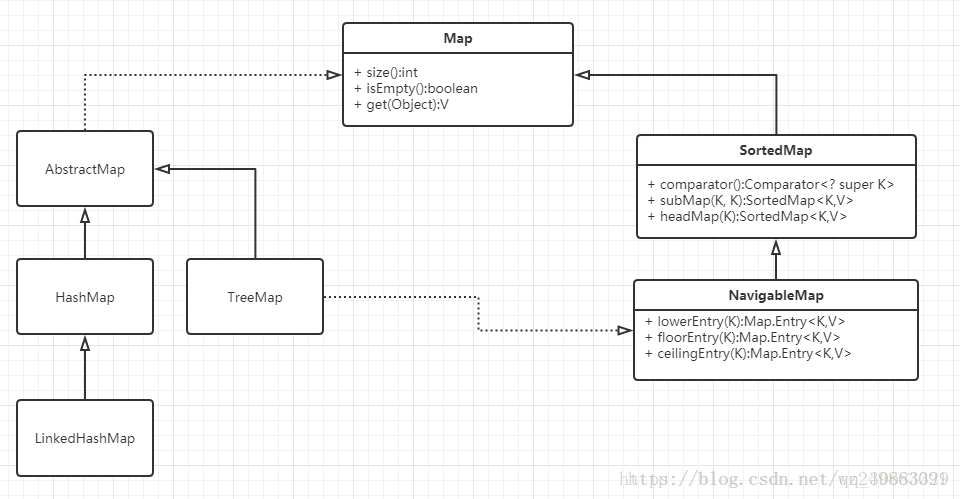

# 集合框架

## 概述
  

Java集合主要由两大接口派生：**Collection**和**Map**  

Collection存放单一元素  

Map存放Key-Value键值对  

## Collection
Collection中的API无非四种:增删改查，其中没有改，实际就是增删改，另外还有其他API，包括isEmpty()/size()/toArray()  

### List
List最大的特点就是**有序，可重复**。List的实现有ArrayList、LinkedList、Vector三种，其中Vector已经不推荐使用。  
|功能|方法|ArrayList|LinkedList|
|----|----|----|----|
|增|add(E e)|O(1)|O(1)|
|增|add(int index, E e)|O(n)|O(n)|
|删|remove(int index)|O(n)|O(n)|
|删|remove(E e)|O(n)|O(n)|
|改|set(int index, E e)|O(1)|O(n)|
|查|get(int index)|O(1)|O(n)|
ArrayList是用数组实现的，**可以随机访问**，可以用O(1)的复杂度拿到任何位置的数，而链表做不到，只能从头开始遍历。所以在改和查这两个操作，ArrayList更快。  

* 改、查操作多选ArrayList
* 增删在尾部选ArrayList
* 其他情况下，如果时间复杂度一样，优先使用ArrayList，因为overhead更小，内存使用更有效率

* Vector
	数组实现，线程安全。但已经被弃用，弃用的原因就是加了太多synchronized，效率低！
	另外和ArrayList的另外一个区别就是，ArrayList扩容时扩为原本的1.5倍；而Vector扩容时扩为原本的2倍  
* Stack继承自Vector，那自然也不推荐使用了。如果要实现Stack的语义，就使用**ArrayDeque**吧！

### Queue Deque

队列一般都是先进先出FIFO，但有个例外，就是PriorityQueue，也叫heap，并不按照进去的顺序出来，而是按照规定的优先级排序出来，并且它操作不是O(1)的。  

Queue有两组API，功能基本一样，区别在于越界等情况会不会抛异常。  

|功能|抛异常|返回值|
|----|----|----|
|增|add(e)|offer(e)|
|删|remove()|poll()|
|查|element()|peek()|
方法都是O(1)
#### Deque
Double End Queue的缩写，双端队列，两端都可以进出，则有两端API，每一端都有两组，一组抛异常，一组返回特殊值。  

它们的实现类有三个：LinkedList、ArrayDeque、PriorityQueue
* 如果想实现【普通队列-先进先出】就是用LinkedList或者ArrayDeque
* 如果想实现【优先队列】就使用PriorityQueue
* 如果想实现【栈】的语义，就使用ArrayDeque

ArrayList和LinkedList性能对比：
* 头部插入：LinkedList快于ArrayList
* 中间插入：ArrayList快于LinkedList。明明链表插入不需要复制，而数组中间插入需要复制，为什么链表却比数组慢呢？这是因为：**LinkedList在中段插入时，需要先判断插入位置离哪一端更近，然后从这端开始遍历找到插入位置，就有了一个for循环；而ArrayList需要遍历调用Native的数组复制操作，也是一个C语言的遍历for循环，这两个for循环C语言的更快**  
* 尾部插入：ArrayList略快一点点，因为LinkedList有额外的new Node和变换指针的开销。  

ArrayDeque和LinkedList性能对比：
* ArrayDeque使用数组实现的循环队列，https://www.cnblogs.com/wxd0108/p/7366234.html ，ArrayDeque在大多数情况下的增删改查都比LinkedList要快，除了一种情况，就是在遍历LinkedList的过程中，删除掉遍历到的这个元素。  
* 因为循环队列，所以ArrayDeque在头尾操作都比LinkedList要快。  
* ArrayDeque不能存放null，而LinkedList可以
* 什么使用LinkedList？Java6之前，还没有ArrayDeque

### Set
Set的特点和List相反，无序，不重复。  

Set常用的实现类有三个：

* HashSet：采用HashMap的Key来存数据，无序，基本操作都是O(1)
* LinkedHashSet：HashSet + LinkedList的结，既拥有了O(1)的复杂度，又保留了插入的顺序
* TreeSet：红黑树，有序，可以用自然顺序或者自定义比较器，但查询速度没有HashSet快。

每个Set底层其实都是对应的Map，Key上放了值，Value上放了一个PRESENT，是一个静态的Object用来占位。

## Map
  
Map独立于Collection之外，常用的实现类有HashMap、HashTable、TreeMap、ConcurrentHashMap、LinkedHashMap、weakHashMap

### HashMap
采用位桶和链表/红黑树存储，线程不安全。

### Hashtable
**线程安全，各个方法上添加了synchronize关键字**。但是现在已经不再推荐使用HashTable了，因为现在有了ConcurrentHashMap这个专门用于多线程场景下的map实现类，其大大优化了多线程下的性能。  

### ConcurrentHashMap
jdk1.8之前采用分段锁，1.8开始采用CAS + syncronized

### TreeMap
红黑树组织的Map，查找O(logN)，节点有序。按照Key的顺序

### LinkedHashMap
有序的Map，按照插入顺序

### weakHashMap
弱键，Key和Value都可以是null，而且其Map中如果这个Key值指向的对象没被使用，此时触发了GC，该对象就会被回收掉的。其原理主要是使用的WeakReference和ReferenceQueue实现的，其key就是weakReference，而ReferenceQueue中保存了被回收的 Key-Value。  

## 源码中的重点
### ArrayList
* ArrayList可以在初始化时指定长度，如果不指定，采用无参构造函数，**默认初始化一个空数组，等add时才分配默认 10** 的初始容量。
* 数组扩容，当数组满时会重新定义一个**原长度1.5倍**长度的新数组，并将源数据复制到新数组中。 
* 初始化时可以指定长度，但不会初始化数组。如果新定义的ArrayList，直接set(5,1)，会抛出IndexOutOfBoundsException  
* ArrayList插入数据和删除数据都会大量复制，所以效率比较低。  
* ArrayList不是线程安全的，Vector是线程安全的，但效率低。如果需要线程安全的数组，也可以用Collections.synchronizedList把一个普通ArrayList包装成一个线程安全版本的数组容器，原理和Vector一样，都是给所有方法套上Syncronized  
* ArrayList不适合做队列，但数组实现为循环数组的话，是适合做队列的（ArrayBlockingQueue）

### LinkedList
* 双向链表结构存储数据，适合数据的动态插入和删除。  
* 随机访问和顺序访问速度较慢  
* 可以当作栈、队列、双向链表使用

### PriorityQueue
* 堆/优先级队列，按照优先级来排序，优先级高的在堆顶。  
* PriorityQueue是用二叉堆实现的，其底层是**数组实现的二叉堆**
* 当前节点为x，那么parent index = (x - 1) / 2，left child index = 2 * x  + 1，right child index = 2 * x + 2
* 时间复杂度：增O(logN)；删O(logN)；查O(1)；heapify() O(n)

### HashMap
* **数组 + 链表 + 红黑树**组合而成，数组中保存Key-Value实例Node。  
* **扩容负载因子0.75f**，即总容量100，存第76个的时候扩容。取值0.75的目的是，**达到空间复杂度和查询复杂度的平衡**
* 扩容分为两步：1.创建一个新数组，长度是原来的2倍 2.Rehash。Rehash的原因是哈希随长度变化 index = HashCode（Key） & （Length - 1）
* 哈希冲突用**拉链法解决，尾插法**。JDK8之前是头插法，resize时会改变链表的顺序，多线程put时可能会产生环形链表（https://coolshell.cn/articles/9606.html）。尾插法在多线程下不会产生环形链表，但可能会产生数据覆盖。  
* 产生循环链表死循环的原因简单来说就是：两个线程A,B，A在put时，发现数组需要扩容，则执行resize。当resize了一半时，此时一个指针e指向链表中的一个元素，next指向下一个元素。此时B也过来put，发现数组需要扩容，也执行resize，因为头插法，让e先插入，next后插入了，导致next的下一个元素变成了e。这时候A恢复执行，e的下一个是next，next的下一个是e，形成循环链表。
* **数组初始大小是16**，是位运算出来的，效率比较高。  
* index计算采用h&(length - 1)，用&代替模主要是性能比较快，能代替的前提是初始大小是2^n，而取初始值16是因为经验，不大不小。
* 重写equals时也要重写hashCode方法。原本的equals方法比较**两个对象的内存地址**，对象不同内存地址肯定不同。HashMap是通过key的hashCode去寻找index的，index一样就形成了链表。如果我们此时有两个Key index相同，形成了链表，在get时怎么区分他们呢？通过equals方法，重写此方法建议一定要对hashCode方法重写，**以保证相同的对象返回相同的hash值，不同的对象返回不同的hash值**。不然形成了链表，没办法区别两个Key不同但HashCode相同的键。  
* HashMap使用&位运算代替取模，提高了效率，但可能会发生冲突。位为此HashMap对Key的HashCode进行**扰动计算**，防止不同hashCode的高位不同但低位相同导致的hash冲突。**简单点说，就是为了把高位的特征和低位的特征组合起来，降低哈希冲突的概率，也就是说，尽量做到任何一位的变化都能对最终得到的结果产生影响。**  
* 为什么转红黑树的分界是8？**泊松分布**，在负载因子默认为0.75的时候，**单个hash槽内元素个数为8的概率小于百万分之一**，所以将7作为一个分水岭，等于7的时候不转换，大于等于8的时候才进行转换，小于等于6的时候就化为链表。

### Hashtable
* 线程安全，每个操作都上锁。
* HashTable不允许Key或者Value为null，而HashMap是允许的。这是因为Hashtable使用了安全失败机制（fail-safe），这种机制会使你此次读到的数据不一定是最新的数据。而并发访问时，就会使得其无法判断对应的key是不存在还是一开始put的时候就为空。
* HashMap是fail-fast的，而Hashtabl是fail-safe的

#### fail-fast和fail-safe
* 快速失败（fail—fast）是java集合中的一种机制， 在用迭代器遍历一个集合对象时，如果遍历过程中对集合对象的内容进行了修改（增加、删除、修改），则会抛出Concurrent Modification Exception。  

  原理是：迭代器在遍历时直接访问集合中的内容，并且在遍历过程中使用一个 modCount 变量。集合在被遍历期间如果内容发生变化，就会改变modCount的值。每当迭代器使用hashNext()/next()遍历下一个元素之前，都会**检测modCount变量是否为expectedmodCount值，是的话就返回遍历；否则抛出异常，终止遍历。**  

* 安全失败（fail—safe）是java.util.concurrent包下的容器使用的机制，允许多线程下并发访问并发修改。

### ConcurrentHashMap
1.7中，采用Segment， Segment继承了ReentrantLock，分段加锁。数据加volatile保证可见性  

1.8中采用 **CAS + Synchronized**，同时数据加volatile。

* ConcurrentHashMap在进行put时，先计算出hashcode，然后当前位置如果为空则CAS插入，失败则自旋保证成功；如果当前位置`hashcode == MOVED == -1`，则需要进行扩容；如果数组位置有元素且不需要扩容，则synchronized加锁写入数据。
* get时，不需要加锁。

#### ConcurrentHashMap的并发扩容

首先每个线程承担**不小于 16 个槽**中的元素的扩容，然后从右向左划分 16 个槽给当前线程去迁移，每当开始迁移一个槽中的元素的时候，线程会锁住当前槽中列表的头元素。假设这时候正好有 **get 请求过来会仍旧在旧的列表中访问，如果是插入、修改、删除、合并、compute 等操作时遇到 ForwardingNode，当前线程会加入扩容大军帮忙一起扩容**，扩容结束后再做元素的更新操作。

### TreeMap
* TreeMap是由**红黑树**实现的，实现了有序Map。
* 查找、插入、删除在最坏情况下的复杂度都是O(lgN)
* TreeSet是TreeMap实现的

## 参考
https://mp.weixin.qq.com/s/bVOSat47L0Hskfx9akAN6Q  

三太子敖丙  