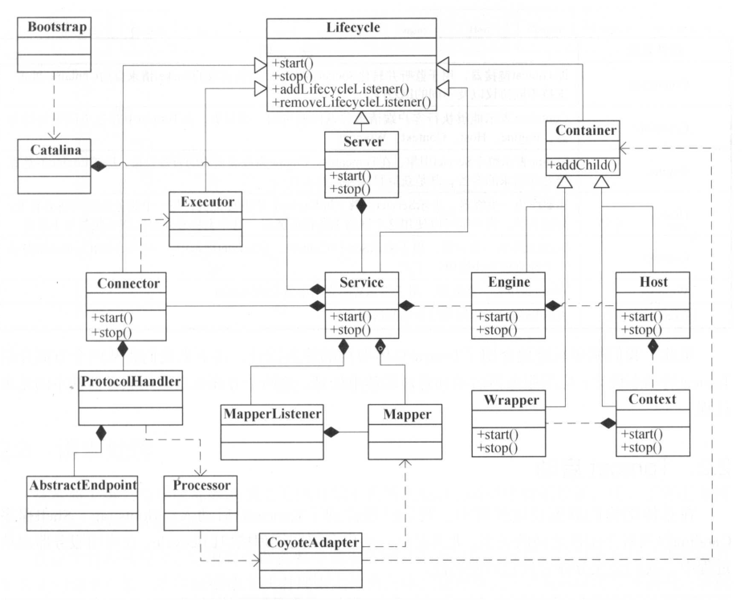
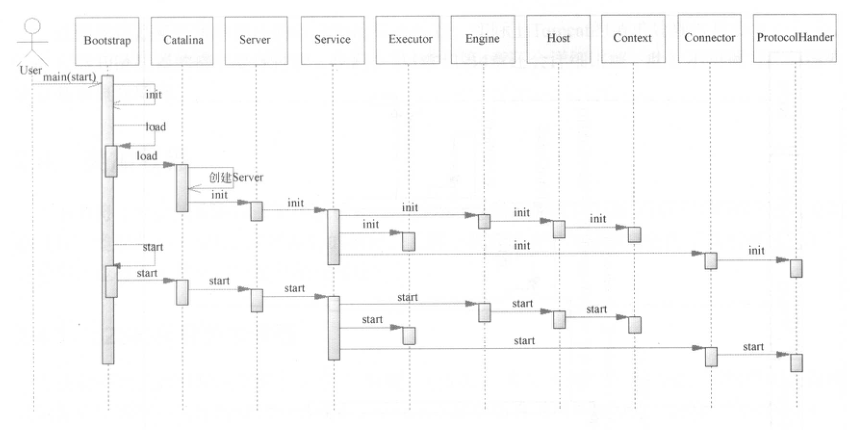

# Tomcat概要
> 《How Tomcat Works》 《深入剖析Tomcat》 《Tomcat架构解析》  
> Tomcat是Apache开源的Web服务器，其以Catalina作为Servlet容器，采用Pipeline作为服务的连续触发，Lifecycle管理所有组件的生命周期。  

对Tomcat的运行机制很感兴趣，凭着新手的理解，结合上面的书籍浅读了一下Tomcat源码下面进行一些个人理解的总结。  
基于Tomcat8.5.57源码
# Tocmat中的一些知识点
## Tomcat架构的简单描述
  要理解Tomcat，就要理解Http，一次Http请求的过程中发生了什么，将要发生什么，可能会发生什么。    
  跟着上面那张图，把Tomcat的基本架构理顺一下。首先，一个简单的服务器可以被描述为Server，它有启动和停止命令，能够使用Socket监听端口；我们的服务器需要处理连接和处理请求，将它们解耦，我们有了Connector和Container，其中Connector负责开启Socket并监听客户端请求、返回响应数据；Container负责处理请求。  
  在上面的模式中，如果我们需要让他们形成工作流，一个Server是无法管理多个Connector和Container的对应的，所以多了一层Service，用来管理多个Connector和一个Container的对应，而Server管理多个Service。
  接下来把Container命名为Engine，表示整个Servlet引擎。  
  一个Engine下面可以有多个应用，一个应用为一个Context实际上对应的就是一个Web Application，我们可以在配置文件中修改端口配置多个Context，也就实现了一个Tomcat中运行多个项目的目的。  
  Host代表一个虚拟域名，内部嵌套Context。  
  一个Wrapper对应一个Servlet，Context中有多个Wrapper。  
  我们再次提起Container，这里以上提到的Engine，Host，Context，Wrapper均继承自Container。  
  再抽象一层，我们需要管理所有组件，包括Server和Service的生命周期，我们就让所有的组件都实现一个管理生命周期的接口，称之为LifeCycle。  
  从Engine到Host，再到Context，再到Wrapper，都维护了一个Pipeline，有基础Valve，其层级之间通过PipeLline连接，并可以通过Valve对请求处理进行扩展（比如密码校验等）。这里叫做责任链模式。  
  接下来我们再看Connector的设计，连接器完成的任务有  
    1，监听端口，读取请求  
    2，将请求数据按照指定协议解析  
    3，根据请求地址匹配正确的容器进行处理  
    4，容器处理完成后，将响应返回客户端  
  从这里我们可以看到，连接其需要判断不同的协议，还要选择不同的容器。这里Tomcat对其进行了解耦，设计了Endpoint作为IO，监听请求；Processor按照请求地址映射到容器进行处理（Mapper）。Tomcat通过适配器模式实现了Connector与Mapper、Container的解耦，默认为CoyoteAdapter。  
  为了解决并发问题，Tomcat设计了Executor作为可在组件间共享的线程池，实现了Lifecycle，可按照通用组件进行管理。Executor由Service维护，所以共享范围为同一个Service。  
  到这里Tomcat的基本结构就大概了解了。  

## Tomcat初始化流程  

  Tomcat的主类在Bootstrap，初始化后进入Catalina类，在Catalina的load方法中的digester.parse(inputSource)中解析了配置文件，并初始化了Service（包括初始化了Connector、Endpoint等）。  
  注意，各种组件的初始化都是由从Lifecycle继承来的initInternal方法在做，且都要在函数中调用super.initInterval()(实际上是LifecycleMBeanBase类中的此方法)，用来注册Bean。在Catalina中getServer并初始化和启动了它。这里StandardServer主要用来监听Stop命令，真正的请求监听还是Endpoint在做。  

## 一次请求是如何被接收、处理、返回的，流程如何

## 如何处理并发请求的  
  Tomcat处理并发的手段是通过线程池。  
  各种组件被初始化之后,Lifecycle同样链式的调用了每个组件的startInternal()方法，其中包括Connector的，其中调用了protocalHandler的start方法，protocalHandler接口的实现类的start()被调用，并在其中调用了endpoint.start()方法，其中再调用了startIntenal方法，其实现类NioEndpoint在其startInternal()方法中实例化了一个东西叫Poller，这个东西看名字的意思，就知道他是从队列里面拉东西出来的。
  我们可以看到，Endpoint有三个实现类，分别是Apr，Nio（默认的），Nio2
    他们的区别是Apr是从操作系统级别解决异步IO；
    Nio是利用了Java的NIO实现非阻塞IO
    Nio2利用代码实现
> https://www.javadoop.com/post/tomcat-nio
> https://juejin.im/post/6844903874122383374
> 这两篇文章讲endpoint的细节讲的比较多，直接看文章+源码即可，这里重点说Poller。

  我们可以看到Poller是NioEndpoint的内部类，其实现了Runnable接口。在endpoint的startinternal方法中，有这么一段。
  
  我们可以看到初始化了一个pollers数组，这里默认长度是2，然后为每个poller启动了一个单独的线程并开启。
  然后下面进入startAcceptorThreads方法，开启Acceptor。Poller是选择器，Acceptor是接收器。接收器不断接收请求，丢入Channel，channel和Poller绑定，Poller不断轮询里面有没有事件。这里应该知道了Poller要做的事情就是衔接请求接收和请求处理两个步骤，实际上poller会将channel中读出的字节流包装为NioSocketWrapper最终在processSocket中注册给Executor（线程池的接口），再丢给protocalProcessor解析，最后流转给Servlet。
  为什么这么设计？因为Acceptor只处理接受请求，接收到之后，要赶紧把他丢进Channel回头再去接收新的请求，同时生成新的SocketChannel，与下一个空闲的Poller register，再有新的Poller。由Poller接手下面的工作，这样不仅可以解耦，也可以让每个组件的工作更加专注，分离，效率更高。

(Poller这段代码其实没太看懂，消息过来之后怎么包装的，怎么往下传的。后面有时间了再回来debug这段仔细研究一下吧。)

## Servlet的原理、加载机制

  Servet的生命周期一直是一个重点，然而单纯的背知识点是没有有意义的。接下来从源码角度来看Servlet到底是什么，其生命周期有哪几个阶段，分别是什么时间开始和结束的。
  1，我们前面讲到，Poller接手了Acceptor丢过来的Channel，封装成NioSocketWrapper，在内部类SocketProcessohttr的doRun方法中调用state = getHandler().process，一路调用process下去，最终调用service方法交给Http11Processor解析，并包装Request、Response对象，再调用service方法，在service方法中将request和response对象交给Adaptor.service()。
  Adaptor这里，就是Servlet的入口点了。Adaptor的service()方法中，可以看到有一行connector.getService().getContainer().getPipeline().getFirst().invoke(request, response);这里的getContainer实际上get到的是Engine。从这里开始，开始进入了我们前面说的流水线Pipeline，顺序调用Engine，Context，Wrapper的invoke方法，将request和response一直往后传，期间经过了Filter等。
  一直到StandardWrapperValve的invoke方法，这里初始化了Servlet，方法是通过wrapper.allocate()。同时，在StandardWrapperValve的invoke方法中，利用servlet实例化了FilterChain，还将request和response封装成了ServletRequest和ServletResponse，并调用了doFilter(ServletRequest, ServletResponse)，使得可以继续往下流转。
  最终，在doFilter方法中，将设置的Filter全部都流转过一遍之后，进入了servlet.service(request, response);
  以上Servlet的初始化时机、调用时机的源码解析就讲完了。总结一下的话，就是当该Servlet被调用时，请求进入Tomcat，流转到WrapperValve的invoke方法调用中，调用了wrapper.allocate()方法实例化了Servlet。其实Servlet还可以配置成Tomcat开启时直接初始化，但是这样比较耗费内存。同时我们上面还讲到了Servlet是什么时候开始service的，总结来说就是Filter流转完之后直接流转进入Servlet。
  另外的，servlet的init方法也是在wrapper.allocate()中被调用的。关于这个allocate方法，需要注意的一点是，wrapper实际上维护了一个Stack中存放了Servlet，如果Tomcat开启的不是singleThreadModel的话，需要Servlet时都会先到pool中找。如果不够了，每次实例化Servlet，用完之后都会被回收进这个栈（名字叫instancePool），当然，有个最大限制，如果Servlet实例过多，新来的请求就只能等待了。
  这里提到了singleThreadModel，如果开启了单线程模式，每次请求都会来进入这一个instance，它不会被回收，会重复利用。
  2，接下来我们来看Servlet运转完之后，是什么时候开始销毁的。
  Servlet的销毁方法的调用是从StandardWrapperValve的invoke方法中开始的，具体来说是在dofilter被调用，并返回之后，进入其finally代码块，首先release了filterChain，然后调用了wrapper.deallocate(servlet)方法。从名字也看得出，和allocate方法是相反作用。
  deallocate方法就是做了上面我们提到的将Servlet回收进Pool的动作。
  至于销毁的话，实际上这里关于这个请求的Servlet其实就已经被回收了，如果以destory方法被调用作为销毁的话，实际上是在servlet超时（Long.MAX_VALUE）或者Tomcat被关闭时。因为Servlet是单例的，这里涉及到了单例模式。

## Session和Cookie是怎么生成、使用、存储的

  Session和Cookie作为后端维持会话信息的工具，是由后端生成，保存在后端的，返回给前端的。前端每次请求时带上Cookie，后端即认证这个用户。

  Session在后端R

## 过滤器Filter是如何加载的
## 热加载
## Tomcat中的设计模式
## NIO AIO BIO
## 