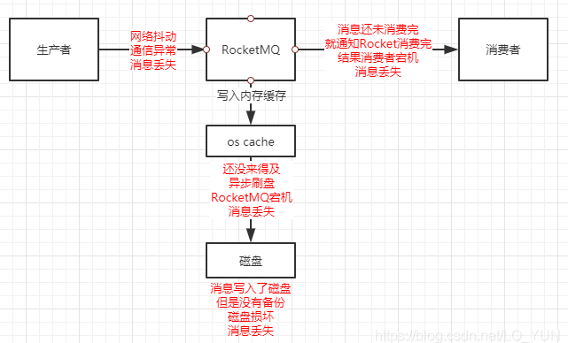

# RocketMQ

## 架构组成

###  NameServer

负责管理元数据，充当路由消息的提供者，包括对**Topic和路由信息**的管理。其角色类似Dubbo中的Zookeeper，但更轻量，NameServer平时主要开销是**维持心跳和提供Topic-Broker的关系数据**。集群相互之间无通信，伪集群

### Broker

消息中转角色，负责**存储消息，转发消息**。  

* Broker是具体提供业务的服务器，**单个Broker节点与所有的NameServer节点保持长连接及心跳，并会定时将Topic信息注册到NameServer**，顺带一提底层的通信和连接都是**基于Netty实现**的。  
* Broker负责**消息存储**，以Topic为维度支持轻量级的队列，单机可以支撑**上万队列**规模，支持**消息推拉模型**。  
* 具有上亿级消息堆积能力，同时可严格保证消息的有序性。  

### Producer

消息生产者，负责产生消息，一般由业务系统负责。  

* Producer由用户进行分布式部署，消息由Producer通过多种负载均衡模式发送到Broker集群，发送低延时，支持快速失败。  
* RocketMQ 提供了三种方式发送消息：**同步、异步和单向**
  * 同步发送：同步发送指消息发送方发出数据后会在收到接收方发回响应之后才发下一个数据包。一般用于重要通知消息，例如重要通知邮件、营销短信。
  * 异步发送指发送方发出数据后，不等接收方发回响应，接着发送下个数据包，一般用于可能链路耗时较长而对响应时间敏感的业务场景，例如用户视频上传后通知启动转码服务。
  * 单向发送是指只负责发送消息而不等待服务器回应且没有回调函数触发，适用于某些耗时非常短但对可靠性要求并不高的场景，例如日志收集。

### Consumer

消息消费者，负责消费消息，一般是后台系统负责异步消费。  

* Consumer也由用户部署，支持**PUSH和PULL两种消费模式**，支持集群消费和广播消息，提供实时的消息订阅机制。
* **Pull**：拉取型消费者（Pull Consumer）**主动从消息服务器拉取信息**，只要批量拉取到消息，用户应用就会启动消费过程，所以 Pull 称为主动消费型。  
* **Push**：推送型消费者（Push Consumer）封装了消息的拉取、消费进度和其他的内部维护工作，将消息到达时执行的回调接口留给用户应用程序来实现。所以 Push 称为被动消费类型，但**从实现上看还是从消息服务器中拉取消息**，不同于 Pull 的是 **Push 首先要注册消费监听器，当监听器处触发后才开始消费消息。**  

## 领域模型

### Message

要传输的信息。一条Message必须有一个Topic，也可以拥有一个可选的Tag和额外的键值对，它们可以用于设置一个业务Key并在Broker上查找此消息以便在开发期间查找问题。  

### Topic

Topic可以看作消息的归类，它是消息的第一级类型。比如一个电商系统可以分为：交易消息、物流消息等，一条消息必须有一个 Topic 。一个Topic下面有多个Message Queue，默认是4个。

### Tag

Tag可以看作子主题，消息的第二级类型，用于为用户提供额外的灵活性。*使用标签，同一业务模块不同目的的消息就可以用相同 Topic 而不同的 Tag 来标识。*  

标签有助于保持您的代码干净和连贯，并且还可以为 RocketMQ 提供的查询系统提供帮助。

### Group

分组，一个组可以订阅多个Topic。  

一般有生产者组（Producer Group）和消费者组（Consumer Group）。  

* 生产者组（Producer Group）：同一类Producer的集合，这类Producer发送同一类消息且发送逻辑一致。如果发送的是事务消息且原始生产者在发送之后崩溃，则Broker服务器会联系同一生产者组的其他生产者实例以提交或回溯消费。
* 消费者组（Consumer Group）：同一类Consumer的集合，这类Consumer通常消费同一类消息且消费逻辑一致。消费者组使得在消息消费方面，实现负载均衡和容错的目标变得非常容易。要注意的是，消费者组的消费者实例必须订阅完全相同的Topic。RocketMQ 支持两种消息模式：集群消费（Clustering）和广播消费（Broadcasting）。

### Queue

每个Queue内部有序，在RocketMQ中分为读和写两种队列，一般来说读写队列数量一致。

### Message Queue

消息队列，Topic被划分为一个或多个子主题，即消息队列。  

* 一个 Topic 下可以设置多个消息队列，发送消息时执行该消息的 Topic ，RocketMQ 默认会轮询该 Topic 下的所有队列将消息发出去。  
* 消息的物理管理单位。一个Topic下可以有多个Queue，Queue的引入使得消息的存储可以分布式集群化，具有了水平扩展能力。  

### Offset

在RocketMQ中，所有的消息队列都是持久化，长度无限的数据结构。  

队列中每个存储单元定长，访问其存储单元使用Offset，Offset为java long类型，64位，理论上100年不会溢出，所以认为长度无限。  

也可以认为Message Queue是一个长度无限的数组，Offset就是下标。  

## 消息存储


### 消息存储架构和文件  

1. CommitLog：**消息主体以及元数据的存储主体，存储Producer端写入的消息主体内容，消息内容不是定长的**。单个文件大小默认1G，文件名长度20位，左边补零，剩下的是起始偏移量，如：00000000001073741824，起始偏移量为1073741824。**消息主要是顺序写入日志文件，当文件满了则写入下一个文件**

2. ConsumeQueue：**消息消费队列，引入目的是提高消息消费的性能，因为RocketMQ基于Topic的订阅模式，如果要遍历commitLog文件，根据topic检索信息非常低效。ConsumeQueue作为消费消息的索引，保存了指定Topic下的队列消息在CommitLog中的起始物理偏移量offset。Consumer可以根据ConsumeQueue来快速查找待消费的消息。**

   consumequeue文件夹的组织方式如下：topic/queue/file三层组织结构，具体存储路径为：`$HOME/store/consumequeue/{topic}/{queueId}/{fileName}`。

3. IndexFile：**索引文件提供了一种通过Key或者时间区间来查询消息的方式**。Index文件的存储位置是：`$HOME \store\index${fileName}`，文件名是创建时的时间戳。**IndexFile底层存储是文件系统中实现HashMap结构，故RocketMQ的索引文件底层是Hash索引。**

RocketMQ采用混合型存储结构，**Broker单个实例下，所有队列共用一个日志数据文件（CommitLog）来存储**，针对Producer和Consumer分别采用了数据和索引分离的存储结构。  

**Producer发送消息到Broker，Broker端使用同步或者异步方式对消息进行刷盘持久化，保存在CommitLog中。只要消息被刷盘，就不会丢失。也正因如此，Consumer就肯定有机会消费这条消息。**  

服务端也支持长轮询模式，如果一个消息拉取请求未拉到消息，Broker允许等待30s的时间，只要这段时间有消息到达，将直接返回给消费端。后台用服务线程分发并异步构建ConsumeQueue和IndexFile。

### 页缓存和内存映射

页缓存（PageCache）是OS对文件的缓存，用于加速文件读写。  

一般来说，操作系统会将一部分内存用作PageCache，对文件的读写操作进行了性能优化，使文件**顺序**读写速度接近于内存。  

* 对于数据写入，OS会先写入Cache，随后**异步**由pdflush内核线程将数据刷盘。
* 对于数据读取，**如果一次读取未命中PageCache，则OS从物理磁盘上访问读取文件的同时，会顺序对其他相邻的数据文件进行预读取**。

#### 读

在RocketMQ中，ConsumeQueue存储的数据较少，并且**顺序读取，在PageCache的预读取作用下，ConsumeQueue文件的读性能几乎接近读内存**，即使消息堆积也不影响性能。  

而对于CommitLog来说，独取消息内容会产生较多随机访问，严重影响性能。则如果选择**合适的系统IO调度算法，比如Deadline，也会提高消息消费的性能**  

#### 写

RocketMQ主要通过MappedByteBuffer对文件进行读写，利用了NIO的FileChannel模型将磁盘上的物理文件直接映射到用户态的内存地址中（**零拷贝mmap的方式减少了传统IO在内核地址空间的缓冲区和用户应用程序地址空间的缓冲区之间来回拷贝的性能开销**），将对文件的操作转化为直接对内存的操作，极大提高文件的读写效率。**RocketMQ文件采用定长结构的原因，就是需要用内存映射机制，方便将文件整个一次映射到用户内存**  

### 消息刷盘

1. 同步刷盘：**只有在消息真正持久化至磁盘后RocketMQ的Broker端才会真正返回给Producer端一个成功的ACK响应**。同步刷盘对MQ消息**可靠性**来说是一种不错的保障，但是性能上会有较大影响，一般适用于**金融业务**应用该模式较多。
2. 异步刷盘：能够充分利用OS的PageCache的优势，**只要消息写入PageCache即可将成功的ACK返回给Producer端**。消息刷盘采用**后台异步线程提交**的方式进行，降低了读写延迟，提高了MQ的性能和吞吐量

## 消息发送模式

同步消息和异步消息需要Broker返回发送结果；而单向消息不关心结果，不需要Broker回复  

1. 发送同步消息：producer.send方法返回一个SendResult类型，其中包含是否成功送达
2. 发送异步消息：向producer.send中注册一个回调，覆写OnSuccess和onException。
3. 发送单向消息：producer.sendOneWay方法。

## 消息消费模式

### Clustering 集群消费

**默认**，相同Consumer Group的每个Consumer实例平均分摊消息。  

一个消费者集群共同消费一个主题的多个队列，**一个队列只会被每个Consumer Group中的一个消费者消费**，如果某个消费者挂掉，分组内的其他消费者会接替挂掉的消费者继续消费。  

### Broadcasting 广播消费

相同Consumer Group的每个Consumer实例都接收全量的消息。

## 顺序消息

RocketMQ的顺序消息可以实现**全局有序**和**分区有序**。是利用Queue的FIFO来实现的

### 顺序发送

**RocketMQ提供了MessageQueueSelector队列选择机制，用来实现Topic下的队列选择**  

* 全局有序：一个Topic下所有的消息是严格有序的。需要保证一个Topic下只向一个Queue中发送消息
* 分区有序：业务上将消息进行分区，比如同一个订单ID的消息要保证有序，利用hash将需要保证顺序的消息发送到同一个Queue，保证局部有序

### 顺序消费

> 来自官方文档https://github.com/apache/rocketmq/blob/master/docs/cn/RocketMQ_Example.md#22-%E9%A1%BA%E5%BA%8F%E6%B6%88%E8%B4%B9%E6%B6%88%E6%81%AF  
>
> **在默认的情况下消息发送会采取Round Robin轮询方式把消息发送到不同的queue(分区队列)**；而消费消息的时候从多个queue上拉取消息，这种情况发送和消费是不能保证顺序。**但是如果控制发送的顺序消息只依次发送到同一个queue中，消费的时候只从这个queue上依次拉取，则就保证了顺序**。当发送和消费参与的queue只有一个，则是全局有序；如果多个queue参与，则为分区有序，即相对每个queue，消息都是有序的。  

消费者有两种：MessageListenerConcurrently并发消费， MessageListenerOrderly顺序消费  

* 并发消费允许一个Message Queue由Consumer的多个线程并发消费，不保证消息消费的顺序。是默认，也是最常用的消费方式，消费的性能高。  

* 顺序消费时，一个Message Queue只能由Consumer的一个线程消费，保证消费顺序。  


## 延时消息

定时消息是指消息发到Broker后，不能立刻被Consumer消费，要到特定的时间点或者等待特定的时间后才能被消费。  

RocketMQ支持定时消息，但是**不支持任意时间精度**，支持特定的level，例如定时5s，10s，1m等。  

```
  message.setDelayTimeLevel(3);   //level 3表示10秒。详细的看delayTimeLevel
  // private String messageDelayLevel = "1s 5s 10s 30s 1m 2m 3m 4m 5m 6m 7m 8m 9m 10m 20m 30m 1h 2h";
```

### 延时消息的使用场景

比如电商场景中，需要客户1小时内付款。可以在用户下单时发送一个延时1小时的消息，待一小时到达时，消费消息，检查用户是否付款。  

## 过滤消息

利用TAG来过滤消息，即Topic + TAG 组合确定consumer要消费什么样的消息  

### 基本语法

* 数值比较，比如：>，>=，<，<=，BETWEEN，=；
* 字符比较，比如：=，<>，IN；
* IS NULL 或者 IS NOT NULL；
* 逻辑符号 AND，OR，NOT；

常量支持类型：

* 数值，比如：123，3.1415；
* 字符，比如：'abc'，必须用单引号包裹起来；
* NULL，特殊的常量
* 布尔值，TRUE 或 FALSE

## 事务消息

**RocketMQ采用2PC的思想来提交事务消息，同时增加了一个补偿逻辑来处理二阶段超时或者失败的消息。**

### 事务状态

RocketMQ中，事务消息定义了三种状态：提交状态、回滚状态、中间状态

* TransactionStatus.CommitTransaction: 提交事务，它允许消费者消费此消息。
* TransactionStatus.RollbackTransaction: 回滚事务，它代表该消息将被删除，不允许被消费。
* TransactionStatus.Unknown: 中间状态，它代表需要检查消息队列来确定状态。

### 发送事务消息

* Half Message 半消息：是指暂不能被Consumer消费的消息。**Producer 已经把消息成功发送到了 Broker 端，但此消息被标记为暂不能投递状态**，处于该种状态下的消息称为半消息。需要 Producer对消息的**二次确认**后，Consumer才能去消费它。

创建`TransactionMQProducer`事务生产者，设置一个**线程池处理检查请求**。执行本地事务之后，根据执行结果对消息队列进行回复。  

首先发送半消息成功时，执行本地事务。返回三种事务状态之一。检查本地事务状态之后，回复消息队列的检查请求，回复内容也是三个事务状态之一。  

消息队列中的消息**必须要等待Producer确认提交之后才能被Consumer消费**  

### 消息回查

* 消息回查：由于网络闪段，生产者应用重启等原因，导致 Producer 端一直没有对 Half Message(半消息) 进行 二次确认。这时Brock服务器会**定时扫描长期处于半消息的消息**，会**主动询问 Producer端 该消息的最终状态(Commit或者Rollback)**,该消息即为 消息回查。
* 消息回查默认检查15次，如果超过次数Broker将丢弃该消息


## 消息重复与去重

### 消息重复的原因

消息领域有一个对消息投递的QoS（服务质量）定义，分为：

* 最多一次
* 至少一次
* 仅一次

RocketMQ实现了至少一次的质量，即如果消息发送失败，则重复发送直至成功。成功的确认消息是返回一个CONSUME_SUCCESS的成功标志。  

但如果发生**网络原因闪断，ACK返回失败**等故障，确认消息没有回到消息队列，导致消息队列不知道消息已经被消费过，消息再次被分发给其他消费者，导致**消息重复**。为了幂等性，就要有消息去重的实现。  

### 去重

RocketMQ本身没有实现消息去重，需要客户端自己实现去重幂等  

去重的原则和目的：使业务端逻辑保持**幂等性**。只要保证幂等性，不管来多少条重复消息，最后的处理结果都一样，需要业务端来实现。  

**去重策略**：1. 保证每条消息都有唯一编号，2. 且保证消息处理成功与去重表的日志同时出现。  

建立一个消息表，拿到这个消息做数据库的insert操作。给这个消息做一个唯一主键（primary key）或者唯一约束，那么就算出现重复消费的情况，就会导致主键冲突，那么就不再处理这条消息。  

* 注：幂等性：就是用户对于同一操作发起的一次请求或者多次请求的结果是一致的，不会因为多次点击而产生了副作用，数据库的结果都是唯一的，不可变的。  

## 消息可用性

在集群模式下，有同步刷盘和异步刷盘的策略。**如果开启同步刷盘，可以最大程度保证可用性**，刷盘超时会返回FLUSH_DISK_TIMEOUT。  

另外主从同步也有同步和异步两种模式，同步同样可以提升可用性，但消息发送的RT会下降10%左右。  

## 消息重试

Consumer消费消息失败后，RocketMQ提供了一种重复机制，令消息在消费一次。  

消费失败通常有以下几种情况：

* 消息本身问题，例如反序列化失败，或者消息中的数据本身无法处理。这种错误**通常需要跳过这条消息**，所以最好提供一种定时重试策略，即过10秒再重试一下。
* 下游应用不可用，比如DB连接不可用。这种错误，即使跳过当前消息，再消费其他消息也会报错。这种情况建议应用sleep 30s，在消费下一条消息，减轻Broker重试消息的压力

RocketMQ会**为每个消费组都设置一个Topic名称为“%RETRY%+consumerGroup”的重试队列**，用于暂时保存因为各种异常而导致Consumer端无法消费的消息。  

**重试队列可以设置多个重试级别，每个重试级别都有与之对应的重新投递延时，重试次数越多投递延时就越大**。RocketMQ对于重试消息的处理是先保存至Topic名称为“SCHEDULE_TOPIC_XXXX”的延迟队列中，后台定时任务按照对应的时间进行Delay后重新保存至“%RETRY%+consumerGroup”的重试队列中。  

## 消息堆积问题

消息中间件的主要功能是异步解耦，还有个重要功能是**挡住前端的数据洪峰**，保证后端系统的稳定性，这就要求消息中间件具有**一定的消息堆积能力**。  

首先找到消息堆积的原因是Producer太多了，Consumer太少了导致的还是说其他情况？然后看一下消息消费的速度是否正常，如果正常，可以上线更多Consumer，临时解决堆积。  

### 如果Consumer和Queue不对等，上线了多台也在短时间内无法消费完堆积的消息怎么办？

准备一个临时topic，queue分配到多个Broker，上线一台Consumer做消息的搬运工，**把原本Topic中的消息搬运到新的Topic中**，上线N台Consumer同时消费临时Topic中的数据。改完消费者bug后再恢复原来的Consumer和Topic。  

### 堆积的消息怎么办？

消息消费失败后会进入**重试队列（%RETRY%+ConsumerGroup）**，重试失败**16次**之后进入**死信队列（%DLQ%+ConsumerGroup）**。  

## 消息丢失

消息丢失可能产生在三个位置：生产者导致的丢失，MQ本身导致的丢失，消费者导致的丢失

  


#### 生产者端导致的消息丢失

生产者到MQ之间，可能出现**网络抖动或者通信异常**等问题，消息就可能会丢失。  

解决：生产者生产消息之后，调用同步发送或者异步发送，Broker会返回SendResult，生产者根据SendResult来发起重试。设置最大重试次数，如果超过次数还没有成功，说明RocketMQ挂了或者网络出现问题了，设置一张异常数据表，把发送失败的数据先暂存进去，然后去人工介入检修，修好之后，再把异常数据表中的数据捞出来重新发送。  

#### MQ本身导致的丢失
MQ有两种刷盘，同步刷盘和异步刷盘。同步刷盘一般不会导致消息丢失，即使RocketMQ挂了消息也还持久化在磁盘上，除非这台机器硬盘坏了。异步刷盘的极端情况会在PageCache刷盘之前，系统宕机了，导致缓存里的数据丢失了。  

解决：在数据敏感度很高的场景下，尽量都使用同步刷盘。另外为了防止某台物理机因为磁盘损坏导致的消息丢失，我们需要采用主从架构，集群部署，以防止单点故障。  

主从架构是异步复制，极端情况下也会有少量消息丢失。那么可以同步双写，完全避免丢失，但性能也会降低。  

#### 消费者端导致的消息丢失

消费端中消费者利用监听器处理消息，当消息处理完毕之后，只有返回了ConsumeConcurrentlyStatus.CONSUME_SUCCESS ，消费者才会告诉RocketMQ我已经消费完了，此时如果消费者宕机，消息已经处理完了，也就不会丢失消息了。  

如果还没有返回CONSUME_SUCCESS，消费者就宕机了，那么RocketMQ会认为这个消费者节点挂掉了（超时），会自动故障转移，将消息交给同消费者组的其他消费者去消费，保证消息不会丢失。  

#### 总结

以上的方案就可以保证消息零丢失，但保证消息零丢失会导致性能和吞吐量大幅下降  

* 无法用异步刷盘，内存和磁盘速度完全不是一个数量级
* 主从节点需要异步同步，消耗服务器资源
* 消费端不能异步消费，必须要等消费完成才通知MQ

## 回溯消费

指Consumer已经消费成功的消息，业务上需求需要重新消费。  

要支持此功能，需要Broker向Consumer成功投递消息后，消息仍需要保留在Broker中。  

RocketMQ支持按照时间回溯消费，时间维度精确到毫秒，可以向前回溯也可以向后回溯。  

## 负载均衡

### Producer的负载均衡

**采用随机递增取模的负载均衡方式**，模数是Queue的数量。  

除此之外，还要通过`latencyFaultTolerance`方式过滤掉not available的Broker，对之前失败的消息，做一定时间的退避。例如，如果上次请求的latency超过550Lms，就退避3000Lms；超过1000L，就退避60000L；如果关闭，采用随机递增取模的方式选择一个队列（MessageQueue）来发送消息，latencyFaultTolerance机制是实现消息发送高可用的核心关键所在。

### Consumer的负载均衡

平均分配的负载均衡策略。  

消息消费队列在同一消费组不同消费者之间的负载均衡，其核心设计理念是在一个消息消费队列在同一时间只允许被同一消费组内的一个消费者消费，一个消息消费者能同时消费多个消息队列。

### 当消费负载均衡consumer和queue不对等的时候会发生什么？

Consumer和queue会优先平均分配  

* 如果Consumer少于Queue的个数，则存在部分Consumer消费多个Queue的情况
* 如果Consumer等于Queue的个数，则一个Consumer消费一个Queue
* 如果Consumer大于Queue的个数，那么会有部分Consumer空余出来，浪费了

## 为什么消息消费底层都是pull而不用事件监听机制？

事件驱动方式是建立好长连接，由事件（发送数据）的方式来实时推送。  

如果broker主动推送消息的话有可能push速度快，消费速度慢的情况，那么就会造成**消息在consumer端堆积过多**，同时又不能被其他consumer消费的情况。而pull的方式可以根据当前**Consumer自身情况来pull**，不会造成过多的压力而造成瓶颈。所以采取了pull的方式。


## 一次完整的通信流程是怎样的

* Producer与NameServer集群中的其中一个（随机选择）建立长连接，定期从NameServer获取Topic路由信息，并向提供Topic服务的Broker Master建立长连接，且定期向Broker发送心跳。Producer的消息只能发送给Master。  
* Consumer与NameServer集群中的其中一个节点（随机选择）建立长连接，定期从NameServer获取Topic路由信息；Consumer可以同时和Master / Slave建立长连接，且定时向Master、Slave发送心跳，从二者订阅消息都可以


1. 启动NameServer，NameServer起来后监听端口，等待Broker、Producer、Consumer连上来，相当于一个**路由控制中心**。
2. Broker启动，跟**所有**的NameServer保持长连接，定时发送心跳包。**心跳包中包含当前Broker信息(IP+端口等)以及存储所有Topic信息**。注册成功后，**NameServer集群中就有Topic跟Broker的映射关系**。
3. 收发消息前，先创建Topic，创建Topic时需要指定该Topic要存储在哪些Broker上，也可以在发送消息时自动创建Topic。
4. Producer发送消息，启动时先跟NameServer集群中的其中一台建立长连接，并从NameServer中获取当前发送的Topic存在哪些Broker上，**轮询**从队列列表中选择一个队列，然后与队列所在的Broker建立长连接从而向Broker发消息。
5. Consumer跟Producer类似，跟其中一台NameServer建立长连接，获取当前订阅Topic存在哪些Broker上，然后直接跟Broker建立连接通道，开始消费消息。

## RocketMQ的优缺点

优点：  

* 单机吞吐量：十万级
* 可用性：分布式架构，可用性很高
* 消息可靠性：经过参数优化配置，可以达到消息0丢失
* 功能支持：MQ功能较为完善，扩展性好
* 支持10亿级别的消息堆积，不会因为堆积导致性能下降
* 稳定性好，经历过双11的考验

缺点：

* 支持的客户端语言少
* 社区活跃度一般
* 没有在MQ核心中，实现JMS（Java消息服务应用程序接口，是一个Java平台中关于面向消息中间件（MOM）的API），在某些系统迁移的时候可能比较麻烦


## Broker的Buffer问题

Broker的Buffer通常指的是Broker中一个队列的内存Buffer大小，这类Buffer通常大小有限。  

另外，RocketMQ没有内存Buffer概念，**RocketMQ的队列都是持久化磁盘，数据定期清除**。  

RocketMQ同其他MQ有非常显著的区别，RocketMQ的内存Buffer抽象成一个无限长度的队列，不管有多少数据进来都能装得下，这个无限是有前提的，Broker会定期删除过期的数据。  

例如Broker只保存3天的消息，那么这个Buffer虽然长度无限，但是3天前的数据会被从队尾删除。


## RocketMQ集群

- NameServer是一个几乎无状态节点，可集群部署，节点之间无任何信息同步。

* Broker部署关系相对复杂，分为Master和Slave，一个Master对应多个Slave，一个Slave只能对应一个Master。Master也可以部署多个。  

每个Broker与NameServer集群中的所有节点建立长连接，定时注册Topic信息到所有NameServer。  （这里注意：**Master挂了不会选举新的Master**）

* Producer完全无状态，可集群部署。producer与Nameserver中的一个节点（随机选择）建立长连接，定期获取Topic信息。并向提供Topic服务的Master建立长连接，定时向Master发送心跳
* Consumer与NameServer集群中的一个节点建立长连接，定期从NameServer获取Topic路由信息，并向提供Topic服务的Master、Slave建立长连接，且定时向Master、Slave发送心跳。Consumer既可以从Master订阅信息，也可以从Slave订阅信息。消费者在向Master拉取消息时，Master服务器会根据拉取偏移量与最大偏移量的距离（判断是否读老消息，产生读I/O），以及从服务器是否可读等因素建议下一次是从Master还是Slave拉取。


## 为什么选择RocketMQ

在金融场景下，RocketMQ一般是最好的选择，为什么？  

1. RocketMQ有集群部署，经历过阿里双十一的考验，高可用，高可靠，高性能
2. RocketMQ由Java编写，适合Java程序员面向业务二次开发
3. RocketMQ有分布式事务功能，实现最终一致性
4. RocketMQ消息堆积能力强，同步刷盘时，消息直接堆积在磁盘上，一般不会丢失（金融场景比如说发工资，或者利息结算，会短时间有大量的消息发出，引起堆积）
5. 单机10万级吞吐量，性能中规中矩，能满足使用
6. 功能比较多，有延时消息，过滤消息，消息重试等

### 和kafka对比

1. RocketMQ支持同步、异步刷盘，可靠性高；Kafka只支持异步刷盘
2. kafka性能高，百万TPS；RocketMQ性能低，十万级
3. Kafka单机超过64个队列/分区。Load会发生明显的飙高现象，队列越多，load越高，发送消息响应时间变长；RocketMQ单机支持5万个队列，Load不会发生明显变化
4. Kafka采用短轮询，实时性略低；RocketMQ采用长轮询，实时性比较高
5. Kafka不支持消息重试
6. Kafka有Broker宕机后会发生消息乱序
7. Kafka不支持定时消息
8. Kafka不支持事务消息
9. Kafka不支持消息查询；RocketMQ支持根据Message Id查询消息
10. Kafka只支持根据offset回溯消息；RocketMQ可以精确到秒回溯
11. RocketMQ支持两种消息过滤
12. Kafka消息堆积能力更强

