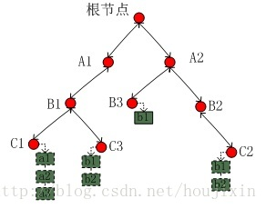

# mosquitto
## 简介
mosquitto是一款实现了消息推送协议MQTT v3.1 的开源消息代理软件，提供轻量级的，支持可发布/可订阅的的消息推送模式，使设备对设备之间的短消息通信变得简单，例如现在应用广泛的低功耗传感器，手机、嵌入式计算机、微型控制器等移动设备。  
Mosquitto采用发布/订阅的模式实现MQTT协议，这种设计模式将通信终端之间的关系统一到服务程序中进行管理，可极大减轻客户端的开发和维护工作。  
## 发布/订阅模式
发布订阅模式定义了如何向一个节点发布和订阅消息，这些节点被称为Topic。Topic可以被看作是消息传输的中介或管道，发布者publish消息到topic，订阅者subscribe topic而获得消息。这种模式使得发布者和订阅者保持相互独立，实现了解耦。  
在TCP连接中，每个连接都由<源IP，源端口，目的ip，目的端口，通信协议>这五个元素确定，在一条TCP连接建立后，它需要在一段时间内一直被通信双方保持，以备下次数据传输使用。如果通信数量多，那么需要每个终端维持它所有的通信关系。  
发布订阅模式就是为了解决这个问题，**使每个终端只需要保持自己与服务器之间的连接，而客户端之间的关系由中间件维护**，这种设计模式将复杂的通信关系维护工作从客户端剥离出来，方便了客户端的开发和维护。  
在mosquitto中，程序就是通过这种方式工作，将客户端之间的关系通过**一棵订阅树**来维持。  
## 订阅树
mosquitto通过一棵订阅树来维护所有的topic，对于每个topic用一个双向链表来存储订阅者。
### 数据结构定义
```
// mosquitto中存储所有信息的总结构体
struct mosquitto_db{
	dbid_t last_db_id;
	// 订阅树的根节点
	struct mosquitto__subhier *subs;
	struct mosquitto__unpwd *unpwd;
	struct mosquitto__unpwd *psk_id;
	struct mosquitto *contexts_by_id;
	struct mosquitto *contexts_by_sock;
	struct mosquitto *contexts_for_free;
#ifdef WITH_BRIDGE
	struct mosquitto **bridges;
#endif
	// 检索订阅者的哈希表
	struct clientid__index_hash *clientid_index_hash;
	struct mosquitto_msg_store *msg_store;
	struct mosquitto_msg_store_load *msg_store_load;
#ifdef WITH_BRIDGE
	int bridge_count;
#endif
	int msg_store_count;
	unsigned long msg_store_bytes;
	char *config_file;
	struct mosquitto__config *config;
	int auth_plugin_count;
	bool verbose;
#ifdef WITH_SYS_TREE
	int subscription_count;
	int retained_count;
#endif
	int persistence_changes;
	struct mosquitto *ll_for_free;
#ifdef WITH_EPOLL
	int epollfd;
#endif
};
```
* 订阅树中的节点定义
```
struct mosquitto__subhier {
	UT_hash_handle hh;
	struct mosquitto__subhier *parent;
	struct mosquitto__subhier *children;
	// 维持该topic的订阅者的双向链表
	struct mosquitto__subleaf *subs;
	struct mosquitto_msg_store *retained;
	mosquitto__topic_element_uhpa topic;
	uint16_t topic_len;
};
```
* 双向链表的节点定义
```
struct mosquitto__subleaf {
	struct mosquitto__subleaf *prev;
	struct mosquitto__subleaf *next;
	// 订阅者
	struct mosquitto *context;
	int qos;
};
```
* 订阅者定义（截取主要部分）
```
struct mosquitto {
	mosq_sock_t sock;
#ifndef WITH_BROKER
	mosq_sock_t sockpairR, sockpairW;
#endif
#if defined(__GLIBC__) && defined(WITH_ADNS)
	struct gaicb *adns; /* For getaddrinfo_a */
#endif
	enum mosquitto__protocol protocol;
	char *address;
	char *id;
	char *username;
	char *password;
	uint16_t keepalive;
	uint16_t last_mid;
	enum mosquitto_client_state state;
	time_t last_msg_in;
	time_t next_msg_out;
	time_t ping_t;
	struct mosquitto__packet in_packet;
	struct mosquitto__packet *current_out_packet;
	// 链表维持的消息队列
	struct mosquitto__packet *out_packet;
	struct mosquitto_message *will;
}
```
### 组织方式
首先mosquitto将所有的topic用 “ / ” 分割来组织成一棵树结构，从根节点到树中每个节点的路径都能组成该节点对应的一个topic，每个topic分别保存一个订阅列表，其中维持了订阅当前topic的客户端信息。  
* 示例如下：
```
客户端a1,a2,a3订阅了topic：A1/B1/C1

客户端b1,b2订阅了topic：A2/B2/C2

客户端c1,c2订阅了topic：A1/B1/C3

客户端d1订阅了topic：A2/B3
```
则对应的订阅树为  
  
* mosquitto在实现中根据topic中传输消息的性质将订阅树分为两棵子树：**业务子树和系统子树**，其分别保存的是**业务topic和系统topic**。前者主要是用户定义的业务topic；后者主要用于发布和维护mosquitto内部的系统消息。  
之所以要区分两种类型是因为其实现方式有许多差别：
  1. **生存周期不同**：系统topic无论是否有用户订阅，都会存在订阅树中，而业务topic不是（除非该业务topic中的消息retain字段设置为1）.
  2. **创建方式不同**：系统topic在消息发布时创建，业务topic可以在订阅时创建也可以在消息发布时创建（此时需要该消息retain字段为1）
  3. **消息保存方式不同**：凡是发布到系统topic的消息都会被保存下来，而业务消息将被挂到订阅列表各context的消息队列中，如果没有连接订阅或未设置retain字段，则消息不会被保存
### 订阅树的原理
* 创建订阅树
	mosquitto启动时将初始化订阅树，该过程创建三个节点：订阅树总根节点、业务子树根节点、系统子树根节点。这两个子树根节点作为总根节点的子节点，总根节点和业务子树根节点的topic的值为空字符串，而系统子树根节点的topic为“$SYS”。  
	**注：该订阅树使用孩子兄弟链表法表示的**  
* 搭建订阅树
	系统子树和业务子树的搭建方式不同：系统子树是在系统消息发布时创建，而业务子树创建过程即可以在消息发布时创建也可以在客户端订阅时才创建。  
	其创建过程都是将topic用/分割，逐级查询，递归添加节点。
* 发布消息
	在mosquitto中，通过某个topic发送消息要通过遍历订阅树完成，具体过程为：
		1. 递归遍历订阅树找到指定topic中的订阅链表，并将此消息挂在链表中每个订阅者的消息队列中
		2. 如果消息的retain字段被设置为1，那么mosquitto还需要保存此消息，以备新订阅的客户端可以立即收到上次发送的消息；另外，发往系统topic的消息也会被mosquitto保存起来。  
* 从订阅树中删除订阅客户端  
	客户端可以向mosquitto发送取消对某个topic的订阅请求，服务器收到请求后，将从订阅树中删除该客户端，该过程需要**遍历订阅树**以找到其topic所在的位置，进而获取订阅列表，然后将其从订阅链表中删除。
### 优缺点
* 优点：用树形结构来维护客户端之间的订阅与发布关系，这种方式逻辑清晰，便于开发和维护。
* 缺点：遍历效率较低，订阅、发布消息、取消订阅等过程都需要遍历，尤其是当客户端数量增加时，对效率的影响格外明显。
## epoll
在mosquitto1.5.0之前，使用的是poll机制，在1.5.0版本中加入了epoll作为其I/O机制。  
要介绍epoll，就要将UNIX中的三种I/O多路复用机制的前因后果，发展历程，select、poll、epoll都总结一下。  
新开一篇[点这里](../Linux环境编程与理解/IO多路复用.md)
## 心跳机制 或 ping/pong机制
在MQTT那篇文章里有讲到  
用处就是判断连接是否异常断开，采用keep alive的参数来控制检查时间，如果服务器在1.5倍ka时间内没有收到来自该客户端的心跳消息（或任何消息），就认为该客户端离线，断开MQTT连接，如果客户端在一定时间内没有收到服务端的心跳消息，则也会断开。
## plugin
mosquitto中，向用户提供了一些用于开发身份认证功能的方法，开发人员可以通过这些方法实现更多功能。
### 函数定义
```
// 返回插件版本，用于判断mosquitto是否支持此插件版本
int mosquitto_auth_plugin_version(void)

// 用于加载插件，成功返回0，否则返回>0
int mosquitto_auth_plugin_init(void **user_data, struct mosquitto_opt *auth_opts, int auth_opt_count)

// mosquitto退出之前调用
int mosquitto_auth_plugin_cleanup(void *user_data, struct mosquitto_opt *auth_opts, int auth_opt_count)

// 1，代理启动时运行
// 2，代理请求重新加载配置时调用（此时reload参数为true）。
int mosquitto_auth_security_init(void *user_data, struct mosquitto_opt *auth_opts, int auth_opt_count, bool reload)

// 1，代理退出时调用
// 2，代理请求重新加载配置时调用（在上一个函数之前调用）
int mosquitto_auth_security_cleanup(void *user_data, struct mosquitto_opt *auth_opts, int auth_opt_count, bool reload)

// 当用户名/密码必须被校验时调用
int mosquitto_auth_unpwd_check(void *user_data, const struct mosquitto *client, const char *username, const char *password)

// 当topic的访问权限被校验时调用（读权限，写权限，订阅权限）
int mosquitto_auth_acl_check(void *user_data, int access, const struct mosquitto *client, const struct mosquitto_acl_msg *msg)

// 重要！当publish发生时调用，msg结构体包含了消息的各种属性。很多功能都可以通过这个函数完成
int mosquitto_auth_handle_publish(void *user_data, const struct mosquitto *client, const struct mosquitto_acl_msg *msg)

// 客户端连接时调用
int mosquitto_auth_handle_connect(void *user_data, const struct mosquitto *client)

// 客户端断开连接时调用
int mosquitto_auth_handle_disconnect(void *user_data, const struct mosquitto *client, bool socket_error)

// 当客户端使用TLS/PSK连接到listener时由mosquitto调用。这用于检索与客户端关联的预共享密钥。
int mosquitto_auth_psk_key_get(void *user_data, const struct mosquitto *client, const char *hint, const char *identity, char *key, int max_key_len)
```