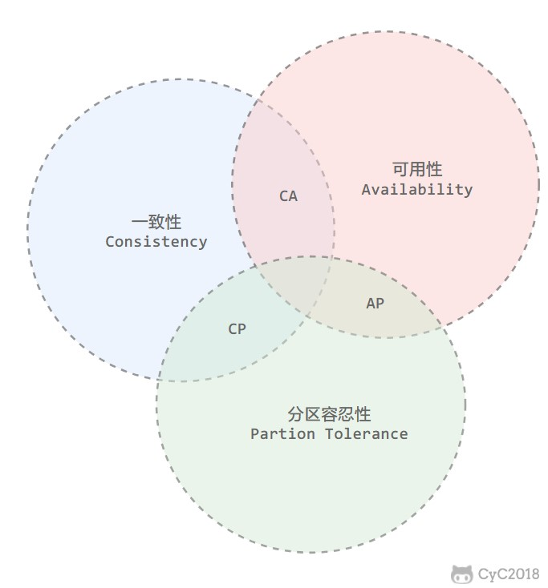
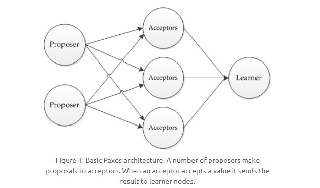
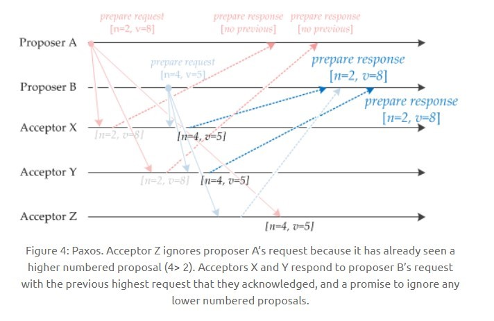

# 分布式一致性协议
数据一致性问题非常多样，比如：
* 在更新数据时，先更新了数据库，后更新了缓存，如果有一方更新失败，那么数据就会不一致
* 比如数据库中的参照完整性
* 比如数据库中的原子性
* 比如数据库中的Master-Slave异步复制
一致性问题分为两大类：**事务一致性和多副本一致性**  

# 事务一致性
事务问题的关键则在于事务涉及的一系列操作需要满足 ACID 特性，例如要满足原子性操作则需要这些操作要么都执行，要么都不执行  

## 2PC
2PC涉及两方：参与者和协调者。  

在MySQL Binlog和Redo Log中就用到了2PC，当然这是单机问题，在分布式环境中，2PC的应用更加广泛  

两阶段提交（Two-phase Commit，2PC）通过引入协调者来协调参与者的行为，并最终决定这些参与者是否真正执行事务。  

### 1. 运行过程
#### 1.1 准备阶段

1. 协调者向所有参与者发送**事务预处理**  
2. 参与者执行本地事务  
3. 协调者询问参与者事务是否执行成功，参与者发回事务执行结果。询问可以看成一种投票，需要**所有参与者都同意**才能执行。

#### 1.2 提交阶段

如果每个参与者都表示执行成功，事务协调者发送通知让参与者Commit事务；否则，协调者发送通知让参与者回滚事务。  

注意：在准备阶段，参与者执行了事务，但是还未提交。只有在提交阶段接收到协调者发来的通知后，才进行提交或者回滚。

### 2. 存在的问题
#### 2.1 同步阻塞

所有事务参与者在等待其他参与者响应的时候都处于**同步阻塞等待状态**，无法进行其他操作。  
#### 2.2 单点故障问题

协调者在2PC中起到很大作用，如果协调者发生故障将造成很大影响。特别是在提交阶段，所有参与者会一直同步阻塞等待，如果协调者此时故障，那么参与者将无法完成其他操作。  

#### 2.3 数据不一致
在提交阶段，如果协调者**只发送了部分 Commit 消息，此时网络发生异常**，那么只有部分参与者接收到 Commit 消息，也就是说只有部分参与者提交了事务，使得系统数据不一致。

#### 2.4 太过保守
任意一个节点失败就会导致整个事务失败，没有完善的容错机制。

## 3PC
3阶段提交协议主要是为了解决2PC的阻塞问题。  
2PC存在的问题是当协作者在第二阶段崩溃时，参与者不能做出最后的选择，因此参与者在协作者恢复之前都会保持阻塞。  
3PC有两个改进点：
1. 在协调者和参与者都引入超时机制  
2. 在第一阶段和第二阶段之间插入一个准备阶段，保证了最后提交阶段之前各个参与节点的状态是一致的。  

### 1. 运行过程
#### 1.1 CanCommit
之前2PC的一阶段是本地事务执行结束后，最后不Commit,等其它服务都执行结束并返回Yes，由协调者发生commit才真正执行commit。而这里的CanCommit指的是 尝试获取数据库锁 如果可以，就返回Yes。  

1. 协调者询问参与者是否可以执行事务提交，然后等待参与者回复
2. 参与者如果认为自己的状态可以顺利执行事务，则返回Yes，并进入预备状态，否则反馈No

#### 1.2 PreCommit
如果所有参与者都返回Yes，那么进入PreCommit  

1. 协调者向所有参与者发送**事务预处理**  
2. 参与者执行本地事务  
3. 协调者询问参与者事务是否执行成功，参与者发回事务执行结果。询问可以看成一种投票，需要**所有参与者都同意**才能执行。

如果有参与者返回了No，或者超时后仍未收到参与者的响应，则执行事务中断。   
事务中断也分两种情况：
1. 发送中断成功，所有参与者中断
2. 有参与者超时之后仍未收到协调者发来的中断或者DoCommit，则自动执行事务中断

#### 1.3 DoCommit
如果每个参与者都表示执行成功，事务协调者发送通知让参与者Commit事务；**存在参与者表示执行失败，协调者发送通知让参与者回滚事务之后中断事务。**  
**如果参与者超时没有收到协调者的通知，则自动提交。**  

### 2. 与2PC的对比
1. 对于协调者和参与者都设置了超时时间，避免了参与者在长时间无法与协调者通讯的情况下，无法释放资源的问题。
2. 另外，通过CanCommit、PreCommit、DoCommit三个阶段的设计，相较于2PC而言，多设置了一个缓冲阶段保证了在最后提交阶段之前各参与节点的状态是一致的。

# 多副本一致性
## CAP
分布式系统不可能同时满足**一致性（C：Consistency）、可用性（A：Availability）和分区容忍性（P：Partition Tolerance）**，最多只能同时满足其中两项。  

  

### 一致性
一致性指的是多个数据副本能否保持一致的特性，在一致性的条件下，系统在执行数据更新操作之后能够从一致性状态转移到另一个一致性状态。  

对系统的一个数据更新成功之后，如果所有用户都能够读取到最新的值，该系统就被认为具有强一致性。  

### 可用性
可用性指分布式系统在面对各种异常时可以提供正常服务的能力，可以用系统可用时间占总时间的比值来衡量，4 个 9 的可用性表示系统 99.99% 的时间是可用的。  

在可用性条件下，要求系统提供的服务一直处于可用的状态，对于用户的每一个操作请求总是能够在有限的时间内返回结果。  

### 分区容忍性
网络分区指分布式系统中的节点被划分为多个区域，每个区域内部可以通信，但是区域之间无法通信。  

在分区容忍性条件下，分布式系统在遇到任何网络分区故障的时候，仍然需要能对外提供一致性和可用性的服务，除非是整个网络环境都发生了故障。  

### 权衡
在分布式系统中，**分区容忍性必不可少，因为需要总是假设网络是不可靠的**。因此，CAP 理论实际上是要在可用性和一致性之间做权衡。  

可用性和一致性往往是冲突的，他们很难同时满足。在多个节点进行数据同步时：
* 为了保证一致性（CP），不能同时访问未同步完成的节点，也就失去了部分可用性
* 为了保证可用性（AP），允许读取所有节点的值，但数据可能在中间阶段不一致

## BASE
BASE是**基本可用（Basically Available）、软状态（Soft State）、最终一致性（Eventually Consistent）**三个短语的缩写  
BASE理论是对CAP中一致性和可用性权衡的结果，它的核心思想是：即使无法做到强一致性，但每个应用都可以根据自身业务特点，采用适当的方式来使系统达到最终一致性  

### 基本可用
指分布式系统在出现故障的时候，保证核心可用，允许损失部分可用性。（服务降级）  

例如，电商在做促销时，为了保证购物系统的稳定性，部分消费者可能会被引导到一个降级的页面。  

### 软状态
指允许系统中的**数据存在中间状态，并认为该中间状态不会影响系统整体可用性**，即允许系统不同节点的数据副本之间进行同步的过程存在时延。  

### 最终一致性
最终一致性强调的是系统中所有的数据副本，**在经过一段时间的同步后，最终能达到一致的状态。**  

ACID中的一致性要求的是强一致性，通常运行在传统数据库系统上。而BASE要求最终一致性，通过牺牲强一致性来达到可用性，通常运用在大型分布式系统中。  

## Paxos
用于达成共识性问题，即对多个节点产生的值，该算法能保证只选出唯一一个值。  

Paxos算法中主要有三类节点：  
* 提议者（Proposer）：提议一个值
* 接受者（Acceptor）：对每个提议进行投票
* 告知者（Learner）：被告知投票的结果，不参与投票

  

### 解决的问题
比如多个请求写入一个数据库集群，机器A写入值1，机器B写入值2，机器C写入值3，三个请求并发发生。既然是一个数据库集群的同一个值，最终一定要保证对外的一致性，就涉及到同步三个请求的顺序问题，即，到底是谁覆盖了谁？123，还是213，还是321等等？  

在这种场景下，Paxos解决的分布式一致性问题就是，**日志的最终打印顺序**。  

### 执行过程
规定一个提议包含两个字段：[n, v]，n为序号（具有唯一性），v为提议值  

#### 1. Prepare阶段
下图演示了两个Proposer和三个Acceptor的系统中运行该算法的初始过程，**每个Proposer都会向Acceptor发送Prepare请求**  

  

当 Acceptor 接收到一个 Prepare 请求，包含的提议为 [n1, v1]，并且之前还未接收过 Prepare 请求，那么发送一个 Prepare 响应，设置当前接收到的提议为 [n1, v1]，并且**保证以后不会再接受序号小于 n1 的提议**。  

如下图，Acceptor X 在收到 [n=2, v=8] 的 Prepare 请求时，由于之前没有接收过提议，因此就发送一个 [no previous] 的 Prepare 响应，设置当前接收到的提议为 [n=2, v=8]，并且保证以后不会再接受序号小于 2 的提议。其它的 Acceptor 类似。  

  

如果 Acceptor 接收到一个 Prepare 请求，包含的提议为 [n2, v2]，并且之前已经接收过提议 [n1, v1]。如果 n1 > n2，那么就**丢弃该提议请求**；否则，发送 Prepare 响应，该 Prepare 响应包含之前已经接收过的提议 [n1, v1]，设置当前接收到的提议为 [n2, v2]，并且保证以后不会再接受序号小于 n2 的提议。  

如下图，Acceptor Z 收到 Proposer A 发来的 [n=2, v=8] 的 Prepare 请求，由于之前已经接收过 [n=4, v=5] 的提议，并且 n > 2，因此就抛弃该提议请求；Acceptor X 收到 Proposer B 发来的 [n=4, v=5] 的 Prepare 请求，因为之前接收到的提议为 [n=2, v=8]，并且 2 <= 4，因此就发送 [n=2, v=8] 的 Prepare 响应，设置当前接收到的提议为 [n=4, v=5]，并且保证以后不会再接受序号小于 4 的提议。Acceptor Y 类似。  

  

#### 2. Accept阶段
当**一个 Proposer 接收到超过一半 Acceptor 的 Prepare 响应时，就可以发送 Accept 请求。**  

Proposer A 接收到两个 Prepare 响应之后，就发送 [n=2, v=8] Accept 请求。该 Accept 请求会被所有 Acceptor 丢弃，因为此时所有 Acceptor 都保证不接受序号小于 4 的提议。  

Proposer B 过后也收到了两个 Prepare 响应，因此也开始发送 Accept 请求。需要注意的是，Accept 请求的 v 需要取它收到的最大提议编号对应的 v 值，也就是 8。因此它发送 [n=4, v=8] 的 Accept 请求。  

  

#### 3. Learn阶段
Acceptor 接收到 Accept 请求时，如果序号大于等于该 Acceptor 承诺的最小序号，那么就发送 **Learn 提议给所有的 Learner。当 Learner 发现有大多数的 Acceptor 接收了某个提议，那么该提议的提议值就被 Paxos 选择出来。**  

### 约束条件
#### 1. 正确性
指只有一个提议值会生效。  

因为 Paxos 协议要求每个生效的提议被多数 Acceptor 接收，并且 Acceptor 不会接受两个不同的提议，因此可以保证正确性。  

#### 2. 可终止性
之最后总会有一个提议生效。Paxos协议能够让 Proposer 发送的提议朝着能被大多数 Acceptor 接受的那个提议靠拢，因此能够保证可终止性。  

## 简单的Basic Paxos有以下问题 —— Multi Paxos解决方案
### 问题1：活锁问题
前面的Paxos看起来是一个**多点发起，不断循环的2PC**，事实也确实如此。但如果多个客户端写多个机器，造成多个机器都是Proposer，会造成阶段1的并发冲突很高，每个节点都要循环很多次才确定一条日志，**极端情况下，每个节点都在无限循环2PC，造成“活锁问题”**  

为了减少冲突，可以把**多写变为单写**，**选出一个Leader**，只让Leader充当Proposer，其他机器收到写请求，都把请求转发给Leader。  

关于Leader的选举，分为**“有租约”和“无租约”**。有租约：在一定期限内（即租约内），某台机器一直是Leader，严格保证任意时刻只能有一个Leader。  

#### 1. 无租约的Leader选举
1. 每个节点有一个编号，选择编号最大的作为Leader
2. 每个节点周期性向其他节点发送心跳，假设周期为T。心跳中带上自己的编号  
3. 如果一个节点在最近2T时间内没有收到**比自己编号更大的节点**发来的心跳，则自己变为Leader
4. 如果一个节点认为自己不是Leader，则将写请求转发给Leader

这种算法比较简单，但因为网络超时，2T时间内可能心跳发送不到，导致出现多个Leader。但是不影响Paxos协议的正确性，只是增大了并发写冲突的概率而已。  

#### 2. 有租约的Leader选举
在租约内，即使这台机器宕机，Leader也不能切换，直到租约到期，才能重新选举。  
** 这种方式会带来短暂的不可用。**

### 问题2：性能问题
由于Basic Paxos是一个**无限循环的2PC**，一条日志的确认至少需要两个R22 + 两次落盘计算，这样会导致性能比较差。  

Multi Paxos把2PC优化成了1PC，思路如下：一个节点被选为Leader后，先广播一次Prepare，如果超过半数同意，那么以后收到的写操作日志，直接直接Accept，而不是每条都执行一次Prepare。  
可以理解为，Leader发出的Prepare不再是对一条日志的控制权，而是**对所有日志的控制权。**  

如果有新的Leader出现，那么发出Prepare时，Id肯定会变大，就把旧的Leader的Accept都失效掉了，旧的Leader再把自己转为普通的Acceptor。  

## Paxios的精髓
### 精髓1：强一致的P2P网络
整个Paxos网络就类似一个P2P网络，所有节点双向同步，对所有unchoose的日志不断确认的过程。  
一条日志在每个节点上，可能有choose，unchoose两种状态。choose就是被多数派接受，不可更该；unchoose状态的日志就是不确定，“薛定谔的猫”，这条日志可能已经被choose了，只是该节点还不知道，也可能还没有被choose。要确认到底如何，就要再执行一次Paxos，找到最大commit。  

### 精髓2：“时序”
Paxos保证所有节点的日志顺序一模一样，但实际上对于每个节点，日志并没有顺序。  

只有单个客户端，串行做操作时，才有所谓顺序。多个客户端并发写，服务器又是并发对每条日志执行Paxos。对于服务器来说，日志就没有绝对的“顺序”，而是保证整体上的相对顺序一致。  

## Raft
前面说的Basic Paxos是多点写入的分布式一致性协议，而Raft类似Multi Paxos，是选举Leader + 单点写入的分布式一致性协议。  

在Raft协议中，有三个角色：
* Leader：作为单点写入的节点，同步写入结果给所有Follower。Leader 会周期性的发送心跳包给 Follower。
* Follower：接收写入后的日志。每个 Follower 都设置了一个随机的竞选超时时间，一般为 150ms~300ms，如果在这个时间内没有收到 Leader 的心跳包，则随机睡眠一段时间后，变成 Candidate，进入竞选阶段。
* Candidate：若Leader挂了，则Follower变成Candidate，参与Leader选举

下面各阶段的动图看这里 https://github.com/CyC2018/CS-Notes/blob/master/notes/%E5%88%86%E5%B8%83%E5%BC%8F.md#%E7%BA%A6%E6%9D%9F%E6%9D%A1%E4%BB%B6  
### 1. 选举阶段
在分布式环境初始时，系统中没有Leader，所有节点都是Follower。  
Follower等待了一段时间，没收到Leader的心跳包，则**分别睡眠一段随机时间**，醒来之后编程Candidate。  
#### 单个 Candidate 的竞选
如果一个Follower先醒过来了，则系统变成单Candidate的竞选。
1. 该Node发送投票请求给其他所有节点
2. 其他节点对请求回复，如果超过一半的节点恢复了，则该Candidate变成Leader
3. 之后 Leader 会周期性地发送心跳包给 Follower，Follower 接收到心跳包，会重新开始计时。

#### 多个 Candidate 竞选
如果多个Follower醒来，称为Candidate，并且投票所获得的票数相同，那么需要重新投票。  
由于每个节点设置的**竞选超时时间不同**此下一次再次出现多个 Candidate 并获得同样票数的概率很低。  

### 2. 日志复制阶段
1. 来自客户端的修改都会被传入 Leader。注意该修改还未被提交，只是写入日志中。
2. Leader 会把修改复制到所有 Follower。
3. Leader 会等待大多数的 Follower 也进行了修改，然后才将修改提交。
4. 此时 Leader 会通知的所有 Follower 让它们也提交修改，此时所有节点的值达成一致。

此阶段是一个2PC  

### 3. 恢复阶段
如果Leader宕机了，那么进行选举，选出一个新Leader。但所有Follower是不知道新Leader是谁的。  

新Leader上台之后，马上给所有Follower发送一个心跳，其中包含自己的term（本Leader的任期），所有Follower同步term为新的term。那么就算之后前任Leader醒过来了，也没有机会再发送日志了，保证了唯一的Leader。  

## ZAB
ZAB是Zookeeper使用的分布式一致性协议，出现在Raft之前，Paxos之后，Raft和ZAB的思路很像。  

在ZAB中，节点有三种状态：Leader、Follower和Election。其中Election是中间状态，和Raft中的Candidate状态类似。  

### 1. 选举阶段
FLE算法。  
初始时，节点处于Election状态，然后开始发起选举，选举结束，处于Follower或者Leader状态。 选举出的Leader是ZXID最大的一个   
与Raft算法类似，只不过ZAB是双向心跳。  

### 2. 2PC提交
1. 与Raft类似，写请求全部都转发给Leader
2. 发送Propose消息给所有Follower，收到半数以上Follower返回的ACK
3. 向所有Follower发送Commit

注意：ZAB中有几处与Raft不同
1. Raft中，返回给客户端写成功的前提是，多数节点的Commit指令执行成功，而ZAB中，在步骤2中收到半数以上ACK则表示成功

### 3. 恢复阶段
Leader崩溃有两种情况：
1. Leader在复制数据给所有Follower之后崩溃
2. Leader在收到ACK并且提交了自己，同时发送了部分comit出去之后崩溃

ZAB定义了两个原则：
1. ZAB 协议确保那些已经在 Leader 提交的事务最终会被所有服务器提交。
2. ZAB 协议确保丢弃那些只在 Leader 提出/复制，但没有提交的事务。
3. 说白了就是以Leader提没提交为准

为了保证这一点，ZAB和Raft其实是类似的，为每个事务都是设计了ZXID。针对客户端的每一个事务请求，Leader都会产生一个新的Propose并且把ZXID计数器+1.  

当崩溃恢复之后，Follower连接上新的Leader，Leader服务器会根据自己服务器上最后提交的ZXID和Follower上的ZXID对比，对比的结果要么回滚，要么和Leader同步。  

