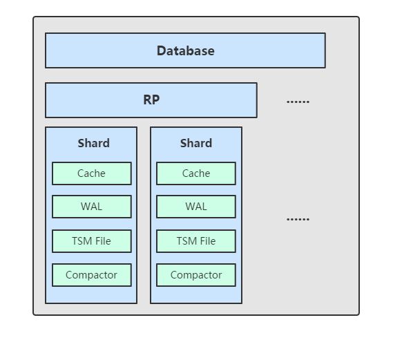

# InfluxDB
## InfluxDB概要
InfluxDB是一种时序数据库，数据按照时间顺序存储，对于日志、时序的数据的查询存储是一个很好的选择。
## InfluxDB的数据格式
InfluxDB中存储的数据被称为时间序列数据，时序数据由多个**数据点**组成，数据点又由**time**（时间戳）、**measurement**（测量，统计）、至少一个**k-v格式的field**和**零个或多个tag**组成。  
在概念上可以将measurement理解为mysql中的table，其主键总是time，tag和field是除主键外的其他列，区别是tag是被索引的，而field不是。在InfluxDB中，你可以由数百万个measurement，而无需事先定义其scheme，并且null不会被存储。
* 插入数据：需要以数据点的形式进行插入。
```
insert <measurement>[,<tag-key>=<tag-value>...] <field-key>=<field-value>[,<field2-key>=<field2-value>...] [unix-nano-timestamp]
```
中扩号中的内容，是可选的，可以有，有可以没有。例如：  
```
insert cpu,host=serverA,region=us_west value=0.64
payment,device=mobile,product=Notepad,method=credit billed=33,licenses=3i 1434067467100293230
```
time可以被省略，则取默认时间  
* 查询数据：   
```
SELECT "host", "region", "value" FROM "cpu"
```
注意不区分tag和field。若要查询全部field和tag，与mysql一样使用通配符\*。 至于其他查询语法，看参考文献或官方文档  
* InfluxDB可以直接通过HTTP接口来创建数据库和读写数据，默认端口8086。
## 数据采样和保留
InfluxDB若要存储很长时间的数据，可以对数据进行采样，对于高精度的数据和低精度的数据设置不同的保存策略。  
#### 连续查询  Continuous Query （CQ）
  连续查询是在InfluxDB中周期性运行的一个InfluxQL查询，其目的是利用`SELECT`函数添加一个`GROUP BY time()`来对数据进行采样
#### 保留策略  Retention Policy  (RP)
  保留策略是InfluxDB数据架构的一部分，它描述了InfluxDB保存数据的时间。InfluxDB会比较服务器的本地时间和请求数据中的时间戳，删除比你在RPs中使用`DURATION`设置的更老的数据，默认为永久保存。一个数据库中可以为不同数据指定不同RP，但数据库的默认RP只有一个。
#### 数据采样和保留
数据的采样和保留就是结合CQ和RP来实现的，利用CQ可以实现数据降准，将细粒度数据转为粗粒度数据；利用RP可以减小存储空间，保留有价值的数据。  
结合CQ和RP可以对不同粒度的数据采取不同的保留策略，比如细粒度的保存时间短，用来检索短期数值，粗粒度的保存时间长，用来反映长期趋势。  
## tag和field的区别
tag包含索引，适合存储元数据（又称中介数据、中继数据，为描述数据的数据（data about data），主要是描述数据属性（property）的信息，用来支持如指示存储位置、历史数据、资源查找、文件记录等功能。可以简单理解为**目录**）。我们可以设计tag作为查询条件，查询速度会比field快，但是tag过多的话也会增大数据插入的时间，所以tag也不能冗余。
**InfluxDB中可以没有tag，但不能没有field。另外，不要使用field作为查询条件**
## 序列series
series是RP，measurement和tag set的集合，是数据源的合的概念。在**同一个database中，相同retention policy、相同measurement、相同tag的数据属于一个series集合**，标识这条数据来自哪里，同一个series的数据在物理上按照时间顺序排列在一起。  
通过`show series;`可以查询到上述条件的数据。

## 指针/数据点 Points
InfluxDB中的数据由时间序列化结构构成，时间序列化结构包括0个到多个指针(points)，每个指针都是**一个离散的指标中实际的取样值**，指针(points)由timestamp、measurement、0个到多个tag、大于等于一个的field字段等共同构成，类似RDBMS中的row的概念。

## InfluxDB原理
InfluxDB中有一个不对用户开放的概念叫做**Shared**，实际上时连续一段时间内的数据称为一个Shared存储，具体时间长短根据用户设置的时间保存策略决定。这样类似分块的存储方式更方便查询和删除。  
InfluxDB底层使用的存储引擎叫做**TSM Tree**，每一个Shared都会对应一个TSM Tree。事实上InfluxDB以前采用过LSM Tree、mmap B+树作为存储算法，后来自己实现了TSM树。  
TSM tree与LSM tree（日志结构的合并树）的设计思想几乎一样，就是LSM的优化修改。对于LSM，可以和其他索引结构入B树、红黑树等一起写一篇，在这里只需要先了解一点，就是LSM tree的设计思想是  
**核心思想的核心就是放弃部分读能力，换取写入的最大化能力。LSM Tree ，这个概念就是结构化合并树的意思，它的核心思路其实非常简单，就是假定内存足够大，因此不需要每次有数据更新就必须将数据写入到磁盘中，而可以先将最新的数据驻留在内存中，等到积累到最后多之后，再使用归并排序的方式将内存内的数据合并追加到磁盘队尾(因为所有待排序的树都是有序的，可以通过合并排序的方式快速合并到一起)。**
#### TSM Tree
TSM存储引擎主要由几个部分组成** cache、wal、tsm file、compactor**  
  
Shared并不是其中一个组件，因为它是在TSM之上的概念。在 InfluxDB 中按照数据的时间戳所在的范围，会去创建不同的 shard，每一个 shard 都有自己的 cache、wal、tsm file 以及 compactor，这样做的目的就是为了可以通过时间来快速定位到要查询数据的相关资源，加速查询的过程，并且也让之后的批量删除数据的操作变得非常简单且高效。  
**InfluxDB中，通过RP设置的数据保留时间，当检测到一个Shared中的数据过期后，只需要将这个Shared整体释放，相关文件删除即可，这样使得批量删除变得更高效。**  
LSM的理解http://blog.fatedier.com/2016/06/15/learn-lsm-tree/
##### Cache和WAL
cache是内存中的一个map结构，WAL是磁盘上的文件，二者内容相同，共同作为InfluxDB写入TSM FILE时的缓存。其中cache在内存中，WAL在磁盘上，当数据库遇到写入操作时，会同时往二者中写入，WAL存在的意义是作为缓存的持久化，一旦系统崩溃，可以通过WAL重建cache中的数据。当cache达到maxSize（默认25MB）时，会将其中内容写入TSM FILE，对应的WAL文件会被删除，并新建新的WAL文件。
##### TSM FILE
单个TSM File最大为2GB，用于存储数据。由于TSM tree是根据LSM tree优化而来，所以原理上的东西可以参考LSM tree。  
TSM文件的格式主要分为四个部分：**Header, Blocks, Index, Footer**。  
* Header用于区分是哪一个存储引擎  
* Blocks内部是一些连续的Block，block是InfluxDB最小的读取单位，每个Block中存储CRC32和Data两部分，CRC用于校验Data是否有问题。  
* Index存放的是Blocks中内容的索引，InfluxDB 在做查询操作时，可以根据 Index 的信息快速定位到 tsm file 中要查询的 block 的位置  
* Footer是tsmFile的最后8字节，其中存放了Index部分的起始位置在TSM File中的偏移量，方便将Index索引加载到内存中  
* 要注意的是，InfluxDB还维持了一个间接索引，保存在内存中，其中维持了一个key在详细索引中的位置，用来实现快速检索。
##### Compactor
这个组件是一个后台运行组件，会每隔一秒检查一下是否有需要压缩合并的数据。  
其主要检查两种操作  
1. cache中的数据达到maxSize，快照之后存储到一个新建的tsm file中
2. 合并磁盘中的tsm file，将多个小的合并成为一个大的，直到其达到单个文件的最大阈值，减少文件的数量。其中过期数据的删除工作也在这个阶段完成。  
#### 数据操作
InfluxDB中有一个`PointsWriter`结构体，对数据的操作基本都是用它来进行的  
##### 写入
* `WritePoints` 函数会根据 Point 的时间戳判断出其属于哪一个 Shard，之后调用` writeToShard` 函数批量将 Points 分别写入到不同的 Shard 中。  
* `writeToShard` 函数中，实际上是调用了 TSDBStore 的` WriteToShard`。这里的 TSDBStore 就是 Store 对象(可以到原文章中去找一下)，是一个负责数据存储的顶层的抽象数据结构。而在 Store 对象中存储了所有 Shard 的管理对象，数据将会交由指定的 Shard 去处理。Shard 会继续调用底层 tsm1 引擎的 engine 对象来真正意义上的写入数据.  
* 数据实际被tsm1的engine写入Cache和WAL中。如下代码  
```
func (e *Engine) WritePoints(points []models.Point) error {
    values := map[string][]Value{}
    for _, p := range points {
        // 一条插入语句中一个 series 对应的多个 value 会被拆分出来，形成多条数据
        for k, v := range p.Fields() {
            // 这里的 key 是 seriesKey + 分隔符 + filedName
            key := string(p.Key()) + keyFieldSeparator + k
            values[key] = append(values[key], NewValue(p.Time().UnixNano(), v))
        }    
    }    
    e.mu.RLock()
    defer e.mu.RUnlock()

    // 向 cache 中写入 value 数据，如果超过了内存阀值上限，返回错误
    err := e.Cache.WriteMulti(values)
    if err != nil {
        return err
    }    

    // 将数据写入 wal 文件中
    _, err = e.WAL.WritePoints(values)
    return err
}
```  
##### 删除  
TSM中的删除操作与LSM的引擎有相同也有不同。  
相同之处在于，都是采用了标记要删除的Key，而并非直接删除，等到压缩合并时，再真正意义上的删除这些文件。  
不同之处在于，TSM的删除操作比LSM更高效。  
#### TSM tree中的数据查询与索引结构
由于LSM tree的原理就是**通过将大量的随机写转化为顺序写**，极大提高数据写入的性能，牺牲掉部分读的性能，而TSM基于LSM，所以情况类似。通常设计数据库时会采用索引文件的方式，例如LevelDB中采用Mainfest文件，或者采用Bloom filter来对LSM Tree的读取操作进行优化。  
**InfluxDB中采用索引进行优化，主要有两种类型。**
##### 元数据索引
* 元数据就是描述数据的数据，又称为中介数据。在数据库启动时，会从所有的Shard中的TSM file中加载index数据，并获取其中的Measurement以及Series信息，作为元数据包装成DatabaseIndex结构缓存在内存中。   
* 利用元数据查询时，会在DatabaseIndex.measurements中查询拿到对应的Measurement对象，再通过host获取到所有匹配的Series。
##### TSM File索引
就是前面提到的中间索引，通过对indirectIndex中的offsets数组进行二分查找，获取到指定key的所有block的索引


## 参考文献
https://www.hellodemos.com/hello-influxdb/influxdb-influxdb-intro.html  
https://www.cnblogs.com/ilifeilong/p/12745565.html  
https://www.influxdata.com/  
https://www.cnblogs.com/owenzh/p/13826805.html  
https://www.jianshu.com/p/b499347ea73a  
InfluxDB原理  
http://blog.fatedier.com/2016/07/05/research-of-time-series-database-influxdb/  
http://blog.fatedier.com/2016/08/05/detailed-in-influxdb-tsm-storage-engine-one/  
http://blog.fatedier.com/2016/08/15/detailed-in-influxdb-tsm-storage-engine-two/  