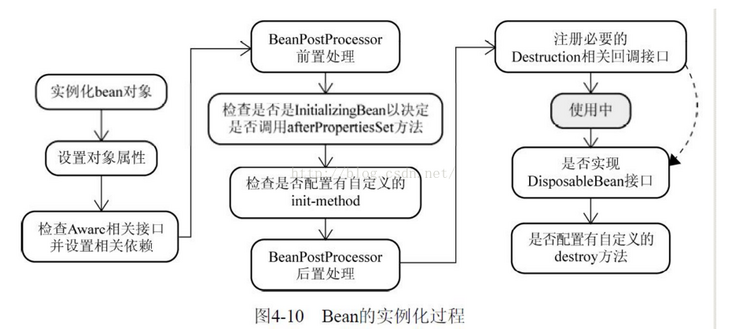
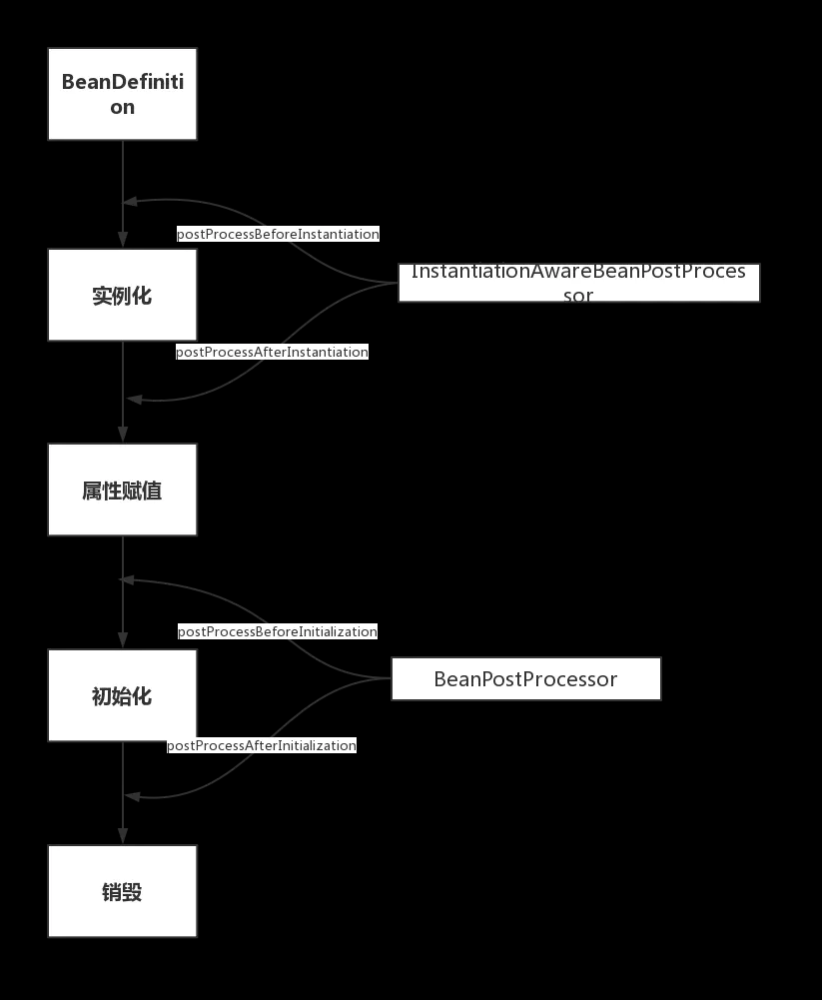
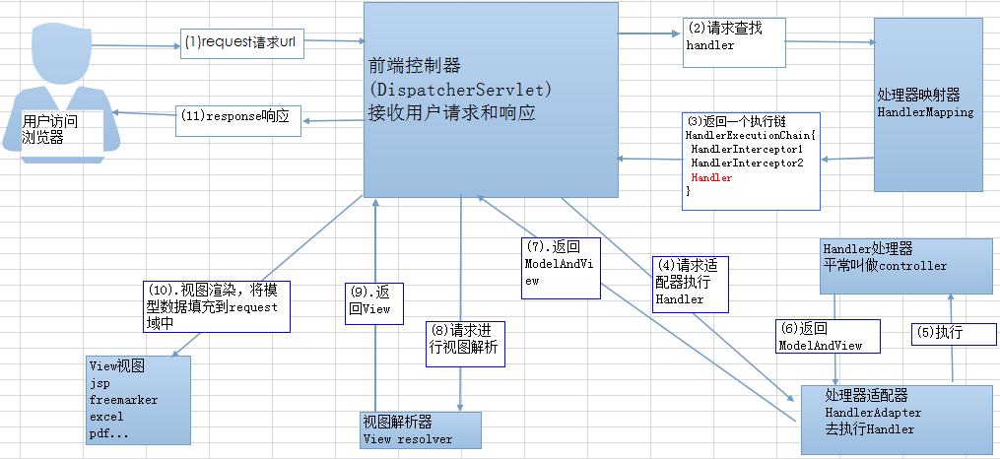
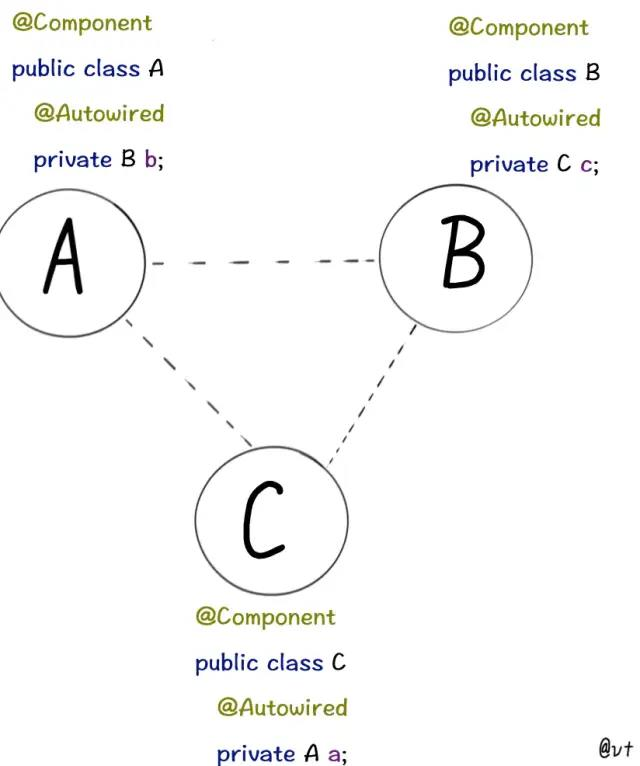

# Spring
## 什么是Spring框架
Spirng是一个旨在提高开发效率，以及系统可维护性的开发框架。  
我们一般说 Spring 框架指的都是 Spring Framework，它是很多模块的集合，使用这些模块可以很方便地协助我们进行开发。这些模块是：**核心容器、数据访问/集成,、Web、AOP（面向切面编程）、工具、消息和测试模块**。比如：**Core Container 中的 Core 组件是Spring 所有组件的核心，Beans 组件和 Context 组件是实现IOC和依赖注入的基础，AOP组件用来实现面向切面编程。**  
Spring 官网列出的 Spring 的 6 个特征:  

* 核心技术 ：依赖注入(DI)，AOP，事件(events)，资源，i18n，验证，数据绑定，类型转换，SpEL。
* 测试 ：模拟对象，TestContext框架，Spring MVC 测试，WebTestClient。
* 数据访问 ：事务，DAO支持，JDBC，ORM，编组XML。
* Web支持 : Spring MVC和Spring WebFlux Web框架。
* 集成 ：远程处理，JMS，JCA，JMX，电子邮件，任务，调度，缓存。
* 语言 ：Kotlin，Groovy，动态语言。
## Spring的重要模块
* Spring Core： 基础,可以说 Spring 其他所有的功能都需要依赖于该类库。主要提供 IoC 依赖注入功能。
* Spring Aspects ： 该模块为与AspectJ的集成提供支持。
* Spring AOP ：提供了面向切面的编程实现。
* Spring JDBC : Java数据库连接。
* Spring JMS ：Java消息服务。
* Spring ORM : 用于支持Hibernate等ORM工具。
* Spring Web : 为创建Web应用程序提供支持。
* Spring Test : 提供了对 JUnit 和 TestNG 测试的支持。
## IoC
IoC(Inverse of Control：控制反转)是一种设计思想，就是将**原本在程序中手动创建对象的控制权，交由Spring框架管理。IoC容器是Spring实现IoC的载体，IoC容器实际上是个Map，存放的是各种对象**  

将对象之间的相互依赖关系交给 IoC 容器来管理，并由 IoC 容器完成对象的注入。这样可以很大程度上简化应用的开发，把应用从复杂的依赖关系中解放出来。 **IoC 容器就像是一个工厂一样，当我们需要创建一个对象的时候，只需要配置好配置文件/注解即可，完全不用考虑对象是如何被创建出来的。** 在实际项目中一个 Service 类可能有几百甚至上千个类作为它的底层，假如我们需要实例化这个 Service，你可能要每次都要搞清这个 Service 所有底层类的构造函数，这可能会把人逼疯。如果利用 IoC 的话，你只需要配置好，然后在需要的地方引用就行了，这大大增加了项目的可维护性且降低了开发难度。

### Spring IoC的初始化过程
XML —读取—> Resource —解析—> BeanDefinition —注册—> BeanFactory
### 参考文章
https://www.zhihu.com/question/23277575/answer/169698662  

IoC源码 https://javadoop.com/post/spring-ioc  

https://www.zhihu.com/question/313785621  

## AOP
AOP(Aspect-Oriented Programming：面向切面编程)能够将那些与业务无关，**却为业务模块所共同调用的逻辑或责任（例如事务处理、日志管理、权限控制等）封装起来，便于减少系统的重复代码，降低模块间的耦合度，并有利于未来的可拓展性和可维护性。**  

Spring AOP就是**基于动态代理**的，**如果要代理的对象，实现了某个接口，那么Spring AOP会使用JDK Proxy，去创建代理对象**，**而对于没有实现接口的对象，就无法使用 JDK Proxy 去进行代理了，这时候Spring AOP会使用Cglib ，这时候Spring AOP会使用 Cglib 生成一个被代理对象的子类来作为代理**  

</br>
另外也可以集成AspectJ实现AOP

### Spring AOP和AspectJ AOP的区别
Spring AOP 属于**运行时增强**，而 AspectJ 是**编译时增强**。 Spring AOP 基于**代理(Proxying)**，而 AspectJ 基于**字节码操作(Bytecode Manipulation)**。  
## Spring Bean
### bean 作用域有哪些
有以下几种作用域：  
* singleton : 唯一 bean 实例，Spring 中的 bean **默认**都是单例的。
* prototype：每次请求都会创建一个新的bean实例
* request：每一次HTTP请求都会产生一个新的bean，该bean仅在当前HTTP request内有效
* session：每一次HTTP请求都会产生一个新的 bean，该bean仅在当前 HTTP session 内有效。
* global-session： 全局session作用域，仅仅在基于portlet的web应用中才有意义，Spring5已经没有了。Portlet是能够生成语义代码(例如：HTML)片段的小型Java Web插件。它们基于portlet容器，可以像servlet一样处理HTTP请求。但是，与 servlet 不同，每个 portlet 都有不同的会话
### Spring中 单例bean的线程安全问题
**存在安全问题。因为，当多个线程操作同一个对象的时候，对这个对象的成员变量的写操作会存在线程安全问题。**  

但是，一般情况下，我们常用的 Controller、Service、Dao 这些 Bean 是**无状态的。无状态的 Bean 不能保存数据，因此是线程安全的。**  

解决办法：

1. **在类中使用ThreadLocal，将需要的可变变量都保存在ThreadLocal中（推荐） ** 
2. **改变Bean作用域为prototype**，这样每次请求都会创建一个新的bean，且仅在当前请求中有效，也就避免了线程安全问题  
### @Component和@Bean的区别
1. 作用对象不同: @Component 注解作用于类，而@Bean注解作用于方法。

2. @Component通常是**通过类路径扫描来自动侦测以及自动装配到Spring容器中**（我们可以使用 @ComponentScan 注解定义要扫描的路径从中找出标识了需要装配的类自动装配到 Spring 的 bean 容器中）。@Bean 注解通常是我们**在标有该注解的方法中定义产生这个 bean**,@Bean告诉了Spring这是某个类的示例，当我需要用它的时候还给我。

3. @Bean 注解比 Component 注解的自定义性更强，而且很多地方我们只能通过 @Bean 注解来注册bean。比如当我们引用第三方库中的类需要装配到 Spring容器时，则只能通过 @Bean来实现。一般和@Configuration搭配使用  

示例：
```
@Configuration
public class AppConfig {
    @Bean
    public TransferService transferService() {
        return new TransferServiceImpl();
    }

}
```
上面的代码相当于xml配置
```
<beans>
    <bean id="transferService" class="com.acme.TransferServiceImpl"/>
</beans>
```
### bean生命周期
1. Bean容器找到配置文件中Spring Bean的定义
2. Bean容器利用Java反射 API创建一个Bean实例（实例化）
3. 如果涉及到属性值，利用set()方法设置
4. 如果Bean实现了`BeanNameAware`接口，调用`setBeanName()`方法，设置Bean名字
5. 如果 Bean 实现了 `BeanClassLoaderAware` 接口，调用 `setBeanClassLoader()`方法，传入 ClassLoader对象的实例。
6. 与上面的类似，如果实现了其他 \*.Aware接口，就调用相应的方法。
7. 如果有和加载这个 Bean 的 Spring 容器相关的 `BeanPostProcessor` 对象，执行`postProcessBeforeInitialization() `方法
8. 如果Bean实现了`InitializingBean`接口，执行`afterPropertiesSet()`方法。
9. 如果 Bean 在配置文件中的定义包含` init-method `属性，执行指定的方法。
10. 如果有和加载这个 Bean的 Spring 容器相关的` BeanPostProcessor `对象，执行`postProcessAfterInitialization() `方法
11. 当要销毁 Bean 的时候，如果 Bean 实现了` DisposableBean `接口，执行` destroy() `方法。
12. 当要销毁 Bean 的时候，如果 Bean 在配置文件中的定义包含` destroy-method` 属性，执行指定的方法。

上面的过程看起来非常复杂，我也不清楚面试是不是要这样回答。下面尽量尝试从原理去理解  

  

**以下重点理解 ** 

**这篇博客重点看** https://www.jianshu.com/p/1dec08d290c1  

https://www.cnblogs.com/javazhiyin/p/10905294.html  

Spring Bean生命周期分为四个部分：  

1. **实例化**
2. **属性赋值**
3. **初始化**
4. **销毁**

实际上对应的就是上面的1，2，3，8, 9，11, 12，而其他的几个步骤，就是通过实现Spring提供的接口，而影响Bean生命周期。分为两类接口  
#### 第一类：影响多个Bean的接口
实现了这些接口的Bean会切入到多个Bean的生命周期中。正因为如此，这些接口的功能非常强大，Spring内部扩展也经常使用这些接口，例如自动注入以及AOP的实现都和他们有关。

* BeanPostProcessor
* InstantiationAwareBeanPostProcessor

**这两个接口是Spring扩展中最重要的两个接口**。**InstantiationAwareBeanPostProcessor作用于实例化阶段的前后，BeanPostProcessor作用于初始化阶段的前后。**正好和第一、第三个生命周期阶段对应。通过图能更好理解：  

  


#### 第二类：只调用一次的接口
这一类接口功能丰富，常用于用户自定义扩展，其中又可以分为两类：
1. Aware类型的接口
2. 生命周期接口
* Aware接口的作用就是让我们能够拿到Spring容器中的一些资源，例如BeanNameAware可以拿到BeanName，以此类推。调用时机需要注意：**所有的Aware方法都是在初始化阶段之前调用的！**
* 生命周期接口：两个生命周期接口`InitializingBean`和`DisposableBean`,用来自己实现bean初始化和销毁两个生命周期
* 

## Spring MVC
* Model1时代，JSP又作表现层又作控制层，少量Java bean来访问数据库，导致控制逻辑和表现逻辑混杂，代码重用率极低；前后端相互依赖，开发效率低，难以测试
* Model2时代，Java Bean + JSP + Servlet，早期的MVC，已经开始有拆解分层的趋势，但还有很多问题。抽象和封装程度不够，代码难以重用，后来出现了Spring MVC。  
* Spring MVC 下我们一般把后端项目分为 Service层（处理业务）、Dao层（数据库操作）、Entity层（实体类）、Controller层(控制层，返回数据给前台页面)。
### Spring MVC工作原理
  

流程：

1. 客户端发送请求，直接请求到`DispatcherServlet`
2. `DispatcherServlet`根据请求信息调用 `HandlerMapping`，解析请求对应的 `Handler`(也就是我们说的`Controller`控制器)。
3. 解析到对应的` Handler`（也就是我们平常说的 Controller 控制器）后，开始由 `HandlerAdapter` 适配器处理。
4. `HandlerAdapter` 会根据` Handler `来调用真正的处理器来处理请求，并处理相应的业务逻辑。
5. 处理器处理完业务后，会返回一个 `ModelAndView `对象，`Model` 是返回的数据对象，`View` 是个逻辑上的 View。
6. `ViewResolver` 会根据逻辑 `View` 查找实际的 `View`。
7. `DispaterServlet` 把返回的` Model` 传给` View`（视图渲染）。
8. 把 `View` 返回给请求者（浏览器）
## Spring框架中用到的设计模式
https://mp.weixin.qq.com/s?__biz=Mzg2OTA0Njk0OA==&mid=2247485303&idx=1&sn=9e4626a1e3f001f9b0d84a6fa0cff04a&chksm=cea248bcf9d5c1aaf48b67cc52bac74eb29d6037848d6cf213b0e5466f2d1fda970db700ba41&token=255050878&lang=zh_CN#rd  
* 工厂设计模式 : Spring使用工厂模式通过 BeanFactory、ApplicationContext 创建 bean 对象。
* 代理设计模式 : Spring AOP 功能的实现。
* 单例设计模式 : Spring 中的 Bean 默认都是单例的。
* 模板方法模式 : Spring 中 jdbcTemplate、hibernateTemplate 等以 Template 结尾的对数据库操作的类，它们就使用到了模板模式。
* 包装器设计模式 : 我们的项目需要连接多个数据库，而且不同的客户在每次访问中根据需要会去访问不同的数据库。这种模式让我们可以根据客户的需求能够动态切换不同的数据源。
* 观察者模式: Spring 事件驱动模型就是观察者模式很经典的一个应用。
* 适配器模式 :Spring AOP 的增强或通知(Advice)使用到了适配器模式、spring MVC 中也是用到了适配器模式适配Controller。
* ......
## Spring 事务
### Spring管理事务的方式有几种？
1. 编程式事务，在代码中硬编码（不推荐）
2. 声明式事务，在配置文件中配置（推荐）
声明式事务又分为基于XML的和基于注解的声明式事务  
### Spring事务中五种隔离级别
* TransactionDefinition.ISOLATION_DEFAULT: 使用后端数据库默认的隔离级别，Mysql 默认采用的 REPEATABLE_READ隔离级别 Oracle 默认采用的 READ_COMMITTED隔离级别.
* TransactionDefinition.ISOLATION_READ_UNCOMMITTED: 最低的隔离级别，允许读取尚未提交的数据变更，可能会导致脏读、幻读或不可重复读
* TransactionDefinition.ISOLATION_READ_COMMITTED: 允许读取并发事务已经提交的数据，可以阻止脏读，但是幻读或不可重复读仍有可能发生
* TransactionDefinition.ISOLATION_REPEATABLE_READ: 对同一字段的多次读取结果都是一致的，除非数据是被本身事务自己所修改，可以阻止脏读和不可重复读，但幻读仍有可能发生。
* TransactionDefinition.ISOLATION_SERIALIZABLE: 最高的隔离级别，完全服从ACID的隔离级别。所有的事务依次逐个执行，这样事务之间就完全不可能产生干扰，也就是说，该级别可以防止脏读、不可重复读以及幻读。但是这将严重影响程序的性能。通常情况下也不会用到该级别。
### Spring事务中七种事务传播行为
**支持当前事务的情况**

* TransactionDefinition.PROPAGATION_REQUIRED： 如果当前存在事务，则加入该事务；如果当前没有事务，则创建一个新的事务。
* TransactionDefinition.PROPAGATION_SUPPORTS： 如果当前存在事务，则加入该事务；如果当前没有事务，则以非事务的方式继续运行。
* TransactionDefinition.PROPAGATION_MANDATORY： 如果当前存在事务，则加入该事务；如果当前没有事务，则抛出异常。（mandatory：强制性）

**不支持当前事务的情况：**

* TransactionDefinition.PROPAGATION_REQUIRES_NEW： 创建一个新的事务，如果当前存在事务，则把当前事务挂起。
* TransactionDefinition.PROPAGATION_NOT_SUPPORTED： 以非事务方式运行，如果当前存在事务，则把当前事务挂起。
* TransactionDefinition.PROPAGATION_NEVER： 以非事务方式运行，如果当前存在事务，则抛出异常。

**其他情况：**

* TransactionDefinition.PROPAGATION_NESTED： 如果当前存在事务，则创建一个事务作为当前事务的嵌套事务来运行；如果当前没有事务，则该取值等价于TransactionDefinition.PROPAGATION_REQUIRED。
### @Transactional(rollbackFor = Exception.class)注解
我们知道：Exception分为运行时异常RuntimeException和非运行时异常。事务管理对于企业应用来说是至关重要的，即使出现异常情况，它也可以保证数据的一致性。  

**当@Transactional注解作用于类上时，该类的所有 public 方法将都具有该类型的事务属性，同时，我们也可以在方法级别使用该标注来覆盖类级别的定义。如果类或者方法加了这个注解，那么这个类里面的方法抛出异常，就会回滚，数据库里面的数据也会回滚。**  

在@Transactional注解中如果**不配置rollbackFor属性,那么事务只会在遇到RuntimeException的时候才会回滚,加上rollbackFor=Exception.class,可以让事务在遇到非运行时异常时也回滚。**  

https://developer.ibm.com/zh/articles/j-master-spring-transactional-use/


## Spring中Bean的作用域

| 作用域         | 描述                                                         |
| -------------- | ------------------------------------------------------------ |
| singleton      | 在spring IoC容器仅存在一个Bean实例，Bean以单例方式存在，默认值 |
| prototype      | 每次从容器中调用Bean时，都返回一个新的实例，即每次调用getBean()时，相当于执行newXxxBean() |
| request        | 每次HTTP请求都会创建一个新的Bean，该作用域仅适用于WebApplicationContext环境 |
| session        | 同一个HTTP Session共享一个Bean，不同Session使用不同的Bean，仅适用于WebApplicationContext环境 |
| global-session | 一般用于Portlet应用环境，该作用域仅适用于WebApplicationContext环境 |

### singleton

默认，单例，Spring IoC 容器中只会存在一个共享的 bean 实例，并且所有对 bean 的请求，只要 id 与该 bean 定义相匹配，则只会返回 bean 的同一实例。

### prototype

表示一个 bean 定义对应多个对象实例。Prototype 作用域的 bean 会导致在**每次对该 bean 请求（将其注入到另一个 bean 中，或者以程序的方式调用容器的 getBean() 方法）时都会创建一个新的 bean 实例**。**Prototype 是原型类型，它在我们创建容器的时候并没有实例化，而是当我们获取bean的时候才会去创建一个对象，而且我们每次获取到的对象都不是同一个对象。**


### 改变Bean作用域

通过注解@Scope

## 说说SpringBoot最核心的注解，它有什么作用？
### @Configuration
SpringBoot通过这个注解完全代替了applicationContext.xml文件，**实现了Spring的零配置**  

**常见用法：**

```
@Configuration 
public class Config { 
 
    @Bean(initMethod = "init",destroyMethod = "destroy") 
    public SomeBean someBean() { 
        return new SomeBean(); 
    } 
} 
```

另外还有一些相关注解也很重要：

* @Bean：用来代替XML李的\<bean\>配置
* @ImportResource：如果有些通过类的注册方式配置不了的，可以通过这个注解引入额外的 XML 配置文件，有些老的配置文件无法通过 @Configuration 方式配置的非常管用。
* @Import：用来引入额外的一个或者多个@Configuration修饰的配置文件类
* @SpringBootConfiguration：这个注解就是 @Configuration 注解的变体，只是用来修饰是 Spring Boot 配置而已，或者可利于 Spring Boot 后续的扩展，源码如下。

### @ComponentScan
用来代替配置文件中的component-scan配置，开启组件扫描，自动扫描包路径下有指定注解的bean自动装配到bean容器context中。  

这里的指定注解有：@Controller，@Service，@Component，@Repository等  

### @EnableAutoConfiguration
这是一个复合注解，实现如下  

```
@Target(ElementType.TYPE)
@Retention(RetentionPolicy.RUNTIME)
@Documented
@Inherited
@AutoConfigurationPackage
@Import(AutoConfigurationImportSelector.class)
public @interface EnableAutoConfiguration {
    String ENABLED_OVERRIDE_PROPERTY = "spring.boot.enableautoconfiguration";

    Class<?>[] exclude() default {};

    String[] excludeName() default {};
}
```

其中最关键的要属`@Import(AutoConfigurationImportSelector.class)`，借助`AutoConfigurationImportSelector`，**`@EnableAutoConfiguration`可以帮助SpringBoot应用将所有符合条件的`@Configuration`配置都加载到当前SpringBoot创建并使用的IoC容器。**  

https://www.jianshu.com/p/464d04c36fb1  

https://blog.csdn.net/zxc123e/article/details/80222967  

https://www.baeldung.com/spring-componentscan-vs-enableautoconfiguration  

## @SpringBootApplication 内包含哪些注解？
@SpringBootApplication是一个复合注解，其中包括@ComponentScan，@SpringBootConfiguration，@EnableAutoConfiguration  

* @SpringBootConfiguration继承自@Configuration，二者功能也一致，**标注当前类是配置类，并会将当前类内声明的一个或多个以@Bean注解标记的方法的实例纳入到srping容器中**，并且实例名就是方法名。
* @ComponentScan，**扫描当前包及其子包下被@Component，@Controller，@Service，@Repository注解标记的类并纳入到spring容器中进行管理**。是以前的<context:component-scan>（以前使用在xml中使用的标签，用来扫描包配置的平行支持）。
* **@EnableAutoConfiguration的作用启动自动的配置，@EnableAutoConfiguration注解的意思就是Springboot根据你添加的jar包来配置你项目的默认配置**，比如根据spring-boot-starter-web ，来判断你的项目是否需要添加了webmvc和tomcat，就会自动的帮你配置web项目中所需要的默认配置。


## 讲讲 SpringBoot 的自动配置原理
SpringBoot自动配置是指，搭建SpringBoot时，无需各种配置文件，无需pom坐标，只需要main方法就可以把项目run起来。  

### 三个重要的注解
main()启动SpringBoot时，只有一个注解@SpringBootApplication，这其中包含了很多个注解，最重要的有三个：

* @SpringBootConfiguration：底层是@Configuration注解，也就是支持注解配置类
* @EnableAutoConfiguration：开启自动配置功能
* @ComponentScan：扫描注解，默认是扫描当前类下的package。将@Controller/@Service/@Component/@Repository等注解加载到IOC容器中。

### @EnableAutoConfiguration
@EnableAutoConfiguration，**是SpringBoot实现约定大约配置的核心注解**，这个注解可以帮我们**自动载入**应用程序所需的所有**默认配置**  

点进去看一下，可以发现@EnableAutoConfiguration中有两个比较重要的注解：

* @AutoConfigurationPackage：自动配置包
* @Import：给IOC容器导入组件

### @AutoConfigurationPackage
这个注解里面依靠@Import注解  

```
@Override
public void registerBeanDefinitions(AnnotationMetadata metadata,
        BeanDefinitionRegistry registry) {
    register(registry, new PackageImport(metadata).getPackageName());
}
```

**在默认的情况下就是将：主配置类(@SpringBootApplication)的所在包及其子包里边的组件扫描到Spring容器中。**  

* 跟@ComponentScan的区别：这个@Entity注解由@AutoConfigurationPackage扫描并加载（Spring本身的Bean），而我们平时开发用的@Controller/@Service/@Component/@Repository这些注解是由ComponentScan来扫描并加载的。

### @Import(AutoConfigurationImportSelector.class)
* Spring启动的时候会扫描所有jar路径下的META-INF/spring.factories，将其文件包装成Properties对象
* 从Properties对象获取到key值为EnableAutoConfiguration的数据，然后添加到容器里边。

如此这样就实现了自动加载

### 总结
@SpringBootApplication等同于下面三个注解：

* @SpringBootConfiguration
* @EnableAutoConfiguration
* @ComponentScan

其中@EnableAutoConfiguration是关键(启用自动配置)，内部实际上就去加载META-INF/spring.factories文件的信息，然后筛选出以EnableAutoConfiguration为key的数据，加载到IOC容器中，实现自动配置功能！

## Spring解决循环依赖
### 什么是循环依赖
  

在Spring中，循环依赖的场景一定是默认**单例的Bean**中，属性相互引用的场景，甚至是自己循环依赖自己  

**出现循环依赖一定是系统设计有问题，比如没有进行合理分层，要优先从系统设计的角度解决**。  

### 循环依赖会导致什么问题？
如果A依赖B，B也依赖A。那么当我们实例化A时，需要实例化B，在实例化B时，又要实例化A，而A还没有被实例化完成，那么就会**无限执行上面的过程，直到内存溢出。**  

### Spring解决循环依赖
首先，Spring内部维护了三个**Map**，也就是通常说的**三级缓存**。  

在Spring的DefaultSingletonBeanRegistry类中，可以找到三个Map的定义：
* singletonObjects 它是我们最熟悉的朋友，俗称**“单例池”“容器”**，缓存创建完成单例Bean的地方。
* singletonFactories 映射创建Bean的原始工厂
* earlySingletonObjects 映射Bean的**早期**引用，也就是说在这个Map里的Bean不是完整的，甚至**还不能称之为“Bean”，只是一个Instance**

Spring是通过建立一个缓存池子，缓存了一下还没有被实例化完成的Bean。正在被创建的Bean放在半成品池子里，在注入Bean时，向容器获取Bean，先向成品缓存要，要不到，再去半成品缓存要。  

Spring通过**三级缓存**解决了循环依赖，其中一级缓存为单例池（singletonObjects）,二级缓存为早期曝光对象earlySingletonObjects，三级缓存为早期曝光对象工厂（singletonFactories）。  

当A、B两个类发生循环引用时，在A完成实例化后，就使用实例化后的对象去**创建一个对象工厂，并添加到三级缓存中**，如果A被AOP代理，那么通过这个工厂获取到的就是A代理后的对象，如果A没有被AOP代理，那么这个工厂获取到的就是A实例化的对象。  

当A进行属性注入时，会去创建B，同时B又依赖了A，所以创建B的同时又会去调用getBean(A)来获取需要的依赖，此时的getBean(A)会从缓存中获取，**第一步，先获取到三级缓存中的工厂；第二步，调用对象工工厂的getObject方法来获取到对应的对象，得到这个对象后将其注入到B中**。  

紧接着B会走完它的生命周期流程，包括初始化、后置处理器等。当B创建完后，**会将B再注入到A中**，此时A再完成它的整个生命周期。至此，循环依赖结束。

### 为什么三级缓存，而不是二级
三级缓存是为了先缓存以下实例化后的Bean，而暂时不对其进行AOP代理。代理时机是通过后主处理器在Bean生命周期的最后一步完成。如果要使用二级缓存解决循环依赖，意味着所有Bean在实例化后就要完成AOP代理，这样违背了Spring设计的原则。

https://developer.aliyun.com/article/766880  

https://zhuanlan.zhihu.com/p/62382615  

https://zhuanlan.zhihu.com/p/84267654  

## Spring如何实现事务管理的，如何使用

> https://mp.weixin.qq.com/s/xFnVBqcVNRFQfHyd03iWcg 这篇写的很好

### 1. 什么是事务

**事务是逻辑上的一组操作，要么都执行，要么都不执行。**  

**事务能否生效数据库引擎是否支持事务是关键。比如常用的 MySQL 数据库默认使用支持事务的`innodb`引擎。但是，如果把数据库引擎变为 `myisam`，那么程序也就不再支持事务了！**  


### 2. 事务的ACID特性

* 原子性
* 一致性
* 隔离性
* 持久性

### 3. Spring对事务的支持

**再提醒一次：你的程序是否支持事务首先取决于数据库 ，比如使用 MySQL 的话，如果你选择的是 innodb 引擎，那么恭喜你，是可以支持事务的。但是，如果你的 MySQL 数据库使用的是 MyISAM 引擎的话，那不好意思，从根上就是不支持事务的。 ** 

这里再多提一下一个非常重要的知识点： **MySQL 怎么保证原子性的？ ** 

我们知道如果想要保证事务的原子性，就需要在异常发生时，对已经执行的操作进行**回滚**，在 MySQL 中，恢复机制是通过 **回滚日志（undo log）** 实现的，所有事务进行的修改都会先先记录到这个回滚日志中，然后再执行相关的操作。如果执行过程中遇到异常的话，我们直接利用**回滚日志** 中的信息将数据回滚到修改之前的样子即可！并且，回滚日志会先于数据持久化到磁盘上。这样就保证了即使遇到数据库突然宕机等情况，当用户再次启动数据库的时候，数据库还能够通过查询回滚日志来回滚将之前未完成的事务。  

#### 3.1 Spring支持的两种事务管理方式 

1. 编程式事务

利用`TransactionTemplate`或者`TransactionManager`手动管理事务，实际很少用。

2. 声明式事务

通过AOP实现，@Transactional注解

#### 3.2 Spring事务管理接口

Spring 框架中，事务管理相关最重要的 3 个接口如下：

- **`PlatformTransactionManager`**： （平台）事务管理器，Spring 事务策略的核心。
- **`TransactionDefinition`**： 事务定义信息(事务隔离级别、传播行为、超时、只读、回滚规则)。
- **`TransactionStatus`**： 事务运行状态。

我们可以把 **`PlatformTransactionManager`** 接口可以被看作是事务上层的管理者，而 **`TransactionDefinition`** 和 **`TransactionStatus`** 这两个接口可以看作是事物的描述。

**`PlatformTransactionManager`** 会根据 **`TransactionDefinition`** 的定义比如事务超时时间、隔离界别、传播行为等来进行事务管理 ，而 **`TransactionStatus`** 接口则提供了一些方法来获取事务相应的状态比如是否新事务、是否可以回滚等等。

##### 3.2.1 **`PlatformTransactionManager`**事务管理接口

**Spring 并不直接管理事务，而是提供了多种事务管理器** 。Spring 事务管理器的接口是： **`PlatformTransactionManager`** 。  

通过这个接口，Spring 为各个平台如 JDBC(`DataSourceTransactionManager`)、Hibernate(`HibernateTransactionManager`)、JPA(`JpaTransactionManager`)等都提供了对应的事务管理器，但是具体的实现就是各个平台自己的事情了。

##### 3.2.2 TransactionDefinition:事务属性

事务管理器接口 **`PlatformTransactionManager`** 通过 **`getTransaction(TransactionDefinition definition)`** 方法来得到一个事务，这个方法里面的参数是 **`TransactionDefinition`** 类 ，这个类就定义了一些基本的事务属性。

里面定义了：隔离级别，传播行为，回滚规则，是否只读，事务超时五方面的事务属性

##### 3.2.3 TransactionStatus:事务状态

`TransactionStatus`接口用来记录事务的状态 该接口定义了一组方法,用来获取或判断事务的相应状态信息。  

```
public interface TransactionStatus{
    boolean isNewTransaction(); // 是否是新的事物
    boolean hasSavepoint(); // 是否有恢复点
    void setRollbackOnly();  // 设置为只回滚
    boolean isRollbackOnly(); // 是否为只回滚
    boolean isCompleted; // 是否已完成
}
```


#### 3.3 事务属性详解

##### 3.3.1 事务传播行为

**事务传播行为是为了解决业务层方法之间互相调用的事务问题**。  

**正确的事务传播行为可能的值如下** ：  

###### 1. **`TransactionDefinition.PROPAGATION_REQUIRED`**

使用的最多的一个事务传播行为，我们平时经常使用的`@Transactional`注解**默认**使用就是这个事务传播行为。**如果当前存在事务，则加入该事务；如果当前没有事务，则创建一个新的事务**。也就是说：

1. 如果外部方法没有开启事务的话，`Propagation.REQUIRED`修饰的内部方法会新开启自己的事务，且开启的事务相互独立，互不干扰。
2. 如果外部方法开启事务并且被`Propagation.REQUIRED`的话，所有`Propagation.REQUIRED`修饰的内部方法和外部方法均属于同一事务 ，只要一个方法回滚，整个事务均回滚。

###### 2. **`TransactionDefinition.PROPAGATION_REQUIRES_NEW`**

**创建一个新的事务，如果当前存在事务，则把当前事务挂起**。也就是说不管外部方法是否开启事务，`Propagation.REQUIRES_NEW`修饰的内部方法会新开启自己的事务，且开启的事务**相互独立，互不干扰**。

###### **3.`TransactionDefinition.PROPAGATION_NESTED`**

**如果当前存在事务，则创建一个事务作为当前事务的嵌套事务来运行；如果当前没有事务，则该取值等价于`TransactionDefinition.PROPAGATION_REQUIRED`**。（NESTED：嵌套的）也就是说：

1. 在外部方法未开启事务的情况下`Propagation.NESTED`和`Propagation.REQUIRED`作用相同，修饰的内部方法都会新开启自己的事务，且开启的事务相互独立，互不干扰。
2. 如果外部方法开启事务的话，`Propagation.NESTED`修饰的内部方法属于外部事务的子事务，**外部主事务回滚的话，子事务也会回滚，而内部子事务可以单独回滚而不影响外部主事务和其他子事务**。

以下四个很少使用。  

###### **4.`TransactionDefinition.PROPAGATION_MANDATORY`**

如果当前存在事务，则加入该事务；如果当前没有事务，则抛出异常。（mandatory：强制性）这个使用的很少。

###### **5.`TransactionDefinition.PROPAGATION_SUPPORTS`**

如果当前存在事务，则加入该事务；如果当前没有事务，则以非事务的方式继续运行。

###### 6. **`TransactionDefinition.PROPAGATION_NOT_SUPPORTED`**

以非事务方式运行，如果当前存在事务，则把当前事务挂起。

###### 7. **`TransactionDefinition.PROPAGATION_NEVER`**

 以非事务方式运行，如果当前存在事务，则抛出异常。

###### 从英文角度记忆以上七个事务传播：

* REQUIRED：需要。意思是需要有事务，当前有则加入，没有则创建
* REQUIRE_NEW：需要有事务，且是新事务。则一定会创建新事务，当前有则挂起
* NESTED：嵌套。当前有则嵌套，没有则创建新事务
* MANDATORY：强制性。强制当前有一个事务，如果当前没有，则抛异常
* SUPPORTS：支持。以没有事务的方式运行，但也“支持有事务的情况”。有则加入，没有则以无事务运行。
* NOT_SUPPORTED：不支持。不支持当前事务，如果有则挂起，没有则继续以无事务方式运行
* NEVER：绝不以事务方式运行，当前如果有事务则抛异常

##### 3.3.2 事务隔离级别

- **`TransactionDefinition.ISOLATION_DEFAULT`** :使用后端数据库默认的隔离级别，MySQL 默认采用的 `REPEATABLE_READ` 隔离级别 Oracle 默认采用的 `READ_COMMITTED` 隔离级别.
- **`TransactionDefinition.ISOLATION_READ_UNCOMMITTED`** :最低的隔离级别，使用这个隔离级别很少，因为它允许读取尚未提交的数据变更，**可能会导致脏读、幻读或不可重复读**
- **`TransactionDefinition.ISOLATION_READ_COMMITTED`** : 允许读取并发事务已经提交的数据，**可以阻止脏读，但是幻读或不可重复读仍有可能发生**
- **`TransactionDefinition.ISOLATION_REPEATABLE_READ`** : 对同一字段的多次读取结果都是一致的，除非数据是被本身事务自己所修改，**可以阻止脏读和不可重复读，但幻读仍有可能发生。**
- **`TransactionDefinition.ISOLATION_SERIALIZABLE`** : 最高的隔离级别，完全服从 ACID 的隔离级别。所有的事务依次逐个执行，这样事务之间就完全不可能产生干扰，也就是说，**该级别可以防止脏读、不可重复读以及幻读**。但是这将严重影响程序的性能。通常情况下也不会用到该级别。

这里需要注意的是：与 SQL 标准不同的地方在于 InnoDB 存储引擎在 **`REPEATABLE-READ`（可重读）** 事务隔离级别下使用的是 Next-Key Lock 锁算法，因此可以避免幻读的产生，这与其他数据库系统(如 SQL Server)是不同的。所以说 InnoDB 存储引擎的默认支持的隔离级别是 **`REPEATABLE-READ`（可重读）** 已经可以完全保证事务的隔离性要求，即达到了 SQL 标准的 **`SERIALIZABLE`(可串行化)** 隔离级别。  

因为隔离级别越低，事务请求的锁越少，所以大部分数据库系统的隔离级别都是 **`READ-COMMITTED`(读取提交内容)** :，但是你要知道的是 InnoDB 存储引擎默认使用 **`REPEATABLE-READ`（可重读）** 并不会什么任何性能上的损失。  

##### 3.3.3. 事务超时属性

所谓事务超时，就是指一个事务所允许执行的最长时间，如果超过该时间限制但事务还没有完成，则**自动回滚事务**。在 `TransactionDefinition` 中以 int 的值来表示超时时间，其单位是秒，默认值为-1。

##### 3.3.4 事务只读属性

**对于只有读取数据查询的事务，可以指定事务类型为 readonly，即只读事务。只读事务不涉及数据的修改，数据库会提供一些优化手段，适合用在有多条数据库查询操作的方法中。**  

> MySQL 默认对每一个新建立的连接都启用了`autocommit`模式。在该模式下，每一个发送到 MySQL 服务器的`sql`语句都会在一个单独的事务中进行处理，执行结束后会自动提交事务，并开启一个新的事务。

但是，如果你给方法加上了`Transactional`注解的话，这个方法执行的所有`sql`会被放在一个事务中。如果声明了只读事务的话，数据库就会去优化它的执行，并不会带来其他的什么收益。  

如果不加`Transactional`，每条`sql`会开启一个单独的事务，中间被其它事务改了数据，都会实时读取到最新值。  

##### 3.3.5 事务回滚规则

这些规则定义了哪些异常会导致事务回滚而哪些不会。**默认情况下，事务只有遇到运行期异常（RuntimeException 的子类）时才会回滚，Error 也会导致事务回滚，但是，在遇到检查型（Checked）异常时不会回滚**。  

可以自定义回滚类型：

```
@Transactional(rollbackFor= MyException.class)
```

#### 3.4 @Transactional 注解使用详解

##### 1. `@Transactional` 的作用范围

1. **方法** ：推荐将注解使用于方法上，不过需要注意的是：**该注解只能应用到 public 方法上，否则不生效。**
2. **类** ：如果这个注解使用在类上的话，表明该注解对该类中所有的 public 方法都生效。
3. **接口** ：不推荐在接口上使用。

##### 2. `@Transactional` 的常用配置参数

常用的有以下五个

| 属性名      | 说明                                                         |
| :---------- | :----------------------------------------------------------- |
| propagation | 事务的传播行为，默认值为 REQUIRED，可选的值在上面介绍过      |
| isolation   | 事务的隔离级别，默认值采用 DEFAULT，可选的值在上面介绍过     |
| timeout     | 事务的超时时间，默认值为-1（不会超时）。如果超过该时间限制但事务还没有完成，则自动回滚事务。 |
| readOnly    | 指定事务是否为只读事务，默认值为 false。                     |
| rollbackFor | 用于指定能够触发事务回滚的异常类型，并且可以指定多个异常类型。 |

