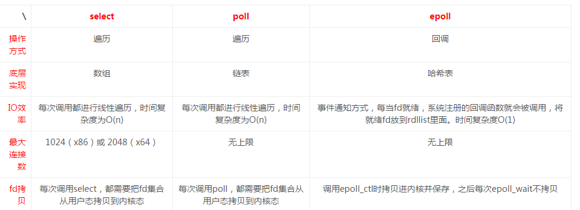

# IO

一般网络IO都有四种模型

## 1. 同步阻塞IO

Linux系统的read和write函数，在调用时会被阻塞，直到数据读取完成或者写入成功

## 2. 同步非阻塞IO

和同步阻塞I/O的API一样，只是打开fd的时候带有`O_NONBLOCK`参数。当调用read和write函数时，如果没有准备好数据，会立即返回，不会阻塞，然后让应用程序不断去轮询。  

## 3. IO多路复用

**IO多路复用是通过系统内核缓冲IO数据的机制，让单个进程可以监视多个文件描述符，一旦某个描述符就绪（读就绪或者写就绪），能够通知程序进行相应的读写操作。**  

### Socket

在讲IO多路复用之前，先了解一下Socket。  

当进程A执行到创建socket的语句时，操作系统会创建一个由文件系统管理的socket对象（如下图）。这个**socket对象包含了发送缓冲区、接收缓冲区、等待队列等成员。等待队列是个非常重要的结构，它指向所有需要等待该socket事件的进程。**  

当程序执行到recv时，**操作系统会将进程A从工作队列移动到该socket的等待队列中**。由于工作队列只剩下了进程B和C，依据进程调度，cpu会轮流执行这两个进程的程序，不会执行进程A的程序。**所以进程A被阻塞，不会往下执行代码，也不会占用cpu资源**。

### select

select的实现思路很直接。加入现在来了sock1，sock2，sock3三个socket，就在调用select之后，操作系统把进程A分别加入这三个socket的等待队列中。  

当有其中一个socket收到数据后，中断程序将唤起进程A，select函数返回给进程**有几个socket可以读写**，进程遍历一遍socket列表，就可以得到就绪的socket。  

这种方法简单且有效，但缺点也很明显：

1. 涉及两次遍历，开销大。调用select需要将进程遍历加入所有被监视socket的等待队列，每次唤醒有需要从每个等待队列中移除。另外每次都要将整个fds列表传递给内核，也有一定的开销。出于效率考量，select的最大监视数量默认1024个。  
2. 进程被唤醒时，程序并不知道哪些socket收到数据，还需要遍历一次

### poll

与select大致相同，管理多个描述符也是轮询根据状态处理，区别是poll没有最大文件描述符数量的限制。  

### epoll

epoll是Reactor事件驱动的OP方式，没有描述符个数限制。  

epoll通过以下措施来改进效率：

1. **功能分离**：select低效的原因之一是将“维护等待队列”和“阻塞进程”两个步骤合二为一。如下图所示，每次调用select都需要这两步操作，然而大多数应用场景中，需要监视的socket相对固定，并不需要每次都修改。epoll将这两个操作分开，先用epoll_ctl维护等待队列，再调用epoll_wait阻塞进程。显而易见的，效率就能得到提升。  

  

2. **就绪列表**：select低效的另一个原因在于程序不知道哪些socket收到数据，只能一个个遍历。如果内核维护一个“就绪列表”，引用收到数据的socket，就能避免遍历。

#### epoll的流程和原理

1. 创建epoll对象

   在调用epoll_create方法时，内核会创建一个eventpoll对象

2. 维护监视列表
   
   创建epoll对象后，可以用epoll_ctl添加或删除要监听的socket。添加过程是将epollevent对象加入对应socket的等待队列，当socket收到数据后，中断程序会操作eventpoll对象，而不是直接操作进程。
   
3. 接收数据

   socket收到数据后，中断程序会给eventpoll的就绪列表rdlist中添加socket引用。eventpoll相当于socket和进程之间的中介。当程序执行到epoll_wait时，如果rdlist已经引用了socket，那么epoll_wait直接返回；如果rdlist为空，则进程阻塞在epoll_wait。
   
4. 阻塞和唤醒进程

   假设计算机中正在运行进程A和进程B，此时AB都在内核的工作队列中。在某时刻进程A运行到了epoll_wait语句，内核会将进程A放入eventpoll的等待队列中，阻塞进程。  
   
   当socket接收到数据，中断程序一方面修改rdlist，另一方面唤醒eventpoll等待队列中的进程，进程A再次进入运行状态。**也因为rdlist的存在，进程A可以知道哪些socket发生了变化**。  
   
#### epoll的实现细节
1. 就绪队列

   **就绪列表引用着就绪的socket，所以它应能够快速的插入数据**。

   程序可能随时调用epoll_ctl添加监视socket，也可能随时删除。当删除时，若该socket已经存放在就绪列表中，它也应该被移除。

   **所以就绪列表应是一种能够快速插入和删除的数据结构。双向链表就是这样一种数据结构，epoll使用双向链表来实现就绪队列（rdllist）**。

2. 索引结构
   既然epoll将“维护监视队列”和“进程阻塞”分离，也意味着需要有个数据结构来**保存监视的socket**。**至少要方便的添加和移除，还要便于搜索，以避免重复添加**。红黑树是一种自平衡二叉查找树，搜索、插入和删除时间复杂度都是O(log(N))，效率较好。**epoll使用了红黑树作为索引结构**（rbr）。

#### LT水平触发
**默认工作模式**，即当epoll_wait检测到某描述符事件就绪并通知应用程序时，**应用程序可以不立即处理该事件**；**下次调用epoll_wait时，会再次通知此事件**。**读缓冲区只要不为空，就会一直触发读事件；写缓冲区只要不为满，就会一直触发写事件。    

#### ET边缘触发

当epoll_wait检测到某描述符事件就绪并通知应用程序时，**应用程序必须立即处理该事件。如果不处理，下次调用epoll_wait时，不会再次通知此事件**。（直到你做了某些操作导致该描述符变成未就绪状态了，也就是说**边缘触发只在状态由未就绪变为就绪的边缘时通知一次**）。

#### LT ET的选择

1. 对于LT模式，要避免写的死循环问题。因为写缓冲区满的概率比较小，写事件会一直触发，所以当用户注册了写事件却没有数据要写时，会一直触发写事件。所以再LT模式下写完数据一定要取消写事件
2. 对于ET模式，要避免short read问题。例如用户收到100字节，触发了一次，但用户只读到了50字节，剩下的50字节不读，它也不会再次触发。因此再ET模式下，一定要一次性把读缓冲区读完。  
3. 实际开发中一般倾向于LT，默认，Java NIO也是用的epoll的LT。因为ET容易漏事件，一次触发如果没有处理好，就没有第二次机会了。LT虽然有少许性能损耗，但是代码写起来更安全。 

### 几种IO多路复用的区别

  

## 4. 异步IO 

Windows的IOCP，读写全部是由操作系统完成，然后通过回调函数或者其他通信手段通知应用程序。  

在Linux系统上，C++的asio异步网络库，封装的是epoll，营造了模拟的异步，但底层实际上是IO多路复用的。  

## 零拷贝

这两篇看完，相当透彻  

https://zhuanlan.zhihu.com/p/83398714  

https://zhuanlan.zhihu.com/p/258513662  

稍微简单写两句，传统IO，涉及四次用户态到内核态切换（上下文切换），四次数据拷贝。  

数据拷贝的流程是，先拷贝到磁盘缓冲区（磁盘控制器做的，不是CPU时间），然后拷贝到内核缓冲区（第一次），再之后拷贝到用户内存（第二次），应用程序处理完之后再写回内核缓冲区（第三次），然后再拷贝到磁盘（第四次）。  

零拷贝就是为了减少上下文切换和数据拷贝，方法是，无需处理，直接发送的数据，比如将磁盘上的数据直接发到网络上，就不通过用户空间，直接在内核缓冲区拷贝到网卡缓冲区，减少两次上下文切换和一次拷贝。  

零拷贝主要实现思路有：用户态直接 I/O、减少数据拷贝次数以及写时复制技术。

减少数据拷贝是主流，方式主要有以下几种：

* mmap+write（四次上下文切换，1 次 CPU 拷贝和 2 次 DMA 拷贝）。 mmap 的目的是**将内核中读缓冲区（read buffer）的地址与用户空间的缓冲区（user buffer）进行映射，从而实现内核缓冲区与应用程序内存的共享，省去了将数据从内核读缓冲区（read buffer）拷贝到用户缓冲区（user buffer）的过程**
* sendfile（两次上下文切换，1 次 CPU 拷贝和 2 次 DMA 拷贝）。**与 mmap 内存映射方式不同的是， sendfile 调用中 I/O 数据对用户空间是完全不可见的。也就是说，这是一次完全意义上的数据传输过程。**
* 以及最牛逼的sendfile+DMA gather copy（两次上下文切换，0 次 CPU 拷贝以及 2 次 DMA 拷贝，直接从内核缓冲区拷贝到网卡，不经过Socket缓冲区）。**为 DMA 拷贝引入了 gather 操作。它将内核空间（kernel space）的读缓冲区（read buffer）中对应的数据描述信息（内存地址、地址偏移量）记录到相应的网络缓冲区（ socket buffer）中，由 DMA 根据内存地址、地址偏移量将数据批量地从读缓冲区（read buffer）拷贝到网卡设备中，这样就省去了内核空间中仅剩的 1 次 CPU 拷贝操作**

RocketMQ采用了mmap + write的方式，适用于小文件传输，频繁调用时效率很高，但不能很好的利用DMA拷贝，会被sendfile多消耗CPU，内存控制复杂，需要避免JVM Crash  

## Reactor

主动模式。所谓主动，是指应用程序不断地轮询，询问操作系统或者网络框架，I/O是否就绪。  

Linux的select，poll，epoll都属于Reactor模式，需要应用程序在一个循环中不断轮询。  

Java的NIO也是Reactor模式。  

## Proactor

被动模式。应用程序把read和write函数操作全部交给操作系统或者网络框架，实际的IO操作由操作系统或者网络框架完成，之后再回调应用程序。C++的asio库就是典型的Proactor模式。  

