# 计算机网络
# 新加问题：


## 基本概念

五层体系结构由**应用层，运输层，网络层（网际层），数据链路层，物理层**组成。运输层最主要的协议是 TCP 和 UDP 协议，网络层最重要的协议是 IP 协议。
## 物理层
物理层主要做的事情是**透明的传送比特流**。  

**物理层考虑的是怎样才能在连接各种计算机的传输媒体上传输数据比特流，而不是指具体的传输媒体。** 现有的计算机网络中的硬件设备和传输媒体的种类非常繁多，而且通信手段也有许多不同的方式。物理层的作用正是尽可能地屏蔽掉这些传输媒体和通信手段的差异，使物理层上面的数据链路层感觉不到这些差异，这样就可以使数据链路层只考虑完成本层的协议和服务，而不必考虑网络的具体传输媒体和通信手段是什么。  

### 常用的信道复用

1. 频分复用(FDM)：所有用户在同样的时间占用不同的带宽资源
2. 时分复用(TDM)：所有用户在不同的时间占用同样的频带宽度
3. 统计时分复用(Statistic TDM)：改进的时分复用，能够明显提高信道的利用率。
4. 码分复用(CDM)：用户使用经过特殊挑选的特殊码型，因此用户之间不会造成干扰。这种系统发送的信号有很强的抗干扰能力，其频谱类似于白噪声，不易被敌人发现。
5. 波分复用(WDM)：光的频分复用
## 数据链路层
* 循环冗余检验CRC：为了保证数据传输的可靠性，CRC 是数据链路层广泛使用的一种检错技术。
* 帧(Frame)：一个数据链路层的传送带元，由一个数据链路层首部和其携带的封包所组成协议数据单元
* MTU(Maximum Transfer Unit)：最大传送单元。帧的数据部分的长度上限
* 误码率BER：在一段时间内，传输错误的比特占所传输比特总数的比率
* PPP(Point-to-Point Protocal)：点对点协议，即用户和ISP通信时所采用的数据链路层协议
* MAC地址：或称为物理地址、硬件地址，用来定义网络设备的位置。**在 OSI 模型中，第三层网络层负责 IP 地址，第二层数据链路层则负责 MAC 地址。**因此一个主机会有一个 MAC 地址，而每个网络位置会有一个专属于它的 IP 地址 。地址是识别某个系统的重要标识符，“名字指出我们所要寻找的资源，地址指出资源所在的地方，路由告诉我们如何到达该处。
* 网桥：用于数据链路层实现中继，连接两个或多个局域网的网络互联设备
* 交换机：实质是一个多接口的网桥
### 以太网的数据链路层
* 以太网采用的无连接的工作方式，对发送的数据帧不进行编号，也不要求对方发回确认。目的站收到有差错帧就把它丢掉，其他什么也不做
* 以太网采用的协议是**具有冲突检测的载波监听多点接入 CSMA/CD**。协议的特点是：发送前先监听，边发送边监听，一旦发现总线上出现了碰撞，就立即停止发送。然后按照**退避算法**等待一段随机时间后再次发送。 因此，每一个站点在自己发送数据之后的一小段时间内，存在这遭遇碰撞的可能性。以太网上的各站点平等的争用以太网信道
* 以太网的适配器具有过滤功能，它只接收单播帧，广播帧和多播帧。
* 使用集线器可以在物理层扩展以太网（扩展后的以太网仍然是一个网络）
## 网络层
网络层主要作用是**实现主机与主机之间的通信，也叫点对点**  

似乎数据链路层也是做的这件事？但他们之间是有区分的：**IP 的作用是主机之间通信用的，而 MAC 的作用则是实现「直连」的两个设备之间通信，而 IP 则负责在「没有直连」的两个网络之间进行通信传输。**  

### IP协议的基础知识
* 在TCP/IP通信时，每个主机都需要配置正确的IP地址，否则无法正常通信。  
* IPv4地址由32位二进制表示；而为了人们记忆方便，采用点分十进制来表示，将32位二进制分为8位一组，总共4组，以‘.’隔开，每组转为0~255之间的十进制。  
* IP地址的最大值位2^32，约为43忆。采用可以更换IP地址的NAT技术，使得能够连接到互联网的设备远远超过43亿台。  
### IP地址的分类
IP地址被分为A、B、C、D、E五类，如下图  
  
黄色部分为分类号，用来区分IP地址的类别。  

#### 什么是A B C类地址？
ABC类地址主要分为两部分，**网络号和主机号**，根据二进制计算可以得到三类IP地址的取值范围和最大主机数。  

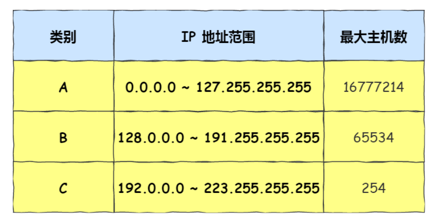  
最大主机数计算方式就是2的主机数位数次方 - 2，这里的减2，减掉的是主机号全1的用于指定某个网络的地址和主机号全0的用于广播的地址  

#### 什么是D E类地址？
而 D 类和 E 类地址是没有主机号的，所以不可用于主机 IP，D 类常被用于多播，E 类是预留的分类，暂时未使用。  

多播用于**将包发送给特定组的所有主机**，可以穿透路由  

#### IP地址分类的优缺点
* 优点：通过第几位是0/1可以快速判断出地址分类，然后就轻易知道了网络地址和主机地址。  
* 缺点：
	1. 同一网络下没有地址层次
	2. 不能很好的与现实的网络规模匹配
为了解决这些缺点，发明了CIDR无分类地址
### 无分类地址CIDR
32比特的IP地址被分为两部分，前面是网络号，后面是主机号，那么怎么划分二者呢？通过在后面添加一个`/x`，前x位属于网络号，x的范围是0~32  

比如：10.100.122.2/24，这种表示形式就是CIDR，前24位是网络号，剩余8位是主机号  

除此之外还有另一种划分网络号与主机号的形式，那就是**子网掩码**，掩码的意思就是掩盖掉主机号，剩余的就是网络号，将子网掩码和IP地址按位做AND操作，即可得到网络号  

### 为什么要分开网络号和主机号？
因为两台计算机要通讯，首先要判断是否处于同一个广播域内，即网络地址是否相同。如果相同，则表示接收方在本网络上，可以把数据包直接发送到目标主机。  

路由器寻址过程中，也是通过这样的方式找到对应网络号，进而把数据包转发进目标网络中的  

### 网络层后续部分先不看

### DNS
DNS域名解析可以将域名网址自动转换为具体的IP地址

https://zhuanlan.zhihu.com/p/32531969

#### 域名的层级关系
DNS中的域名都用句点来分割，例如`www.server.com`，句点代表了不同层次之间的界限  

在域名中，越靠右的位置表示其层级越高。根域是在最顶层，它的下一层是com顶级域，在下面是server.com  

所以域名的层级关系类似一个树状结构：  

* 根DNS服务器

* 顶级DNS服务器(com)

* 权威DNS服务器(server.com)

  根域的DNS服务器信息保存在互联网中所有DNS服务器中，这样任何DNS服务器就都可以找到并访问根域DNS服务器了。  

  因此，客户端只要找到任意一台DNS服务器，就可以通过它找到根域DNS服务器，再一路顺藤摸瓜找到位于下层的某台目标DNS服务器
#### DNS解析过程
1. 在浏览器中输入www . qq .com 域名，操作系统会**先检查自己本地的hosts文件是否有这个网址映射关系**，如果有，就先调用这个IP地址映射，完成域名解析。
2. 如果hosts里没有这个域名的映射，则**查找本地DNS解析器缓存**，是否有这个网址映射关系，如果有，直接返回，完成域名解析。
3. 如果hosts与本地DNS解析器缓存都没有相应的网址映射关系，首先会**找TCP/ip参数中设置的首选DNS服务器，在此我们叫它本地DNS服务器**，此服务器收到查询时，如果要查询的域名，包含在本地配置区域资源中，则返回解析结果给客户机，完成域名解析，此解析具有权威性。
4. 如果本地DNS服务器本地区域文件与缓存解析都失效，则**根据本地DNS服务器的设置（是否设置转发器）进行查询  
	如果未用转发模式，本地DNS就把请求发至13台根DNS，根DNS服务器收到请求后会判断这个域名(.com)是谁来授权管理，并会返回一个负责该顶级域名服务器的一个IP。本地DNS服务器收到IP信息后，将会联系负责.com域的这台服务器。这台负责.com域的服务器收到请求后，如果自己无法解析，它就会找一个管理.com域的下一级DNS服务器地址(http://qq.com)给本地DNS服务器。当本地DNS服务器收到这个地址后，就会找http://qq.com域服务器，重复上面的动作，进行查询，直至找到www  . qq  .com主机。**
	**如果用的是转发模式，此DNS服务器就会把请求转发至上一级DNS服务器，由上一级服务器进行解析，上一级服务器如果不能解析，或找根DNS或把转请求转至上上级，以此循环。不管是本地DNS服务器用是是转发，还是根提示，最后都是把结果返回给本地DNS服务器，由此DNS服务器再返回给客户机。**
* **从客户端到本地DNS服务器是属于递归查询，而DNS服务器之间就是的交互查询就是迭代查询。**

____________________________________
以下是另一个解释，写的也很好  

1. 浏览器缓存　　
	当用户通过浏览器访问某域名时，浏览器首先会在自己的缓存中查找是否有该域名对应的IP地址（若曾经访问过该域名且没有清空缓存便存在）；　　
2. 系统缓存　　
	当浏览器缓存中无域名对应IP则会自动检查用户计算机系统Hosts文件DNS缓存是否有该域名对应IP；　　
3. 路由器缓存　　
	当浏览器及系统缓存中均无域名对应IP则进入路由器缓存中检查，以上三步均为客服端的DNS缓存；　　
4. ISP（互联网服务提供商）DNS缓存　　
	当在用户客服端查找不到域名对应IP地址，则将进入ISP DNS缓存中进行查询。比如你用的是电信的网络，则会进入电信的DNS缓存服务器中进行查找；　　
5. 根域名服务器　　
	当以上均未完成，则进入根服务器进行查询。全球仅有13台根域名服务器，1个主根域名服务器，其余12为辅根域名服务器。根域名收到请求后会查看区域文件记录，若无则将其管辖范围内顶级域名（如.com）服务器IP告诉本地DNS服务器；　　
6. 顶级域名服务器　　
	顶级域名服务器收到请求后查看区域文件记录，若无则将其管辖范围内主域名服务器的IP地址告诉本地DNS服务器；　　
7. 主域名服务器　　
	主域名服务器接受到请求后查询自己的缓存，如果没有则进入下一级域名服务器进行查找，并重复该步骤直至找到正确纪录；　　
8. 保存结果至缓存　　
	本地域名服务器把返回的结果保存到缓存，以备下一次使用，同时将该结果反馈给客户端，客户端通过这个IP地址与web服务器建立链接。
### ARP

### DHCP

https://zhuanlan.zhihu.com/p/32531969

### NAT

### ICMP

### IGMP

## 运输层/传输层
详细看小林coding的pdf
### TCP
#### TCP基本认识
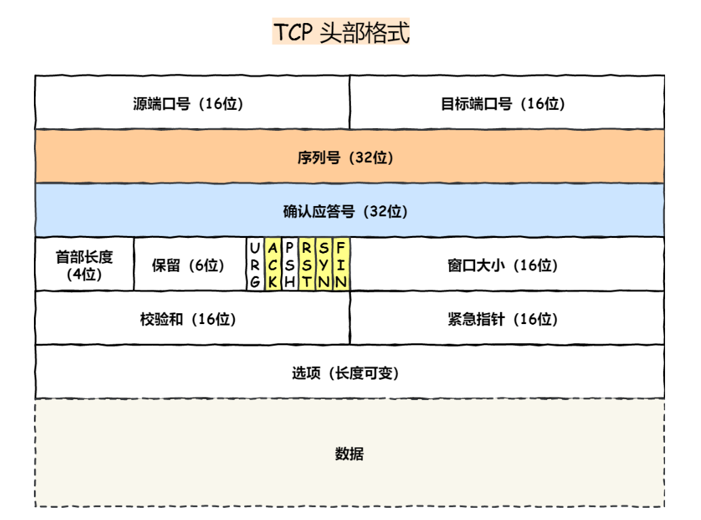
彩色部分是我们要特殊注意的  

* 序列号：在建立连接时，计算机生成随机数作为其初始值，通过SYN传给接收端，每发送一次数据，就**累加一次该数据字节数的大小**，**用来解决网络包乱序问题**
* 确认应答号：下一次**期望**收到的数据的序列号，发送端收到这个确认应答以后**可以认为在这个序号以前的数据都已经被正常接收**。**用来解决丢包的问题**。
* 控制位
	1. ACK：该位为`1`时，确认应答字段有效。TCP规定储存了最初建立连接时的SYN包以外，该位必须设置为1
	2. RST：该位为`1`时，表示TCP连接中出现异常必须强制断开连接
	3. SYN：该位为`1`时，表示希望建立连接，并在其序列号的字段进行序列号初始值的设定
	4. FIN：该位为`1`时，表示今后不会再有数据发送，希望断开连接。当通信结束希望断开连接时，通信双方的主机之间就可以相互交换`FIN`位为1的TCP段
#### 为什么需要TCP？
IP层是不可靠的，它**不保证网络包交付、按序交付、数据完整性**  

要保障网络数据包的可靠性，就需要传输层的TCP来负责。  

因为TCP是工作的**传输层**的**可靠**数据传输服务，它能确保接收端接收的网络包是**无损坏、无间隔、非冗余、按序的**  

#### 什么是TCP？
TCP是**面向连接的、可靠的、基于字节流**的传输层通信协议  
* 面向连接：**一对一**才能连接，不能像UDP，一个主机同时向多个主机发送消息，一对多是无法做到的
* 可靠的：无论网络链路中出现了怎盐大哥链路变化，TCP都可以保证一个报文一定能够到达接收端
* 字节流：消息**没有边界**的，所以无论我们消息有多大，都可以传输。并且消息是**有序的**，当前一个消息没有收到的时候，即使先收到了后面的消息，也不能给应用层去处理，同时**重复**的报文会自动丢弃
#### 什么是TCP连接
**用于保证可靠性和流量控制维护的某些状态信息，这些信息的组合，包括Socket、序列号和窗口大小称为连接**  

建立一个连接需要客户端与服务器就以上三个信息达成共识  

* Socket：由IP地址和端口号组成
* 序列号：用来解决乱序问题
* 窗口大小：用来做流量控制
#### 如何唯一确定一个TCP连接？
**TCP四元组**  

* 源IP地址
* 源端口
* 目的IP地址
* 目的端口

源地址和目的地址字段是在IP头部中，作用是通过IP协议发送报文给对方主机  

源端口和目的端口是在TCP头部中，作用是告诉TCP协议应该把报文发给哪个**进程**  
#### 有一个IP的服务器监听了一个端口，它的TCP最大连接数是多少
服务器通常固定监听某个本地端口，等待客户端的连接请求。  

因此**客户端IP和端口是可变的**，其理论值计算公式如下：

**最大TCP连接数 = 客户端IP数 × 客户端的端口数**

* 对于IPv4，客户端IP数最多为2^32，客户端端口数最多为2^16。也就是说**服务器单机最大TCP连接数约为2^48**  
当然了，服务器最大并发TCP连接数远远不能达到理论上限  
* 文件描述符限制：Socket都是以文件形式打开的，所以要通过ulimit配置文件描述符的数目
* 内存限制：每个TCP连接都要占用一定内存，而内存是有限的  
#### TCP和UDP的区别？分别的应用场景？
* UDP不提供复杂的控制机制，利用IP提供面向无连接的通信服务
* UDP协议非常简单，头部只有8个字节(64位)，UDP头部格式如下
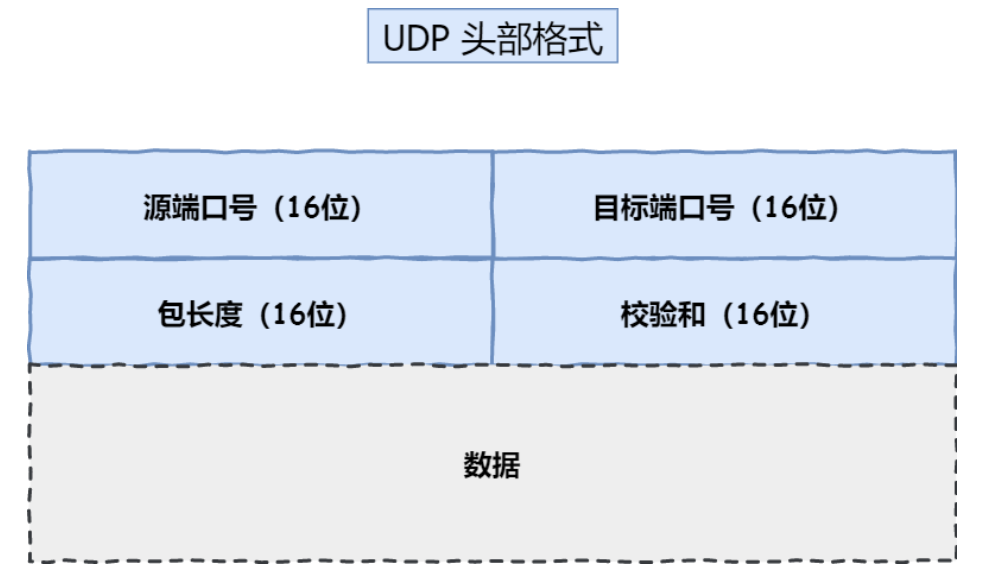  
* 目标和源端口：告诉UDP协议应该把报文发给哪个进程
* 包长度：保存了UDP首部长度和数据长度之和
* 校验和：为了提供可靠的UDP首部和数据而设计

**区别**

1. **连接**
	TCP：面向连接
	UDP：不需要建立连接
2. **服务对象**
	TCP：一对一的两点服务
	UDP：一对一、一对多、多对多交互通信
3. **可靠性**
	TCP：可靠交付，数据无差错、不丢失、不重复、按序到达
	UDP：尽最大努力交付，不保证可靠
4. **拥塞控制、流量控制**
	TCP：有拥塞控制和流量控制，保证数据传输安全性
	UDP：没有，即使网络非常拥堵，也不会影响UDP的发送速率
5. **首部开销**
	TCP首部长度较长，会有一定开销，没有”选项“字段时是20个字节，使用了会变得更长
	UDP：8个字节，固定不变，开销较小
6. **传输方式**
	TCP：流式传输，没有边界，但保证顺序和可靠
	UDP：一个包一个包的发送，有边界，可能会丢包和乱序
7. **分片不同**
	TCP：数据大小如果大于MSS大小，则会在传输层进行分片，目标主机收到后，同样在传输层组装TCP数据包。如果中途丢失了一个分片，只需要传输丢失的这个分片
	UDP：如果数据大小大于MTU大小，则会在IP层分片。目标主机收到后，在IP层组装完数据，接着再传给传输层，但如果中间丢了一个分片，需要**重传所有数据包**。这样效率很差，所以通常UDP报文应小于MTU

**应用场景**

* 由于TCP面向连接，能保证数据的可靠交付，因此经常用于：
	FTP文件传输
	HTTP/HTTPS
* 由于UDP无连接，随时发送数据，再加上UDP本身处理简单又搞笑，因此经常用于：
	包总量较少的通信，如DNS、SNMP等
	视频、音频等多媒体通信
	广播通信
#### 为什么UDP首部没有首部长度，而TCP有呢？
**TCP有可变长的选项字段，而UDP首部长度不会变化**

#### 为什么UDP头部有包长度字段，而TCP没有
TCP数据长度 = IP总长度 - IP首部长度 - TCP首部长度  

其中IP总长度和IP首部长度在IP首部里已知，TCP首部长度在TCP首部中已知，所以就可以求得TCP数据的长度。  

UDP也可以通过同样的方式计算，但有一个问题，**为了网络设备硬件设计和处理方便，首部长度需要是4字节的整数倍**，如果去掉UDP包长度，那么UDP首部就不是4字节的整数倍了，可能是为了补全4的整数倍才加了一个包长度的冗余字段。  

### TCP连接建立
使用TCP前必须先建立连接，建立连接通过**三次握手**  

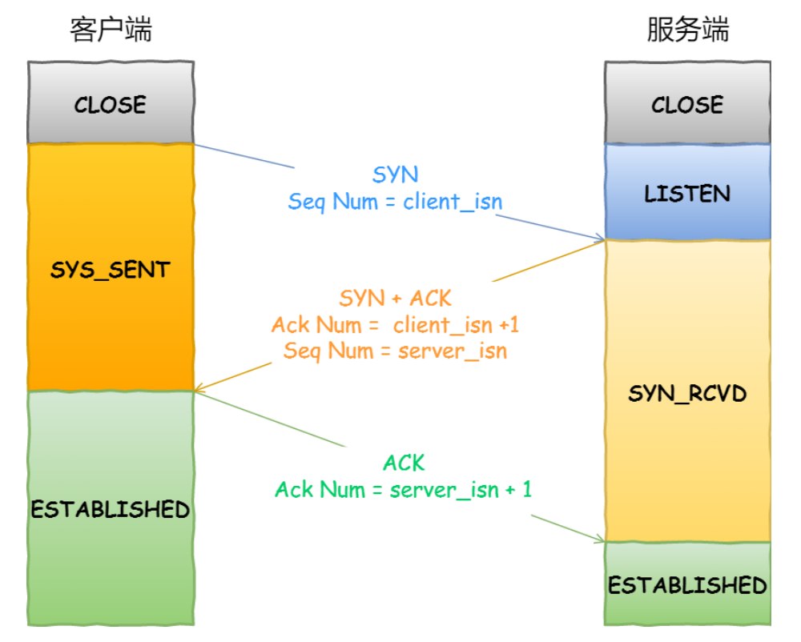  

1. 一开始，客户端和服务端都处于`CLOSED`状态。第一步服务端主动监听某个端口，处于`LISRTEN`状态
2. 第一次握手：客户端随机初始化序号(client_isn)，把它放入 TCP 首部的序列号字段中，同时SYN置为1，表示SYN报文.接着把第一个SYN报文发送给服务端，表示向服务端发起连接，该报文不包含应用层数据，客户端处于`SYN-SENT`状态
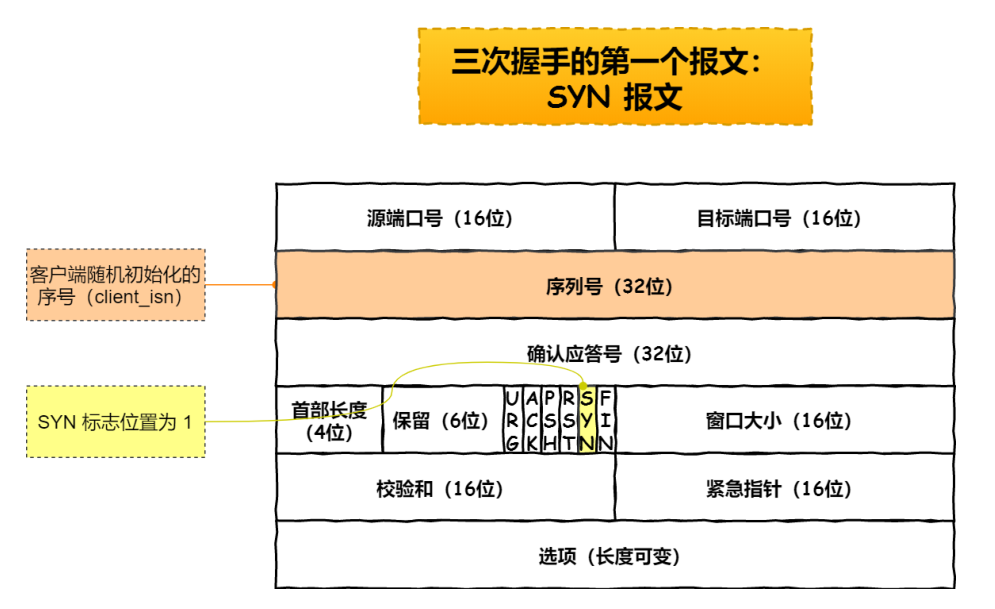  
3. 第二次握手：客户端收到SYN报文后，首先服务端初始花自己的序号(server_isn)，将此序号填入TCP首部序列号字段，其次把TCP首部的确认应答号字段填入`client_isn + 1`，接着把SYN和ACK置为1。最后报文发送给客户端，该报文也不包含应用层数据，之后服务端处于`SYN-RCVD`字段  

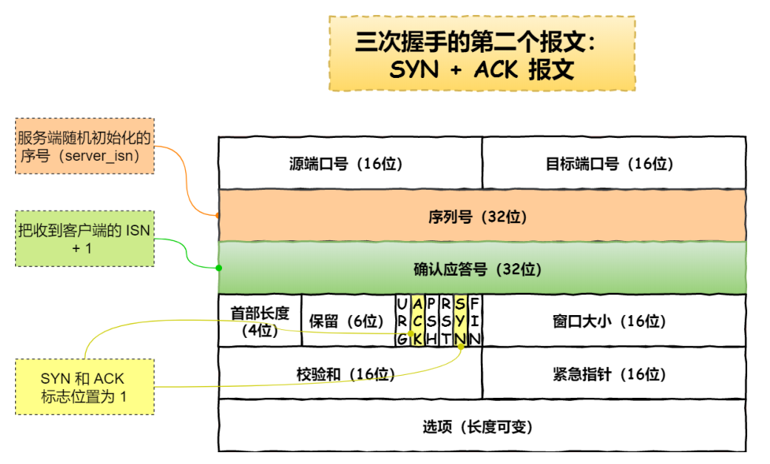  

4. 第三次握手：客户端收到服务端报文后，向服务端回应最后一个应答报文，首先将应答报文TCP首部ACK标志位设置为1，其次确认应答号字段填入`server_isn + 1`，最后把报文发送给服务端，这次报文**可以携带客户到服务器的数据**，之后客户端处于`ESTABLISHED`状态

  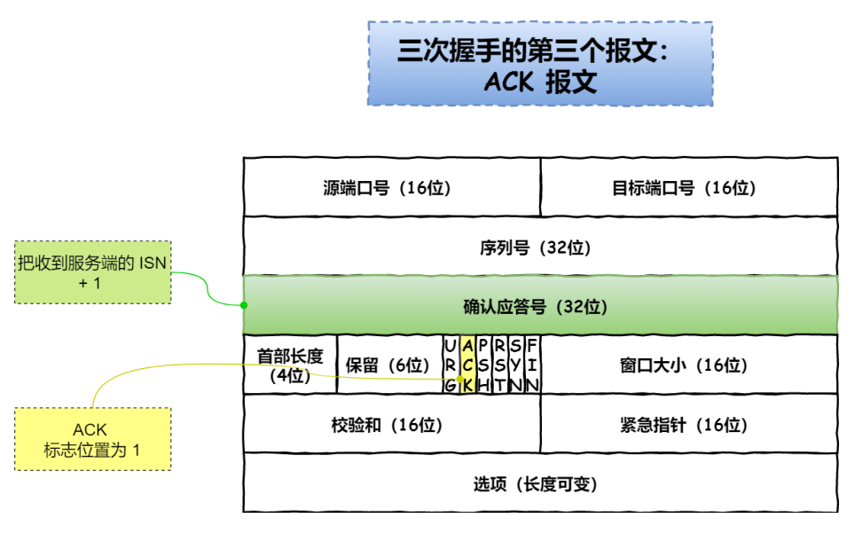  

5. 服务端收到客户端的应答报文，进入`ESTABLISHED`状态，TCP连接建立成功

**上面过程可以发现，三次握手是可以携带数据，其中前两次不可以携带数据**  

#### 如果在Linux系统中查看TCP状态？
通过`netstat -napt`命令查看、
#### 为什么建立TCP连接要三次握手？不是两次、四次？
前面我们知道了**什么是TCP连接：用于保证可靠性和流量控制维护了某些状态信息，这些信息的组合，包括Socket、序列号和窗口大小称为连接**  

所以**为什么三次握手建立TCP连接，其实本质问题是为什么三次握手才能初始化Socket、序列号和窗口大小**  

接下来从三个方面分析：

1. 三次握手才可以阻止重复历史连接的初始化（主要原因）
2. 三次握手才可以同步双方的初始序列号
3. 三次握手才可以避免浪费资源
##### 原因一：避免历史连接
三次握手的**首要原因时为了防止旧的重复连接初始化造成混乱**

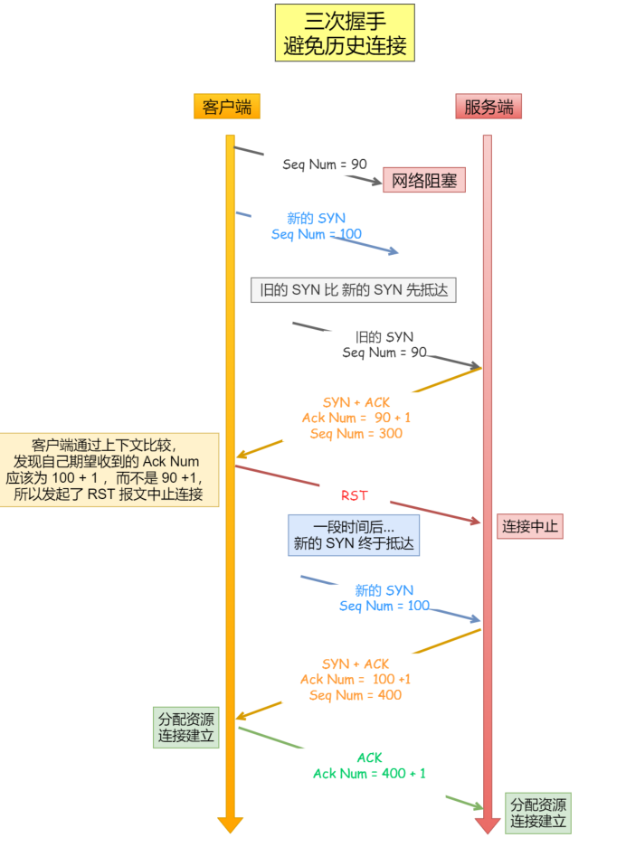  

客户端连续发送多次SYN建立连接的报文，在网络拥堵情况下：

* 一个旧SYN报文比最新的SYN报文早到达了服务端

* 那么此时服务端会回一个SYN+ACK报文给客户端

* 客户端收到后，根据自身上下文，判断这是一个历史连接（序列号过期或超时），那么客户端就会发送RST报文给服务端中止这次连接  

  **如果是两次握手，就不能判断当前连接是否是历史连接，三次握手则可以在客户端准备发送第三次报文时，客户端有足够的上下文判断当前连接是否是历史连接。**  

* 如果是历史连接（序列号过期），则第三次握手发送的报文是RST，以终止历史连接

* 如果不是历史连接，第三次握手发送的报文时ACK，建立连接

**所以TCP使用三次握手建立连接的最主要原因是防止历史连接初始化了连接**  

##### 原因二：同步双方初始序列号
TCP协议的通信双方，都必须维护一个**序列号**，序列号是可靠传输的一个关键因素，作用是：
* 接收方可以取处重复数据
* 接收方可以根据序列号按序接收
* 可以标识发送出去的数据包中，哪些已经被对方收到
可见，序列号占据着非常重要的作用，所以当客户端发送携带**初始序列号**的SYN报文的时候，需要服务端回一个ACK应答报文，表示客户端的SYN报文已经被服务端成功接收，那当服务端发送初始序列号给客户端的时候，也要得到客户端的应答。**这样一来一回，二来二回，（中间两个被合并在一起），才能确保双方的初始序列号能被可靠的同步**  
* 四次握手也能够可靠的同步双方的初始化序列号，但由于**二三步可以优化成一步，就做成了三次握手**；而两次握手只能保证一方的初始序列号能被对方成功接收，没办法双向保证  
##### 原因三：避免资源浪费
如果只有两次握手，客户端的SYN请求连接在网络中阻塞时，如果客户端没有接收到服务器返回的SYN+ACK报文，就会重新发送SYN，由于没有第三次握手，服务器不清楚客户端是否收到了自己发送的建立连接的SYN+ACK信号，所以每收到一个SYN就要主动建立一个连接。这会导致一个问题：  

**在两次握手的情况下，如果客户端的SYN阻塞了，重复发送多次SYN,那么服务器就会在收到请求后建立多个冗余的无效连接，造成不必要的资源浪费**   

所以总结下来：

* 两次握手：无法防止历史连接建立，会造成双方资源浪费，也无法可靠的同步双方序列号
* 四次握手：三次握手就已经理论上最少可靠连接建立，不需要使用更多的通信次数
#### 为什么客户端和服务端的初始序列号isn不相同？
如果一个失效的连接被重用，但是该旧连接的历史报文还残留在网络中，如果序列号相同，那么就无法分辨该报文是否是历史保温，如果历史报文被新的连接接收，就会产生数据错乱。  

所以**每次建立连接前重新初始化一个序列号主要是为了通信双方能够根据序列号将不属于本次连接的报文丢弃**  

另一方面为了**安全性，防止黑客伪造相同序列号的TCP报文被对方接收**  

#### 初始序列号isn是如何随机产生的？
**基于时钟**，每4毫秒+1，转一圈要4.55小时。  

ISN = M + F(localhost, localport, remotehost, remoteport)  

* M是一个计时器，每隔4毫秒加1
* F是一个hash算法，根据localhost, localport, remotehost, remoteport生成一个随机值。要保证该hash不能被外界轻易推算，MD5是一个较好的选择。

#### 既然IP层会分片，为什么TCP层还需要MSS呢？
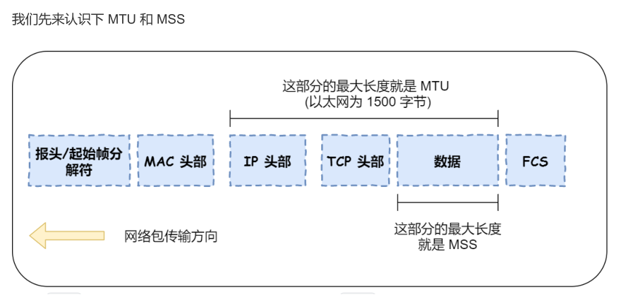  
* MTU：一个网络包的最大长度，以太网中一般为1500字节
* MSS：除去IP和TCP头部之后，一个网络包所能容纳的TCP数据的最大长度
如果TCP的整个报文(头部+数据)交给IP层分片，当IP层有一个超过MTU的数据（TCP头部+TCP数据）要发送，那么IP层就会分片，由目标主机的IP层重新组装后交给TCP传输层。  

这看起来没问题，但存在隐患:**如果一个IP分片丢失，整个IP报文的所有分片都得重传**  

因为IP层本身没有超时重传机制，它由传输层的TCP负责超时和重传  

**当接收方发现TCP报文的某一篇丢失，则不会相应ACK给发送方，那么发送方在TCP超时后，就不得不重发整个TCP报文。由此可见，由IP层进行分片传输，非常没有效率。**   

所以，为了达到最佳的传输效能 TCP 协议**在建立连接的时候通常要协商双方的 MSS 值**，当 TCP 层发现数据超过 MSS 时，则就先会进行分片，当然由它形成的 IP 包的长度也就不会大于 MTU ，自然也就不用 IP 分片了。   

经过 TCP 层分片后，如果一个 TCP 分片丢失后，**进行重发时也是以 MSS 为单位，而不用重传所有的分片**，大大增加了重传的效率。  

#### SYN攻击/SYN泛洪攻击

我们都知道 TCP 连接建立是需要三次握手，在服务器收到SYN报文时，会将其放入**SYN接收队列**，将自己设置为SYN_RCVD状态，并回复ACK + SYN  

假设攻击者短时间伪造不同 IP 地址的 SYN  报文，服务端每接收到一个 SYN  报文，就进入 SYN_RCVD  状态，但服务端发送出去的 ACK + SYN  报文，**无法得到未知 IP 主机的 ACK  应答，久而久之就会占满服务端的 SYN 接收队列（未连接队列），使得服务器不能为正常用户服务。**  

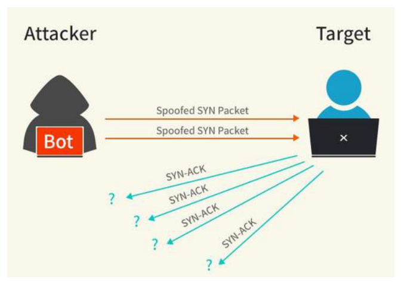  

##### 避免SYN攻击方式一
其中一种解决方式是通过修改 Linux 内核参数，控制队列大小和当队列满时应做什么处理。  

* 当网卡接收数据包的速度大于内核处理的速度时，会有一个队列保存这些数据包。控制**该队列的最大值**如下参数`net.core.netdev_max_backlog`
* SYN_RCVD **状态连接的最大个数** `net.ipv4.tcp_max_syn_backlog`
* 超出处理能力时，**对新的 SYN 直接回报 RST，丢弃连接**  `net.ipv4.tcp_abort_on_overflow`

##### 避免SYN攻击方式二
* 未连接队列/SYN队列中的连接，会在发送SYN+ACK，并收到第三次握手的ACK后，转入Accept队列，应用程序从Accept队列中调用accept()函数取出连接
* 若应用程序处理过慢，Accept队列满，会丢失第三次握手的连接
* 若受到SYN攻击，则不会收到ACK，SYN队列满，Accept队列空
* 处理方式为：开启tcp_syncookies ，设置`net.ipv4.tcp_syncookies = 1`。**该方法会在SYN队列满之后，对后续服务器收到的SYN包，不进入SYN队列，转而计算出一个cookie值，再以SYN + ACK包中的【序列号】返回客户端**
* 服务器收到应答报文时，会检查ACK包合法性，之后直接放入Accept队列。 

详细图解直接看小林Coding

#### TCP三次握手中，某一次握手发生异常会怎么样？
##### 第一次SYN
* 如果第一次SYN丢包：在超时时间内没收到服务端的 ACK，就会在超时重传 SYN 数据包，每次超时重传的等待时间 RTO 是**翻倍**上涨的，直到 SYN 包的重传次数到达 tcp_syn_retries  值后，客户端不再发送 SYN 包。  
* 重传次数默认5次
* 如果SYN发送过去，但是对端端口未打开，或者未连接队列满了，或者端口上没有监听应用程序，则**服务端直接回复RST**


##### 第二次SYN + ACK
* 当 TCP 第二次握手 SYN + ACK 包丢了后，客户端不知道SYN到底到没到达服务端。
* 客户端 SYN 包会发生超时重传，服务端 SYN、ACK 也会发生超时重传。
* 二者重传次数都是默认5次

##### 第三次ACK
* 在建立 TCP 连接时，如果第三次握手的 ACK，服务端无法收到，则服务端就会短暂处于 SYN_RECV状态，而客户端会处于 ESTABLISHED  状态。
* 由于服务端一直收不到 TCP 第三次握手的 ACK，则会一直重传 SYN、ACK 包，直到重传次数超过tcp_synack_retries  值（默认值 5 次）后，服务端就会断开 TCP 连接。
* 而客户端会有两种情况：
	1. 如果客户端在认为连接已经建立之后，没发送数据包，一直处于ESTABLISHED状态，经过2 小时 11 分 15 秒才可以发现一个「死亡」连接，于是客户端连接就会断开连接。  
	2. 如果客户端在认为连接已经建立之后，发送了数据包，一直没有收到服务端对该数据包的确认报文，则会一直重传该数据包，直到重传次数超过 tcp_retries2  值（**默认值 15 次**）后，客户端就会断开 TCP 连接。


### TCP连接断开
#### TCP四次挥手过程和状态变迁
* 双方都可以主动断开连接，断开连接后主机中的资源将被释放  

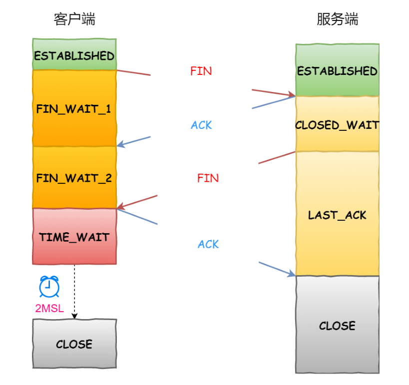  

过程：
1. 客户端打算关闭连接，发送一个TCP首部FIN置为1的报文，即**FIN报文**，之后客户端进入**FIN_WAIT_1状态**
2. 服务端收到该报文，向客户端发送**ACK应答报文**，接着服务端进入**CLOSED_WAIT状态**
3. 客户端收到服务端的ACK应答报文后，进入**FIN_WAIT_2状态**
4. 待服务端处理完数据后，向客户端发送**FIN报文**，之后服务端进入**LAST_ACK状态**
5. 客户端收到服务端的FIN报文后，回一个**ACK应答报文**，之后进入**TIME_WAIT状态**
6. 服务端收到ACK报文后，进入**CLOSED状态**，服务端连接完全关闭
7. 客户端经过**2MSL**时间后，自动进入**CLOSED状态**，客户端连接完全关闭

**可以看到，每个方向都需要一个FIN和一个ACK，因此被称为四次挥手**，需要注意，**主动关闭连接的一方才有TIME_WAIT状态。**  

#### 为什么需要四次挥手？
* 关闭连接时，客户端首先向服务端发送FIN，仅表示客户端不再发送数据了**但还能接收数据**
* 服务器收到客户端FIN时，先回一个ACK，而**服务端可能还有数据要处理和发送，等服务端不在发送数据了，才发送FIN报文给客户端表示同意现在关闭连接**。
* 因此，服务端通常需要等待完成数据的发送和处理，所以服务端中间两次的ACK和FIN一般会分开发送，因此比三次握手多了一次

#### 为什么TIME_WAIT等待时间是2MSL？
MSL：报文最大生存时间，网络上超过这个时间的报文将被丢弃。另外IP头中还有一个TTL字段，表示IP数据报可以经过的最大路由数，每经过一个路由器就减一，当为0时该数据报将被丢弃，同时发送ICMP通知源主机  

MSL与TTL的区别：MSL 的单位是时间，而 TTL 是经过路由跳数。所以 MSL 应该要大于等于 TTL消耗为 0 的时间，以确保报文已被自然消亡。  

TIME_WAIT等待2倍MSL，是因为网络中可能存在来自发送方的数据包，这些数据包被接收方处理后又会向发送方回复响应，所以**一来一回需要等待2倍时间**。  

**比如如果被动关闭方没有收到断开连接时最后的ACK报文，就会触发超时重传FIN报文，另一方接收到FIN后，会重发ACK给被动关闭方，一来一回正好2MSL。**  

2MSL是从客户端接收到**FIN后发送ACK开始计时的，**如果在TIME_WAIT时间内，因为客户端的ACK没有传输到服务端，客户端有接收到了服务端重发的FIN，那么**2MSL将重新计时**  

在Linux中，2MSL默认60秒，也就是MSL=30秒。  

#### 为什么需要TIME_WAIT状态
主动发起关闭连接的一方，才会有TIME_WAIT状态。  

需要这个状态主要是两个原因：

1. **防止具有相同四元组的旧数据包被收到**
2. 保证被动关闭连接的一方能够被正常关闭，即**确保最后的ACK能让被动关闭方接收，从而帮助其正常关闭**

##### 原因一：防止具有相同四元组的旧数据包被收到

TCP 就设计出了这么一个机制，**经过 2MSL  这个时间，足以让两个方向上的数据包都被丢弃，使得原来连接的数据包在网络中都自然消失，再出现的数据包一定都是新建立连接所产生的**。  

因此TIME_WAIT不能过短。  

##### 原因二：保证连接正确关闭
如果 TIME-WAIT 等待足够长的情况就会遇到两种情况：  

* 服务端正常收到四次挥手的最后一个 ACK  报文，则服务端正常关闭连接。
* 服务端没有收到四次挥手的最后一个 ACK  报文时，则会重发 FIN  关闭连接报文并等待新的ACK  报文。而客户端需要2MSL的TIME_WAIT才能等待到服务端超时重发的FIN

所以客户端在 TIME-WAIT  状态等待 2MSL  时间后，就可以保证双方的连接都可以正常的关闭。

#### TIME_WAIT过短或过长有什么危害？
过短：导致收到上一次连接的数据包
过长：1. 内存占用  2. 端口资源占用 

#### 如何优化TIME_WAIT？
1. 设置net.ipv4.tcp_tw_reuse = 1和 tcp_timestamps = 1
	这两个Linux内核参数开启后，可以**复用处于TIME_WAIT的socket为新的连接所用**  
	
	原理是：开启tcp_tw_reuse，可以用于客户端（连接发起方），在调用connect()函数时，内核随即找一个time_wait超过1秒的连接给新的连接复用；但其前提时要开启 tcp_timestamps ，开启了时间戳，2MSL的问题就不复存在了。因为重复的数据包会因为时间戳过期而自然丢弃。  
	
2. net.ipv4.tcp_max_tw_buckets 这个方法不推荐使用

3. 程序中使用SO_LINGER，不推荐使用  

### 如果已经建立了连接，但是客户端突然出现故障了怎么办？
TCP有一个**保活机制**，原理如下：  

定义一个时间段，在这个时间段内，如果没有任何连接相关的活动，TCP 保活机制会开始作用，每隔一个时间间隔，发送一个探测报文，该探测报文包含的数据非常少，如果**连续几个探测报文都没有得到响应，则认为当前的 TCP 连接已经死亡**，系统内核将错误信息通知给上层应用程序。  

默认值：  

```
net.ipv4.tcp_keepalive_time=7200  //保活时间7200秒
net.ipv4.tcp_keepalive_intvl=75   //每次检测间隔75秒
net.ipv4.tcp_keepalive_probes=9   //9次检测无响应则中断连接
```
也就是说在Linux系统中，2小时11分15秒才能发现一个死亡连接  

开启TCP保活后，有以下几种情况：
1. 对端程序正常工作，此时**TCP保活时间会被重置**
2. 对端程序崩溃并重启，此时对端是可以响应的，但由于该连接有效信息已丢失，**会产生一个RST报文**，这样很快会发现TCP连接已经被重置
3. 对端程序崩溃，或对端由于其他原因报文不可达。保活会连续发送几次，到达探测次数后，**TCP会报告该TCP连接已经死亡**  

### Socket编程

### TCP是如何保证可靠的
为了实现可靠性传输，需要考虑很多事情，例如**数据的破坏、丢包、重复以及分片顺序混乱**等问题。如不能解决这些问题，也就无从谈起可靠传输。  

那么，TCP 是通过**序列号、确认应答、重发控制、连接管理以及窗口控制**等机制实现可靠性传输的。  

今天，将重点介绍 TCP 的**重传机制、滑动窗口、流量控制、拥塞控制**。

### 重传机制
TCP实现可靠传输的方式之一，是通过**序列号与确认应答**。  

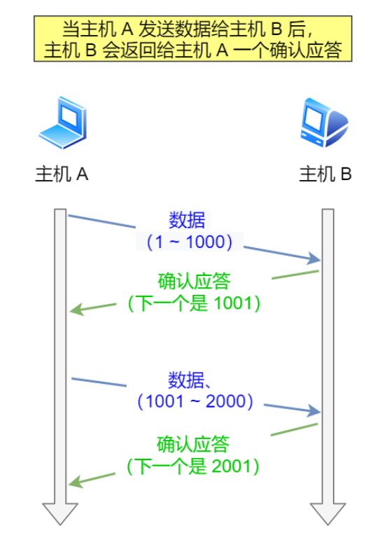  
但是实际错综复杂的网络中，并不一定能顺利正常的数据传输，**TCP针对数据包丢失的情况，采用重传机制解决**  

常见的重传机制：

* 超时重传
* 快速重传
* SACK
* D-SACK
#### 超时重传
重传机制的其中一个方式，就是在发送数据时，设定一个定时器，**当超过指定的时间后，没有收到对方的 ACK  确认应答报文，就会重发该数据**，也就是我们常说的**超时重传**。  

TCP会在以下两种情况发生超时重传：

* 数据包丢失
* 确认应答丢失
##### 超时时间设置为多少呢？
我们先来了解以下RTT（Round-Trip Time往返时延），**RTT是从网络一端传到另一端所需的时间，也就是包的往返时间**。  

超时重传时间是以RTO(Retransmission Timeout 超时重传时间)表示  

* 假设重传的情况下，超时时间RTO较长，重发会很慢，丢了很久才重发，效率较低  

* RTO较短，导致可能还没丢就重发，于是重发太快，会增加网络拥塞，导致更多超时，更多的超时就导致更多的重发  

  因此我们得知，**超时重传时间RTO的值应该略大于报文往返时间RTT的值**  

  实际上RTT的值经常变化，所以RTO也应该是一个**动态变化的值**。  

另外，如果超时重发的数据，再次超时的时候，又需要重传的时候，TCP 的策略是**超时间隔加倍**。也就是每当遇到一次超时重传的时候，都会将下一次超时时间间隔设为**先前值的两倍**。两次超时，就说明网络环境差，不宜频繁反复发送。**可以用快速重传机制来解决超时重发的时间等待**
#### 快速重传
快速重传，**不以时间为驱动，而是以数据驱动重传**  

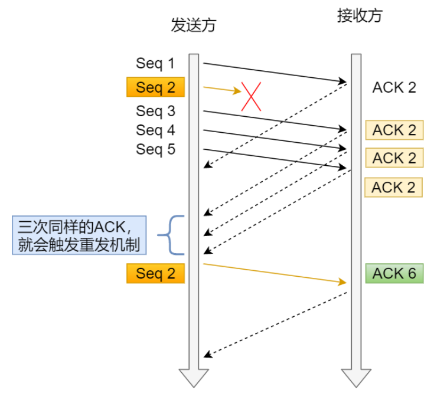  
如上图，**快速重传的工作方式是，当收到三个相同的ACK报文时，会在定时器过期之前，重传丢失的报文**  

快速重传机制只解决了一个问题，就是超时时间的问题，但是**它依然面临着另外一个问题，就是重传的时候，是重传之前的一个，还是重传所有的问题**。  

比如对于上面的例子，是重传 Seq2 呢？还是重传 Seq2、Seq3、Seq4、Seq5 呢？因为发送端并不清楚这连续的三个 Ack 2 是谁传回来的。由于不知道该重传哪些TCP报文，就有了SACK方法

#### SACK方法
SACK（ Selective Acknowledgment 选择性确认）  

这种方式需要**在TCP头部选项字段里加一个SACK的东西，可以将缓存的map发送给发送方**，这样发送方就知道哪些数据收到了，哪些数据没收到，知道了这些信息，就可以**只重传丢失的数据**。  

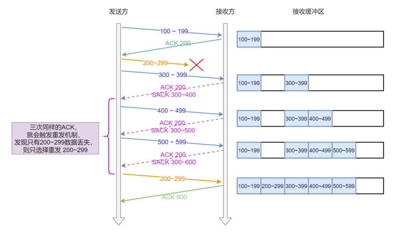  
如果要支持 SACK ，必须双方都要支持。在 Linux 下，可以通过 net.ipv4.tcp_sack  参数打开这个功能（Linux 2.4 后默认打开）。  

#### Duplicate SACK
D-SACK主要使用了SACK来告诉发送方，有哪些数据被重复接收了  

示例一：ACK丢包
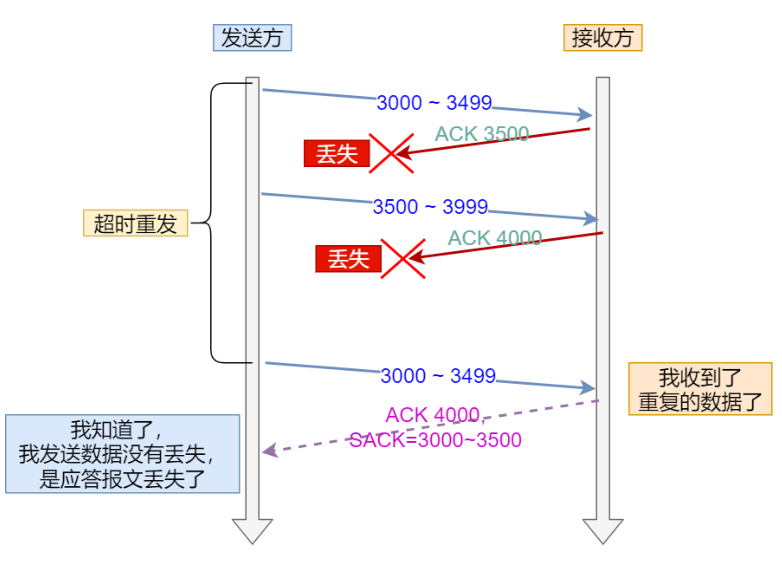  

* 接收方给发送方的两个ACK都丢失了，所以发送方超时后，重传第一个数据包
* **接收方发现数据重复收到，于是回复SACK=3000~3500，告诉发送方3000~3500的数据早已被接受**，ACK都到了4000，这意味着4000之前的数据都已收到，这个SACK就代表着D-SACK  
* 这样发送方就知道了，数据没有丢，是接受方的ACK丢了

示例二：网络延时  

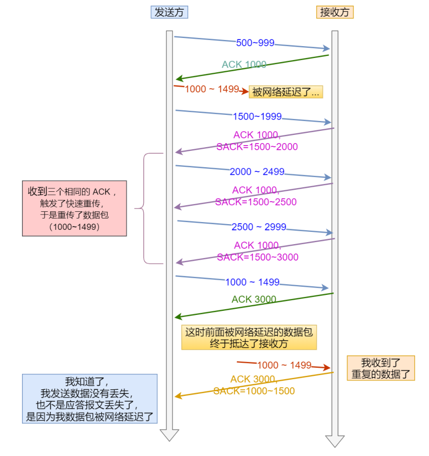  

* 数据包（1000~1499） 被网络延迟了，导致「发送方」没有收到 Ack 1500 的确认报文。
* 而后面报文到达的三个相同的 ACK 确认报文，就触发了快速重传机制，但是在重传后，被延迟的数据包（1000~1499）又到了「接收方」；
* **所以「接收方」回了一个 SACK=1000~1500，因为 ACK 已经到了 3000，所以这个 SACK 是 D-SACK，表示收到了重复的包。**
* 这样发送方就知道快速重传触发的原因不是发出去的包丢了，也不是因为回应的 ACK 包丢了，而是因为网络延迟了。

由此可见D-SACK有几个好处：

1. 可以从让发送方知道，是发出去的包丢了，还是接收方回应的ACK丢了
2. 可以让知道是不是发送方的数据包被网络延迟了
3. 可以知道网络中是不是把发送方的数据包给复制了、
在 Linux 下可以通过 net.ipv4.tcp_dsack  参数开启/关闭这个功能（Linux 2.4 后默认打开）
### 滑动窗口
我们都知道 TCP 是每发送一个数据，都要进行一次确认应答。**当上一个数据包收到了应答了， 再发送下一个**。这个模式就有点像我和你面对面聊天，你一句我一句。**但这种方式的缺点是效率比较低的**。如果你说完一句话，我在处理其他事情，没有及时回复你，那你不是要干等着我做完其他事情后，我回复你，你才能说下一句话，很显然这不现实。  

所以，这样的传输方式有一个缺点：**数据包的往返时间越长，通信的效率就越低**  

为了解决这个问题，TCP引入了**窗口**这个概念，即使在往返时间较长的情况下，它也不会降低网络通信的效率。  

窗口大小**是指无需等待确认应答，而可以继续发送数据的最大值**  

窗口的实现实际上是操作系统上开辟的一个缓存空间，发送方主机在等到确认应答ACK之前，必须在缓冲区中保留已发送的数据，如果按期收到确认应答，此时数据就从缓存区中清除  

* 示例：假设窗口大小为 3  个 TCP 段，那么发送方就可以「连续发送」 3  个 TCP 段，并且中途若有 ACK丢失，可以通过「下一个确认应答进行确认」。如下图：  

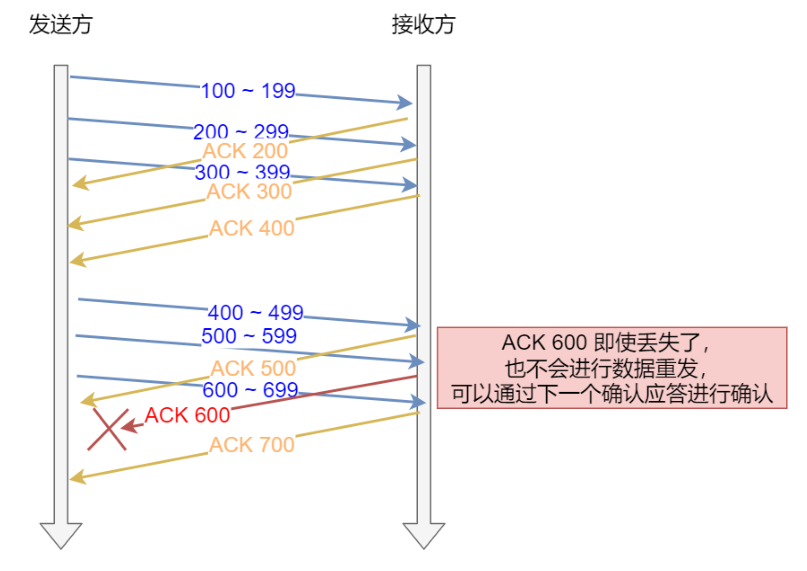  

**图中的 ACK 600 确认应答报文丢失，也没关系，因为可以通过下一个确认应答进行确认，只要发送方收到了 ACK 700 确认应答，就意味着 700 之前的所有数据「接收方」都收到了。这个模式就叫累计确认或者累计应答。**（如果没有收到600，接收方不会发送ACK700，而是继续发送ACK600，如果连续收到三次ACK600，则触发快速重传）  

#### 滑动窗口由谁决定？
TCP首部有一个字段叫Window，也就是窗口大小。  

**这个字段是接收端告诉发送端自己还有多少缓冲区可以接收数据。于是发送端就可以根据这个接收端的处理能力来发送数据，而不会导致接收端处理不过来。**  

所以，**通常窗口的大小是由接收方的窗口大小来决定的。**发送方发送的数据大小不能超过接收方的窗口大小，否则接收方就无法正常接收到数据。  

#### 发送方的滑动窗口
我们先来看看发送方的窗口，下图就是发送方缓存的数据，根据处理的情况分成四个部分，其中深蓝色方框是发送窗口，紫色方框是可用窗口：  

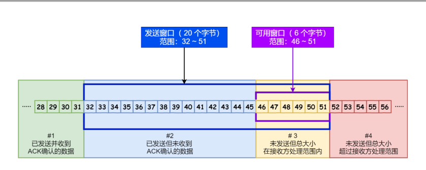  
接下来，当发送方把数全都一下发送出去后，可用窗口的大小就为0了，表明可用窗口耗尽，在没收到ACK确认之前无法继续发送数据了。如下图  

  
当**收到之前发送的数据32~36字节的ACK确认后**，如果发送窗口的大小没有发生变化，则**滑动窗口向右滑动5个字节，因为有5个字节的数据被应答确认了**，接下来52~56字节又进入了可用窗口，也就可以发送这些数据了。如下图  

  

#### 发送方的四个部分在程序中是如何表示的？
TCP使用三个指针来跟踪在四个传输类别中每一个类别中的字节，其中两个指针使绝对指针（指特定的序列号），一个是相对指针（需要做偏移）  

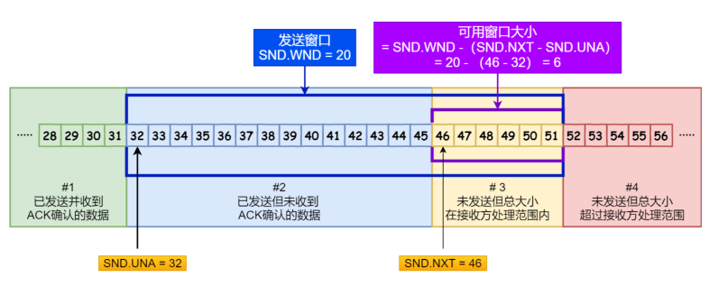  

* SND.WND：表示发送窗口的大小（大小由接收方指定）
* SND.UNA：是一个绝对指针，指向已发送但未收到确认的第一个字节的序列号，也就是#2的第一个字节
* SND.NXT：绝对指针，指向未发送但可发送范围的第一个字节的序列号，也就是#3的第一个字节  
* 指向#4的第一个字节是个相对指针，它需要SND.UNA加上SND.WND大小的偏移量，就可以指向#4的第一个字节。  
* 可用窗口大小的计算就是：可用窗口大小 = SND.WND - (SND.NXT - SND.UNA)  
#### 接收方的滑动窗口
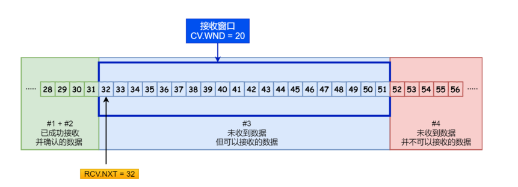  
三部分：

* #1 + #2是已成功接收并确认的数据（等待应用进程读取）
* #3是未收到数据但可以接受的数据
* #4是未收到数据且不可以接收的数据

其中三个接收部分，使用两个指针划分：

* RCV.WND：表示接收窗口的大小，它会告知给发送方
* RCV.NXT：指针，指向期望从发送方发送来的i爱一个数据字节的序列号，也就是#3的第一个字节
* 指向#4的第一个字节是相对指针，它需要RCV.NXT加上RCV.WND大小的偏移量
#### 接收窗口和发送窗口的大小是相等的吗？
**并不完全相等，约等于**  

因为滑动窗口并不是一成不变的。比如，当接收方的应用进程读取数据的速度非常快的话，这样的话**接收窗口可以很快的就空缺出来。那么新的接收窗口大小，是通过 TCP 报文中的 Windows 字段来告诉发送方**。那么这个传输过程是存在**时延**的，所以接收窗口和发送窗口是约等于的关系。

### 流量控制
发送方不能无脑发数据给接收方，要考虑接收方的处理能力。  

为了解决这种现象发生，**TCP 提供一种机制可以让「发送方」根据「接收方」的实际接收能力控制发送的数据量，这就是所谓的流量控制。**  

**这块例子直接看小林coding**  

#### 操作系统缓冲区与滑动窗口的关系
前面我们假定了发送窗口和接收窗口是不变的，**但是实际上，发送窗口和接收窗口中所存放的字节数，都是放在操作系统内存缓冲区中的，而操作系统的缓冲区，会被操作系统调整。**  
* 示例一：服务器非常繁忙，应用程序没有来得及读取缓冲区中的数据，导致接收窗口缩小到了0，也就是发生了窗口关闭。
* 示例二：服务器资源非常紧张时，会主动缩小缓存，并缩小接收窗口的大小。如果发生了**先减少缓存，再收缩窗口，在收缩窗口的报文还没有到达发送方时，发送方已经发送了超出现有接收窗口的数据包，就会导致丢包**  

为了防止这种情况发生，TCP 规定是**不允许同时减少缓存又收缩窗口的，而是采用先收缩窗口，过段时间再减少缓存，这样就可以避免了丢包情况。**

#### 窗口关闭
如果窗口大小为 0 时，就会阻止发送方给接收方传递数据，直到窗口变为非 0 为止，这就是窗口关闭。

* 窗口关闭的潜在危险？
	接收方向发送方通告窗口大小时，是通过 ACK报文来通告的。那么，当发生窗口关闭时，接收方处理完数据后，**会向发送方通告一个窗口非 0 的 ACK 报文，如果这个通告窗口的 ACK 报文在网络中丢失了**，那麻烦就大了。  
	
	**这会导致发送方一直等待接收方的非 0 窗口通知，接收方也一直等待发送方的数据**，如不采取措施，这种相互等待的过程，会造成了**死锁**的现象。
	
* TCP如何解决窗口关闭时潜在的死锁现象呢？
为了解决这个问题，TCP 为每个连接设有一个持续定时器，只要** TCP 连接一方收到对方的零窗口通知，就启动持续计时器。**如果持续计时器超时，就会发送**窗口探测 ( Window probe )** 报文，而对方在确认这个探测报文时，给出自己现在的接收窗口大小。  
#### 糊涂窗口综合征
如果接收方太忙了，来不及取走接收窗口里的数据，那么就会导致发送方的发送窗口越来越小。

到最后，**如果接收方腾出几个字节并告诉发送方现在有几个字节的窗口，而发送方会义无反顾地发送这几个字节，这就是糊涂窗口综合症。**简言之就是，窗口很小，也要发送那几个字节的数据，开销太大，不经济。  

所以，糊涂窗口综合症的现象是可以发生在发送方和接收方：

* 接收方可以通告一个小的窗口
* 而发送方可以发送小数据

于是，要解决糊涂窗口综合症，就解决上面两个问题就可以了
* 让接收方不通告小窗口给发送方
* 让发送方避免发送小数据
##### 怎么让接收方不通告小窗口呢？
设置一个值min = min(MSS, 缓存空间/2)  

当窗口大小小于min，像发送方通告窗口为0，也就阻止了发送方再发数据；  

窗口大小>=MSS时，或者接收方缓存空间有一半可以使用，就把窗口打开。  

##### 怎么让发送方避免发送小数据呢？
发送方通常的策略:  

**使用 Nagle 算法**，该算法的思路是延时处理，它满足以下两个条件中的一条才可以发送数据：  

* 要等到窗口大小 >= MSS  或是 数据大小 >= MSS
* 收到之前发送数据的 ack  回包

Nagle算法默认打开，对于需要小数据包交互的场景比如telnet或ssh，需要关闭Nagle  
### 拥塞控制
前面的流量控制是**避免发送方的数据填满接收方的缓存**，但是并不知道网络中到底发生了什么  

**在网络出现拥堵时，如果继续发送大量数据包，可能会导致数据包时延、丢失等，这时 TCP 就会重传数据，但是一重传就会导致网络的负担更重，于是会导致更大的延迟以及更多的丢包，这个情况就会进入恶性循环被不断地放大....**  

所以TCP不能忽略网络上发生的事，它被设计成一个**无私**的协议，当网络发生拥塞时，TCP会自我牺牲，降低发送的数据量。  

于是有了**拥塞控制**，目的就是**避免发送方的数据填满整个网络**  

为了在发送方调节所要发送的数据的量，定义了一个叫做**拥塞窗口**的概念。  

#### 拥塞窗口
拥塞窗口cwnd是发送方维护的一个状态变量，根据**网络的拥塞程度而动态变化**  

我们在前面提到过发送窗口 swnd  和接收窗口 rwnd  是约等于的关系，那么由于加入了拥塞窗口的概念后，此时**发送窗口的值是swnd = min(cwnd, rwnd)，也就是拥塞窗口和接收窗口中的最小值。**  

拥塞窗口 cwnd  变化的规则：

* 只要网络中没有出现拥塞， cwnd  就会增大
* 但网络中出现了拥塞， cwnd  就减少；
#### 怎么知道当前网络是否发生拥塞呢？
**其实只要「发送方」没有在规定时间内接收到 ACK 应答报文，也就是发生了超时重传，就会认为网络出现了拥塞。**

#### 拥塞控制有哪些控制算法？
拥塞控制主要是四个算法：
* 慢启动
* 拥塞避免
* 拥塞发生
* 快速恢复
##### 慢启动
TCP 在刚建立连接完成后，首先是有个慢启动的过程，这个慢启动的意思就是**一点一点的提高发送数据包的数量**，如果一上来就发大量的数据，这不是给网络添堵吗？  

慢启动的算法记住一个规则就行：**当发送方每收到一个 ACK，拥塞窗口 cwnd 的增量大小就会加 1。**  

  
**呈指数级增长**  

慢启动有**慢启动门限ssthresh**状态变量，一般大小是65535字节

* 当cwnd < sshresh时，使用慢启动算法
* 当cwnd >= ssthresh时，使用拥塞避免算法
##### 拥塞避免算法
拥塞避免算法的规则是：**每当收到一个ACK时，cwnd增加1/cwnd**  

变成了**线性增长**  

  

拥塞避免阶段，增长速度缓慢了一些，但还是在增长。如此增长下去，网络就会慢慢进入拥塞状况，于是会出现丢包，这时就需要对数据包进行重传。  

当触发了重传机制，也就进入了**拥塞发生算法**

##### 拥塞发生
当发生了**超时重传**，使用拥塞发生：

* ssthresh设为cwnd/2

* cwnd重置为1

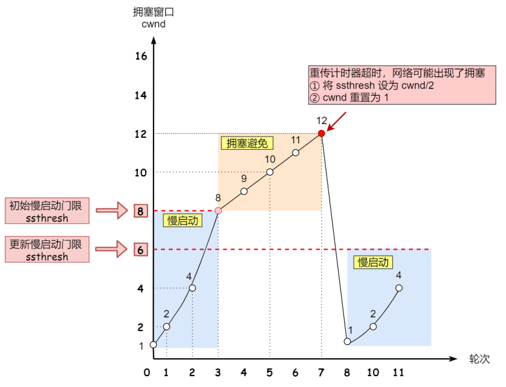  

拥塞发生后，重新开始慢启动。这种方法太激进了，反应很激烈，会造成网络卡顿。  

* 所以，结合解决超时重传问题的快速重传，有了发生快速重传时的拥塞发生  

快速重传算法：**当接收方发现丢了一个中间包的时候，发送三次前一个包的 ACK，于是发送端就会快速地重传，不必等待超时再重传。**TCP认为这种情况不严重，大部分没丢，只丢了一小部分，则发生拥塞发生：

* cwnd = cwnd / 2 

* ssthresh = cwnd

* 进入快速恢复
##### 快速恢复

当发生快速重传时，触发快速恢复

快速恢复如下：

* 拥塞窗口cwnd = ssthresh + 3（3 的意思是确认有 3 个数据包被收到了）
* 重传丢失的数据包
* 如果再收到重复的ACK，cwnd+1
* 如果收到新数据的ACK，把cwnd设置为第一步中的ssthresh，原因是该 ACK 确认了新的数据，说明从 duplicated ACK 时的数据都已收到，该恢复过程已经结束，可以回到恢复之前的状态了，也即再次进入拥塞避免状态  

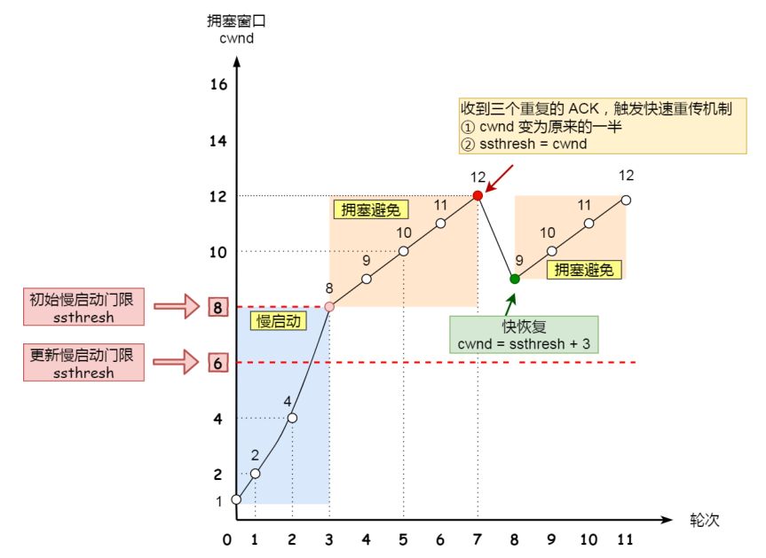  

下面是整个拥塞控制过程的示意图：  

  

### TCP头部的RST字段

RST表示**连接重置**，用于**关闭那些已经没有必要继续存在的连接**。一般情况下是异常关闭连接，区分四次挥手正常关闭。  

#### 产生RST的三个条件

1. 目的地为某端口的`SYN`包到达，然而该端口上并没有正在监听的服务器
2. TCP想取消一个已有连接
3. TCP接收到一个不存在的连接上的包

### TCP还有很多内容，后续继续参照小林coding公众号和pdf

## 应用层
### HTTP基本概念
#### HTTP是什么？
超文本传输协议，HyperText Transfer Protocol。
#### 详细解释超文本传输协议
拆分成三部分讲：
##### 协议
* 「协」字，代表的意思是必须有**两个以上的参与者**。例如三方协议里的参与者有三个：你、公司、学校三个；租房协议里的参与者有两个：你和房东。
* 「议」字，代表的意思是对**参与者的一种行为约定和规范**。例如三方协议里规定试用期期限、毁约金等；租房协议里规定租期期限、每月租金金额、违约如何处理等。

**HTTP 是一个用在计算机世界里的协议。它使用计算机能够理解的语言确立了一种计算机之间交流通信的规范（两个以上的参与者），以及相关的各种控制和错误处理方式（行为约定和规范）。**  

##### 传输
HTTP是一个**双向协议**  

我们在上网冲浪时，浏览器是请求方 A ，百度网站就是应答方 B。双方约定用 HTTP 协议来通信，于是浏览器把请求数据发送给网站，网站再把一些数据返回给浏览器，最后由浏览器渲染在屏幕，就可以看到图片、视频了。  

数据虽然是在 A 和 B 之间传输，**但允许中间有中转或接力。**  

HTTP 是一个在计算机世界里专门用来**在两点之间传输数据**的约定和规范。  


##### 超文本
**超越了普通文本的文本**，它是文字、图片、视频等的混合体，最关键的还有超链接，从一个超文本跳到另一个超文本  
介绍完了以上三点，我们就有了对HTTP更详细的解释：**HTTP 是一个在计算机世界里专门在「两点」之间「传输」文字、图片、音频、视频等「超文本」数据的「约定和规范」。**  
#### HTTP是用于互联网服务器传输超文本到本地浏览器的协议，这种说法正确吗？
不正确，因为也可以是服务器和服务器之间的，所以用**两点之间**来描述更准确
#### HTTP常见状态码
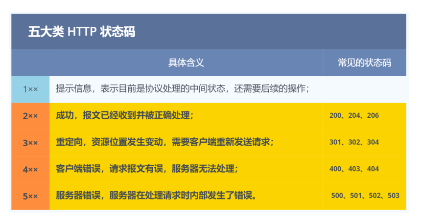  
* 1xx：属于**提示信息**，是协议处理的中间状态，实际用到较少
* 2xx：表示服务器**成功**处理了客户端的请求
	200 OK：最常见的成功状态码，表示一切正常。如果是非HEAD请求，服务器返回的响应头都会有body数据
	204 No Content：常见的成功状态码，响应头没有body数据
	206 Partial Content：是应用于 HTTP 分块下载或断点续传，表示响应返回的 body 数据并不是资源的全部，而是**其中的一部分**，也是服务器处理成功的状态。
* 3xx：**表示客户端请求的资源发生了变动，需要客户端用新的URL重新发送请求获取资源**，也就是**重定向**
	301 Moved Permanently：永久重定向，说明请求的资源已经不存在了，需要用另一个URL
	302 Found：表示临时重定向，说明请求的资源还在，但暂时需要用另一个URL来访问。
	301和302都会在响应头里使用Location，指明后续要跳转的URL  
	304 Not Modified：不具有跳转含义，表示资源为修改，重定向已存在的缓冲文件，也叫缓存重定向
* 4xx：**客户端发送的报文有误**，服务器复发处理
	400 Bad Request：表示客户端请求报文有错误
	403 Forbidden：表示服务器禁止访问资源，不是客户端请求出错
	404 Not Found：请求的资源在服务器上不存在或者找不到
* 5xx：客户端请求报文正确，但是**服务器处理时内部发生了错误**，属于服务器端的错误码
	500 Internal Server Error：笼统通用的服务器错误码
	501 Not Implemented：表示客户端请求的功能还不支持
	502 Bad Gateway：通常是服务器作为网关或者代理时返回的错误码，表示服务器自身工作正常，访问后端服务器发生了错误
	503 Service Unavaliable：服务器当前很忙，暂时无法响应
#### HTTP常见字段
##### Host字段
客户端发送请求时，用来指定服务器的域名  

有了 Host  字段，就可以将请求发往「同一台」服务器上的不同网站。  

##### Content-Length字段
服务器返回数据时，会有此字段，表明此次回应的长度，以字节为单位
##### Connection字段
Connection最常用于客户端要求服务器使用TCP持久连接，以便其他请求复用  

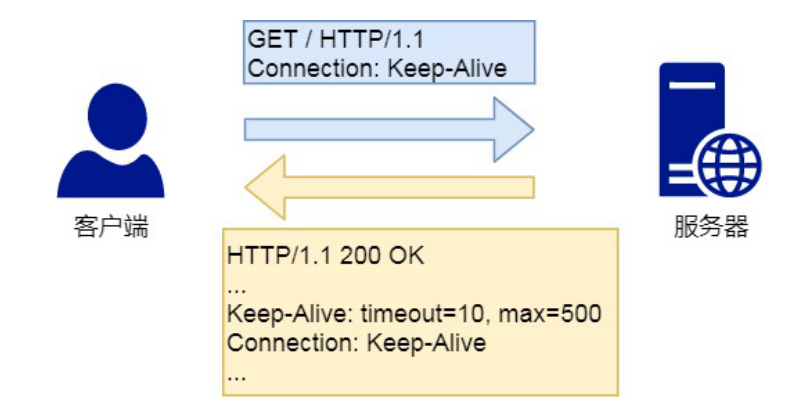  

HTTP/1.1 版本的默认连接都是持久连接，但为了兼容老版本的 HTTP，需要指定 Connection  首部字段的值为 Keep-Alive 。  

```
Connection: keep-alive
```
一个可以复用的 TCP 连接就建立了，直到客户端或服务器主动关闭连接。但是，这不是标准字段。
##### Content-Type字段
用于服务器回应时，告诉客户端，本次数据是什么格式  
```
Content-Type: text/html; charset=utf-8
```
客户端请求时，可以用Accept字段表明自己可以接受哪些数据格式
```
Accept:*/*   表示客户端声明自己可以接受任何格式
```
##### Content-Encoding字段
Content-Encoding 字段说明数据的压缩方法。表示**服务器返回的数据使用了什么压缩格式**  
```
Content-Encoding: gzip
```
客户端在请求时，用 Accept-Encoding  字段说明自己可以接受哪些压缩方法。  
```
Accept-Encoding: gzip, deflate
```
#### GET与POST
##### 区别
Get  方法的含义是请求从服务器获取资源，这个资源可以是静态的文本、页面、图片视频等。  

而 POST  方法则是相反操作，它向 URI  指定的资源提交数据，数据就放在报文的 body 里。  

* GET的语义是请求获取指定的资源。GET方法是安全、幂等、可缓存的（除非有 Cache-ControlHeader的约束）,GET方法的报文主体没有任何语义。  

* POST的语义是根据请求负荷（报文主体）对指定的资源做出处理，具体的处理方式视资源类型而不同。POST不安全，不幂等，（大部分实现）不可缓存。为了针对其不可缓存性，有一系列的方法来进行优化，以后有机会再研究（FLAG已经立起）。  
  

https://www.zhihu.com/question/28586791  

##### GET和POST都是安全幂等的吗？
安全：在HTTP协议中，安全是指请求方法不会破坏服务器上的资源  

幂等：多次执行相同的操作，结果都是相同的  

**GET方法安全且幂等**，因为它是「只读」操作，无论操作多少次，服务器上的数据都是安全的，且每次的结果都是相同的。    

POST 因为是「新增或提交数据」的操作，会**修改服务器上的资源，所以是不安全的**，且多次提交数据就会**创建多个资源，所以不是幂等的**。

#### HTTP特性
HTTP(1.1)的优点：最突出的**优点是简单，灵活，易于扩展，应用广泛，跨平台**  
1. 简单
	HTTP基本报文格式是`header + body`，头部信息也是key+value简单文本，易于理解
	
2. 灵活和易于扩展
	HTTP协议里的各类请求方法、URI/URL、状态码、头字段等每个组成要求都没有被固定死，都允许开发人员自定义和扩充。  
	
	同时 HTTP 由于是工作在应用层（ OSI  第七层），则它下层可以随意变化。HTTPS 也就是在 HTTP 与 TCP 层之间增加了 SSL/TLS 安全传输层，HTTP/3 甚至把 TCP 层换成了基于 UDP 的 QUIC。  
	
3. 应用广泛和跨平台
    互联网发展至今，HTTP 的应用范围非常的广泛，从台式机的浏览器到手机上的各种 APP，从看新闻、刷贴吧到购物、理财、吃鸡，HTTP 的应用片地开花，同时天然具有跨平台的优越性。  

**缺点：无状态、明文传输、不安全**

4. 无状态双刃剑
   

  好处：不需要额外资源来记录HTTP状态，减轻服务器负担

  坏处：完成有关联性的操作时比较麻烦，一般用Cookie或者JWT解决（单独又能讲一堆）  

  

5. 明文传输双刃剑
   

  好处：方便阅读，易于调试或抓包，为工作提供了便利性

  坏处：信息裸奔，内容毫无隐私
    
6. 不安全
  * 通信使用明文，内容可能会被窃听（账号泄露）
  * 不验证通信方身份，可能遭遇伪装（假的淘宝）
  * 无法证明报文完整性，可能遭遇篡改（植入垃圾广告）
    HTTP的安全问题，在HTTPS中，引入SSL/TLS层解决，在安全上达到了极致
#### HTTP/1.1性能如何
HTTP协议基于TCP/IP，使用【请求-应答】通信模式  
1. **长连接**
	早期 HTTP/1.0 性能上的一个很大的问题，那就是每发起一个请求，都要新建一次 TCP 连接（三次握手），而且是串行请求，做了无谓的 TCP 连接建立和断开，增加了通信开销。  
	
	为了解决上述 TCP 连接问题，HTTP/1.1 提出了**长连接**的通信方式，也叫持久连接。这种方式的好处在于减少了 TCP 连接的重复建立和断开所造成的额外开销，减轻了服务器端的负载。  
	
	**持久连接的特点是，只要任意一端没有明确提出断开连接，则保持 TCP 连接状态。**  
	
2. **管道网络传输**

  HTTP/1.1 采用了长连接的方式，这使得管道（pipeline）网络传输成为了可能。  

  即可**在同一个 TCP 连接里面，客户端可以发起多个请求，只要第一个请求发出去了，不必等其回来，就可以发第二个请求出去，可以减少整体的响应时间。**  

  但是服务器还是**按照顺序**，先回应 A 请求，完成后再回应 B 请求。要是前面的回应特别慢，**后面就会有许多请求排队等着。这称为「队头堵塞」**。

3. **队头堵塞**

  「请求 - 应答」的模式加剧了 HTTP 的性能问题。  

  因为当顺序发送的请求序列中的一个请求因为某种原因被阻塞时，在**后面排队的所有请求也一同被阻塞了**，会招致客户端一直请求不到数据，这也就是「队头阻塞」。好比上班的路上塞车。  

  **总之 HTTP/1.1 的性能一般般，后续的 HTTP/2 和 HTTP/3 就是在优化 HTTP 的性能。**
### HTTP与HTTPS
#### HTTP与HTTPS的区别
1. HTTP是超文本传输协议，信息是**明文传输**，存在安全风险。HTTPS则解决HTTP不安全的缺陷，在TCP和HTTP网络层之间加入了SSL/TLS安全协议，使得报文能够加密传输。
2. HTTP连接的建立相对简单，TCP三次握手之后便可进行HTTP的报文传输。而HTTPS在TCP三次握手之后，还需进行SSL/TLS的握手过程，才可进入加密报文传输
3. HTTP的端口号是80；HTTPS的端口号是443
4. HTTPS协议需要向CA（证书权威机构）申请数字证书，来保证服务器的身份是可信的
#### HTTPS解决了HTTP的哪些问题？
HTTP由于明文传输，在安全上存在以下三个风险：

* **窃听风险**，比如通信链路上可以获取通信内容，用户号容易没。

* **篡改风险**，比如强制植入垃圾广告，视觉污染，用户眼容易瞎。

* **冒充风险**，比如冒充淘宝网站，用户钱容易没。

**HTTPS 在 HTTP 与 TCP 层之间加入了 SSL/TLS  协议，可以很好的解决了上述的风险：**

* 信息加密：交互信息无法被窃取

* 校验机制：无法篡改通信内容，篡改了就不能正常显示

* 身份证书：证明淘宝是真的淘宝网

可见，只要自身不做「恶」，**SSL/TLS 协议是能保证通信是安全的。**  
#### HTTPS是如何解决上面的三个风险的？
* **混合加密**的方式实现信息的机密性，解决了**窃听**风险
* **摘要算法**的方式实现完整性，用于校验数据完整性，解决了**篡改**的风险
* **将服务器公钥放在数字证书中**，解决了**冒充**风险
##### 混合加密
通过混合加密的方式可以保证信息的机密性，解决了窃听的风险。  

HTTPS采用**对称加密**和**非对称加密**结合的混合加密方式  

* 在通信建立前，用**非对称加密**得方式交换会话密钥，后续就不再使用非对称加密
* 在通信过程中，全部使用对称加密的会话密钥的方式加密明文文章

采用混合加密的原因：

* 对称加密只使用一个密钥，**运算速度快**，密钥必须保存，**但无法做到安全的密钥交换**
* 非对称加密使用两个密钥，公钥可以任意分发，而私钥保密，**解决了对称加密的密钥交换问题**，但速度慢
##### 摘要算法
**摘要算法用来实现完整性，能够为数据生成独一无二的「指纹」**，用于校验数据的完整性，解决了篡改的风险。  

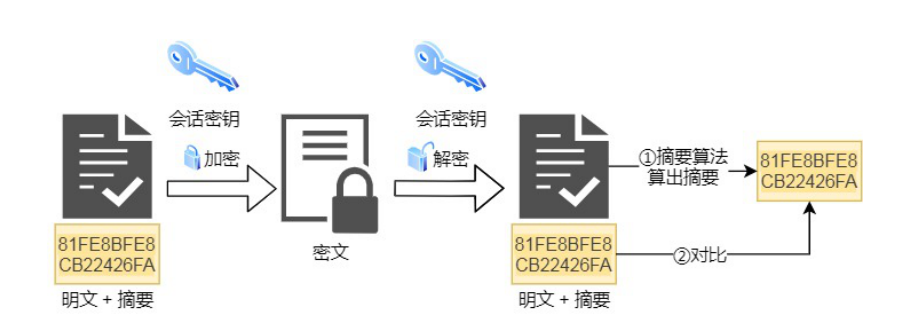  

客户端在发送明文之前会通过摘要算法算出明文的「指纹」，**发送的时候把「指纹 + 明文」一同加密成密文后，发送给服务器**，**服务器解密后，用相同的摘要算法算出发送过来的明文**，通过比较客户端携带的「指纹」和当前算出的「指纹」做**比较**，若「指纹」相同，说明数据是完整的。  

##### 数字证书
**客户端先向服务器索要公钥**，然后用公钥加密信息，服务器收到密文后，用自己的私钥解密。  

这就存在一个问题：**如何保证公钥不被篡改和提高信任度？**  

借助第三方权威机构CA（数字证书认证机构），**将服务器公钥放在数字证书**（由数字证书认证机构颁发）中，只要证书是可信的，就认为公钥是可信的。  

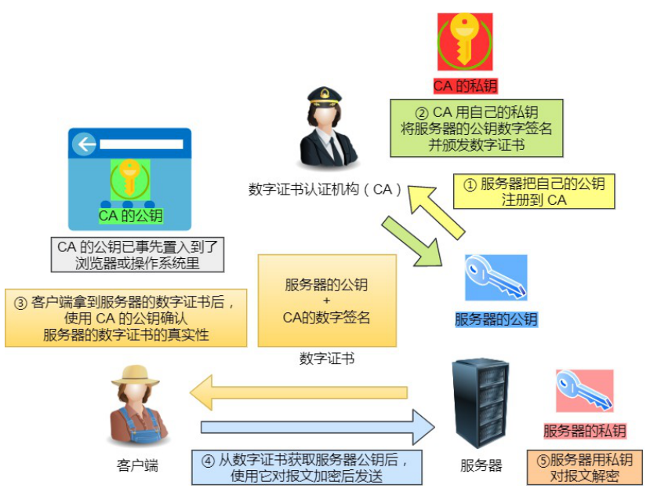  

通过数字证书的方式保证服务器公钥的身份，解决冒充的风险。  

##### SSL TLS的区别
SSL（安全套接字层）是先被研发作为HTTPS的协议加密层的  

TLS（传输层安全）是更为安全的升级版 SSL  

##### HTTPS是如何建立连接的？
SSL/TLS协议基本流程：

* 客户端向服务器索要并验证服务器的公钥

* 双方协议产生【会话密钥】

* 双方采用【会话密钥】进行加密通信

其中前两步是SSL/TLS的建立过程，也就是握手阶段。  

**握手阶段涉及四次通信**，图见小林coding pdf  

**文字叙述过程如下：**

1. TCP三次握手，建立连接，下面开始SSL/TLS握手

2. ClientHello：
	
	客户端发起加密通信请求，称为ClientHello，在这一步客户端主要向服务器发送以下信息：
	
	(1) 客户端支持的SSL/TLS协议版本，如TLS1.2
	
	(2) 客户端生产的随机数1(Client Random)，用于后面生产【会话密钥】
	
	(3) 客户端支持的密码套件，如RSA加密算法
	
3. ServerHello：

  服务器收到客户端的请求后，向客户端发出相应，即ServerHello。内容如下：

  (1) 确认SSL/TLS版本，如果浏览器不支持，则关闭加密通信

  (2) 服务器产生的随机数2(Server Random)，用于后面生产【会话密钥】

  (3) 确认的密码套件列表，如RSA加密算法

  (4) 服务器的数字证书中放入服务端的公钥，发送给客户端

4. 客户端回应：

  客户端收到服务器回应之后，首先通过**浏览器或者操作系统中的CA公钥**，验证服务器的数字证书真实性。  

  如果证书没有问题，**客户端会从数字证书中取出服务器公钥，然后用它来加密报文**，向服务器发送以下信息：

  (1) 一个随机数3(pre-master key)。该随机数会被服务器公钥加密。这样服务器和客户端**同时拥有了三个随机数**，接着就用双方协商的加密算法，**各自生成**本次通信的【会话密钥】

  (2) 加密通信算法改变通知，表示随后的信息都将用【会话密钥】加密通信

  (3) 客户端握手结束通知，表示客户端的握手阶段已经结束。这一项同时把**之前所有内容发生的数据做个摘要，供服务器校验**

  上面第一项的随机数是整个握手阶段的第三个随机数，这样服务器和客户端**同时拥有了三个随机数**，接着就用双方协商的加密算法，**各自生成**本次通信的【会话密钥】。

5. 服务器的最后回应

  **服务器收到客户端的第三个随机数（ pre-master key ）之后，通过协商的加密算法，计算出本次通信的「会话秘钥」**。然后，向客户端发生最后的信息：

  (1) 加密通信算法改变通知，表示随后的信息都将用「会话秘钥」加密通信。

  (2) 服务器握手结束通知，表示服务器的握手阶段已经结束。这一项**同时把之前所有内容的发生的数据做个摘要，用来供客户端校验**。  

至此，SSL/TLS握手阶段全部结束。**接下来，客户端与服务器进入加密通信，完全使用普通HTTP，只不过会用生成的对称加密【会话密钥】加密内容。**  
### HTTP/1.1 HTTP/2 HTTP/3的演变
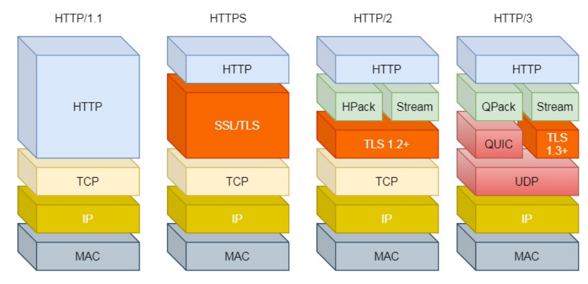  
#### HTTP1.1相比HTTP/1.0提高了什么性能？
改进：

* 使用**TCP长连接**改善了HTTP/1.0短链接造成的性能开销
* **支持管道(pipeline)网络传输，只要第一个请求发出去了，不必等结果回来，就可以发送第二个请求，可以减少整体的响应时间**。  

但HTTP/1.1还有性能瓶颈：

* **请求/响应头部未经压缩**就发送，首部信息越多延迟越大，只能压缩Body部分
* 发送**冗长的首部**，每次互相发送相同首部造成浪费的资源较多
* 服务器按照请求顺序响应，如果服务器响应慢，会导致客户端一直请求不到数据，也就是**队头阻塞**。
* 没有请求优先级控制
* 请求只能从客户端开始，服务器只能被动响应
#### HTTP/2相比HTTP/1.1做了什么优化?
**HTTP/2基于HTTPS，安全性有保障。**  

性能上的改进：

1. **头部压缩**：如果你同时发出多个请求，他们的头是一样或者相似的，那么协议会帮你**消除重复的部分**。 HPACK算法，在客户端和服务器同时维护一张头信息表，字段存入表，生成一个索引号，以后就不发字段了，只发索引号。

2. **二进制格式**：HTTP/2 不再像 **HTTP/1.1 里的纯文本形式的报文**，而是全面采用了**二进制格式，头信息和数据体都是二进制，并且统称为帧（frame）**：头信息帧和数据帧。  
	
	这种方式对人不友好，但对计算机友好，**无需编解码，增加了数据传输的效率**。  
	
3. **数据流**：HTTP/2的**数据包不是按顺序发送的**，同一个链接里的连续包，可能属于不同的回应，对数据包做标记，指出他属于哪个回应。  

​       **每个请求或回应的所有数据包，称为一个数据流(Stream)**。每个数据流都标记着一个独一无二的编号。规定客户端发出的数据流为奇数，服务端发出的数据流为偶数

​       客户端还可以指定**数据流的优先级**。

4. **多路复用**：**HTTP/2 是可以在一个连接中并发多个请求或回应，而不用按照顺序一一对应。**移除了 HTTP/1.1 中的串行请求，不需要排队等待，也就**不会再出现「队头阻塞」问题，降低了延迟，大幅度提高了连接的利用率。**  

5. **服务器推送**：服务器可以主动向客户端发送消息。

#### HTTP/2的缺陷？HTTP/3做了哪些优化？

HTTP/2 主要的问题在于，**多个 HTTP 请求在复用一个 TCP 连接**，下层的 TCP 协议是不知道有多少个HTTP 请求的。所以一旦发生了丢包现象，就会触发 TCP 的重传机制，**这样在一个 TCP 连接中的所有的 HTTP 请求都必须等待这个丢了的包被重传回来。**  

* HTTP/1.1 中的管道（ pipeline）传输中如果有一个请求阻塞了，那么队列后请求也统统被阻塞住了
* HTTP/2 多个请求复用一个TCP连接，一旦发生丢包，就会阻塞住所有的 HTTP 请求。

这都是基于TCP传输层的问题，所以**HTTP/3把HTTP的TCP改成了UDP！**  

UDP 发生是不管顺序，也不管丢包的，所以不会出现 HTTP/1.1 的队头阻塞 和 HTTP/2 的一个丢包全部重传问题。大家都知道 UDP 是不可靠传输的，但**基于 UDP 的 QUIC 协议 可以实现类似 TCP 的可靠性传输。**  

* QUIC有一套机制可以保证传输的可靠性。当某个流发生丢包时，只会阻塞这个流，**其他流不会受影响**  
* TLS3升级成了最新的1.3版本，头部压缩算法升级成了QPack
* HTTPS要建立一个连接，要花费六次交互，先是TCP三次握手，然后是TLS/1.3三次握手。QUIC直接把以前的六次**合并成了三次，减少了交互次数**。

**QUIC是一个在UDP之上的伪TCP + TLS + HTTP/2的多路复用的协议**

