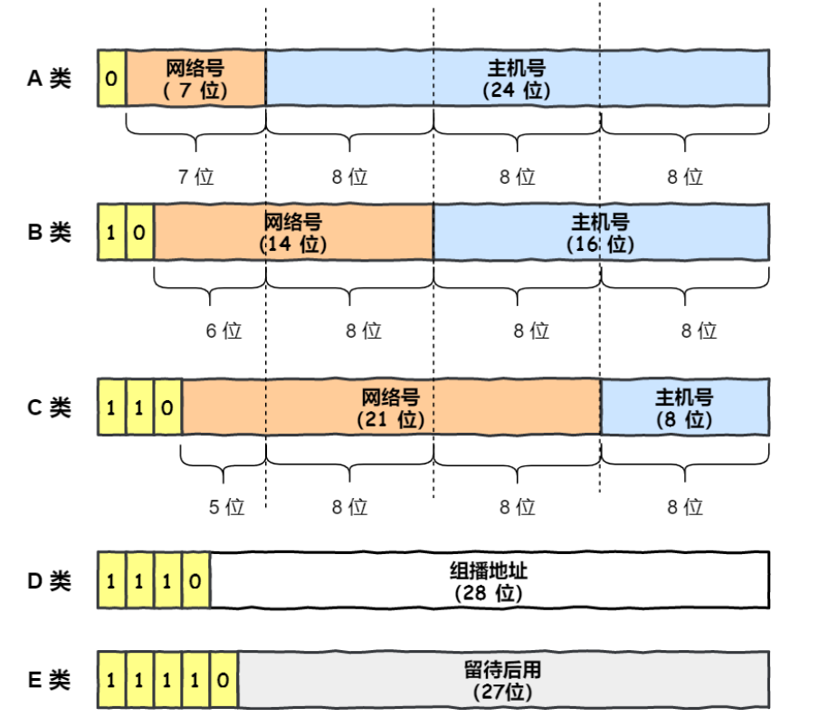

# 计算机网络
## 基本概念
五层体系结构由**应用层，运输层，网络层（网际层），数据链路层，物理层**组成。运输层最主要的协议是 TCP 和 UDP 协议，网络层最重要的协议是 IP 协议。
## 物理层
物理层主要做的事情是**透明的传送比特流**。  
**物理层考虑的是怎样才能在连接各种计算机的传输媒体上传输数据比特流，而不是指具体的传输媒体。** 现有的计算机网络中的硬件设备和传输媒体的种类非常繁多，而且通信手段也有许多不同的方式。物理层的作用正是尽可能地屏蔽掉这些传输媒体和通信手段的差异，使物理层上面的数据链路层感觉不到这些差异，这样就可以使数据链路层只考虑完成本层的协议和服务，而不必考虑网络的具体传输媒体和通信手段是什么。  
### 常用的信道复用
1. 频分复用(FDM)：所有用户在同样的时间占用不同的带宽资源
2. 时分复用(TDM)：所有用户在不同的时间占用同样的频带宽度
3. 统计时分复用(Statistic TDM)：改进的时分复用，能够明显提高信道的利用率。
4. 码分复用(CDM)：用户使用经过特殊挑选的特殊码型，因此用户之间不会造成干扰。这种系统发送的信号有很强的抗干扰能力，其频谱类似于白噪声，不易被敌人发现。
5. 波分复用(WDM)：光的频分复用
## 数据链路层
* 循环冗余检验CRC：为了保证数据传输的可靠性，CRC 是数据链路层广泛使用的一种检错技术。
* 帧(Frame)：一个数据链路层的传送带元，由一个数据链路层首部和其携带的封包所组成协议数据单元
* MTU(Maximum Transfer Unit)：最大传送单元。帧的数据部分的长度上限
* 误码率BER：在一段时间内，传输错误的比特占所传输比特总数的比率
* PPP(Point-to-Point Protocal)：点对点协议，即用户和ISP通信时所采用的数据链路层协议
* MAC地址：或称为物理地址、硬件地址，用来定义网络设备的位置。**在 OSI 模型中，第三层网络层负责 IP 地址，第二层数据链路层则负责 MAC 地址。**因此一个主机会有一个 MAC 地址，而每个网络位置会有一个专属于它的 IP 地址 。地址是识别某个系统的重要标识符，“名字指出我们所要寻找的资源，地址指出资源所在的地方，路由告诉我们如何到达该处。
* 网桥：用于数据链路层实现中继，连接两个或多个局域网的网络互联设备
* 交换机：实质是一个多接口的网桥
### 以太网的数据链路层
* 以太网采用的无连接的工作方式，对发送的数据帧不进行编号，也不要求对方发回确认。目的站收到有差错帧就把它丢掉，其他什么也不做
* 以太网采用的协议是**具有冲突检测的载波监听多点接入 CSMA/CD**。协议的特点是：发送前先监听，边发送边监听，一旦发现总线上出现了碰撞，就立即停止发送。然后按照**退避算法**等待一段随机时间后再次发送。 因此，每一个站点在自己发送数据之后的一小段时间内，存在这遭遇碰撞的可能性。以太网上的各站点平等的争用以太网信道
* 以太网的适配器具有过滤功能，它只接收单播帧，广播帧和多播帧。
* 使用集线器可以在物理层扩展以太网（扩展后的以太网仍然是一个网络）
## 网络层
网络层主要作用是**实现主机与主机之间的通信，也叫点对点**  
似乎数据链路层也是做的这件事？但他们之间是有区分的：** IP 的作用是主机之间通信用的，而 MAC 的作用则是实现「直连」的两个设备之间通信，而 IP 则负责在「没有直连」的两个网络之间进行通信传输。**  
### IP协议的基础知识
* 在TCP/IP通信时，每个主机都需要配置正确的IP地址，否则无法正常通信。  
IPv4地址由32位二进制表示；而为了人们记忆方便，采用点分十进制来表示，将32位二进制分为8位一组，总共4组，以‘.’隔开，每组转为0~255之间的十进制。  
* IP地址的最大值位2^32，约为43忆。采用可以更换IP地址的NAT技术，使得能够连接到互联网的设备远远超过43亿台。  
### IP地址的分类
IP地址被分为A、B、C、D、E五类，如下图  
  
黄色部分为分类号，用来区分IP地址的类别。  
#### 什么是A B C类地址？
ABC类地址主要分为两部分，**网络号和主机号**，根据二进制计算可以得到三类IP地址的取值范围和最大主机数。  
  
最大主机数计算方式就是2的主机数位数次方 - 2，这里的减2，减掉的是主机号全1的用于指定某个网络的地址和主机号全0的用于广播的地址  
#### 什么是D E类地址？
而 D 类和 E 类地址是没有主机号的，所以不可用于主机 IP，D 类常被用于多播，E 类是预留的分类，暂时未使用。  
多播用于**将包发送给特定组的所有主机**，可以穿透路由  

